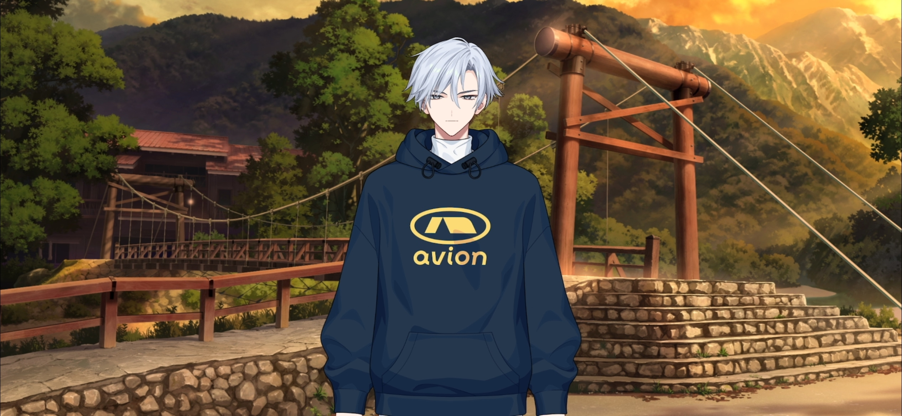

import "@/styles/series/18trip.scss";

<Divider loc="Kamikochi - Taisho Pond Bridge" />

<Bubble mc>
I’m so glad they were still selling kappa-yaki!
</Bubble>

<Bubble character="Yukikaze">
The ones we had before were red bean paste, but these are custard…

Both of them are delicious either way. They easily take home the Yukikaze Award in the regional delicacy category.
</Bubble>

<Bubble mc>
Let’s take a look around. We can’t go too far since our bus is coming soon, but we can walk around the bridge.
</Bubble>

<Bubble character="Yukikaze">
Sure.

We used to walk around while eating food together like this a lot.
</Bubble>

<Bubble mc>
Oh, yeah, like when we were walking back from the ice rink.

We’d get takoyaki and taiyaki… We had soft serve sometimes too.
</Bubble>

<Bubble character="Yukikaze">
You were always so happy when I gave you some of my share.

You’d keep talking about how good it was while you ate… Your smile from back then is still a precious memory to me.

That being said, do you want some of my kappa-yaki? I haven’t eaten this one on the bottom yet.

It has a lot of cream in it, and it’s nice and chewy. It’s pretty filling too. You can have it.

I can feed it to you like I used to. Say “ahhh…”
</Bubble>

<Bubble mc>
N-No, it’s okay! I’m not a kid anymore.

I also feel kinda bad about splitting the kappa’s head in half. I appreciate the thought, though.
</Bubble>

<Bubble character="Yukikaze">
I see. You’re very kind.
</Bubble>

<Bubble mc>
They’re just so cute-looking. I almost don’t even wanna eat them!

…Even though I’m almost done eating this one.

They were so tasty!
</Bubble>

<Bubble character="Yukikaze">
It’s great that you have a healthy appetite. I’m sure the kappa felt honored to be eaten by you.

Come to think of it… You’ve always liked kappas, haven’t you?

I remember how you used to carry around a cucumber with you because you wanted to befriend one.
</Bubble>

<Bubble mc>
Oof… Now that’s an embarrassing memory. I’m surprised you remember.
</Bubble>

<Bubble character="Yukikaze">
I remember everything about you.
</Bubble>

<Bubble mc>
I still haven’t given up on that, you know.

Kappas do exist, and I know I’ll meet one someday if I keep traveling the world…

Haha, just kidding…
</Bubble>

<Bubble character="Yukikaze">
So you still like them? I see. I’ll find one for you.
</Bubble>

<Bubble mc>
Huh?
</Bubble>
