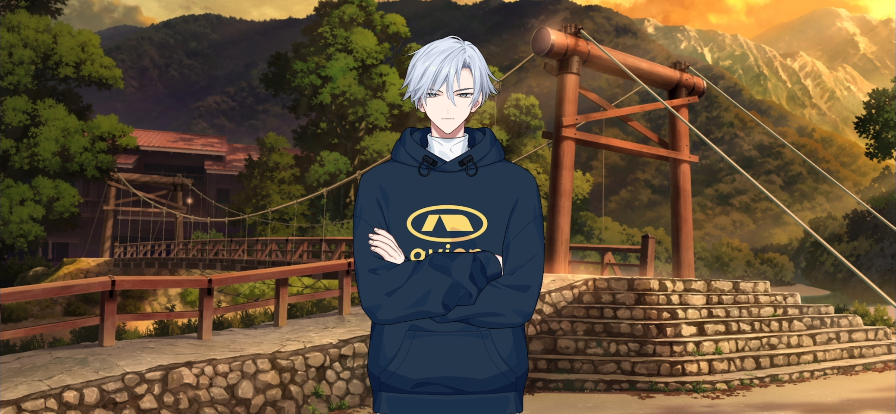
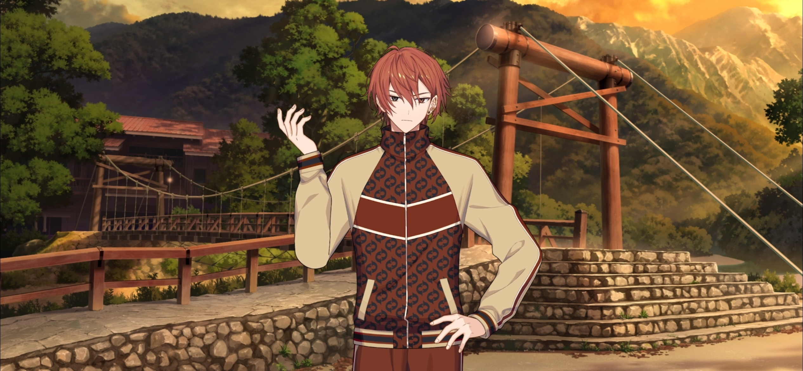

import "@/styles/series/18trip.scss";

<Divider loc="Kamikochi - Taisho Pond Bridge" />

<Bubble mc>
Uh, Yuki-nii? Can you say that again?
</Bubble>

<Bubble character="Yukikaze">
I said I’ll find one for you. I’ll find you a kappa.

If you want to become friends with one, I’ll grant your wish for you.

The people running the store said that the legendary pool where the kappas come out of is still around…

The wildlife on this mountain is rich. I don’t think it would be too much of a stretch to imagine them still leading their lives here.
</Bubble>

<Bubble mc>
Um… Yeah, I guess that would be…nice.
</Bubble>

<Bubble character="Yukikaze">
The possibilities are endless. A kappa school, a kappa apartment building, a kappa ice rink…

Thank you for the kappa-yaki.

I’ll head out. Leave everything to me.
</Bubble>

<Choice speaker="Kaede" response="Hold on!">
<Bubble mc>
Hold on! &ast;grab&ast;
</Bubble>

<Bubble character="Yukikaze">
Hm? I didn’t leave anything behind. I have my phone and my wallet… I’m bringing water and a handkerchief, too.
</Bubble>

<Bubble mc>
That’s not what I meant.
</Bubble>
</Choice>

<Choice speaker="Kaede" response="Okay, good luck!">
<Bubble mc>
Okay, good luck!
</Bubble>

<Bubble character="Yukikaze">
Hearing you cheer me on gives me courage. I feel like I could climb to the top of Mount Yari right now.
</Bubble>

<Bubble mc>
Wait, I mean, no! Yuki-nii, stop!

(I almost let him go by instinct because he’s always so reliable…)

</Bubble>
</Choice>

<Bubble character="Yukikaze">
Why are you stopping me? Could it be…?

Are you feeling nervous about meeting a kappa?

You don’t have to worry. You’re a very good person, so I know that the kappas would love to meet you. You’ll be great friends.
</Bubble>

<Bubble mc>
I’m glad that you think so, but…I was just joking! I know it’s not possible!
</Bubble>

<Bubble character="Yukikaze">
I see… I’ll refrain, then.

Haha. It’s like we’ve swapped places.

One time I was the one stopping you from looking for kappas because it was dangerous.
</Bubble>

<Bubble mc>
Yeah, I remember that.

But we ended up going to look for them in the swamp anyway and came home covered in mud…
</Bubble>

<Bubble character="Yukikaze">
My dad got really mad at me.
</Bubble>

<Bubble mc>
Oh, yeah! He was so shocked, and he was like, “don’t do anything dangerous like that. Hurry up and get in the bath.”
</Bubble>

<Bubble character="Yukikaze">
It’s all so nostalgic.

“Nostalgic,” huh…?
</Bubble>

<Bubble mc>
What’s up?
</Bubble>

<Bubble character="Yukikaze">
We haven’t spent enough time in HAMA Tours together to create nostalgic memories as mayor and chief yet.

This is just the beginning of that chapter.

But as childhood friends…

We’ve made countless memories… It makes me happy to think about all of the time we’ve spent together.

You were always by my side, <Name first />.
</Bubble>

<Bubble mc>
What are you talking about? I still am, and I always will be.
</Bubble>

<Bubble character="Yukikaze">
…Yeah.
</Bubble>

<Bubble character="Renga">
Oh, there they are. Heeey, Yukikaze! Chief! The bus is almost here!
</Bubble>

<Bubble mc>
Oh, no. Let’s head back!
</Bubble>

<Bubble character="Yukikaze">
I didn’t even realize. Time always flies by so fast when I’m with you.
</Bubble>

<Bubble mc>
Sorry, Renga-kun! Let everyone know we’ll be there soon!
</Bubble>

<Narration>
&ast;water plopping&ast;
</Narration>

<Bubble character="Yukikaze">
Hm? What was that…?
</Bubble>

<Bubble mc>
Yuki-nii, are you good? We gotta go!
</Bubble>

<Bubble character="Yukikaze">
Ah, of course…

……

See you. I’ll introduce you to my dear childhood friend and little brothers next time.
</Bubble>

<Narration>
&ast;water plopping&ast;
</Narration>
