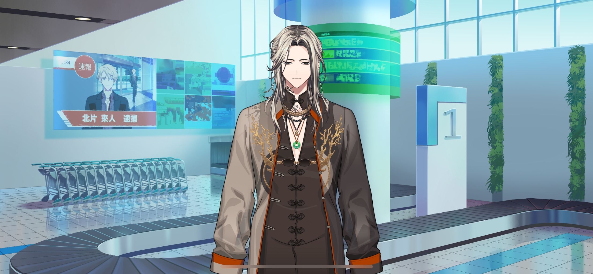
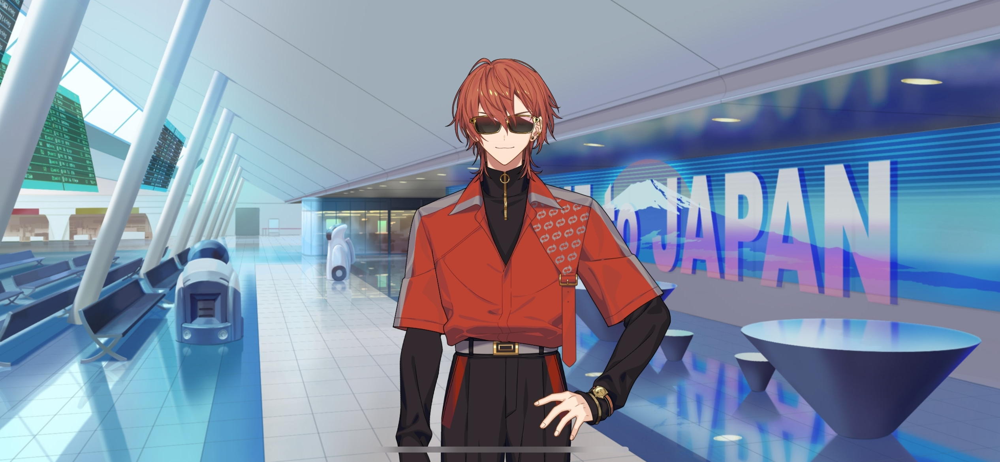
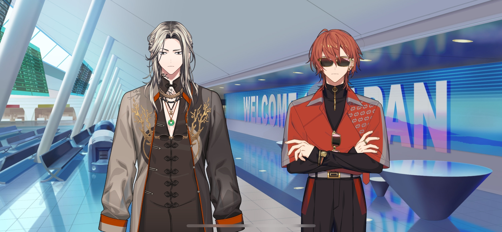

import "@/styles/series/18trip.scss";

# Hospitality Beginnings - SIDE A

<Divider loc="Tokyo Metropolis International Airport - Baggage Claim" />

<Box type="radio">
&lt;&NoBreak;Suspect Kitakata Raito has been arrested on charges of aggravated assault. Kitakata is an entrepreneur well-known for starting the metaverse service known as mahorova…&NoBreak;&gt;
</Box>

<Bubble mc>
Phew… We finally landed.

(I like traveling, but it feels so nice to be back home.)

(Well, it’s not all sunshine and rainbows now that I’m here, seeing as how I’m gonna be unemployed in a week…)

&ast;bump&ast; Ah…
</Bubble>

<Bubble character="Liguang" name="Man with Long Hair">
Excuse me.
</Bubble>

<Bubble mc>
I’m sorry. I wasn’t paying attention…
</Bubble>

<Bubble character="Liguang" name="Man with Long Hair">
I’m sorry too. You’re not hurt?
</Bubble>

<Bubble mc>
No, I’m okay. Are you…?
</Bubble>

<Bubble character="Liguang" name="Man with Long Hair">
Yeah, I’m fine. Thanks.
</Bubble>

<Bubble mc>

(He looked kind of familiar…)

&ast;bump&ast; Woah…!
</Bubble>

<Bubble character="Renga" name="Man with Red Hair">
Slow down! Who said you could walk in front of me?!
</Bubble>

<Bubble character="Liguang" name="Man with Long Hair">
……
</Bubble>

<Bubble character="Renga" name="Man with Red Hair">
Hey! Did I stutter?! Don’t make me say it again!
</Bubble>

<Bubble character="Liguang" name="Man with Long Hair">
…Rudeness doesn’t deserve a response. I shouldn’t have to explain that to you.
</Bubble>

<Bubble character="Renga" name="Man with Red Hair">
You son of a…!

Oh, there’s my luggage. Move!
</Bubble>

<Bubble mc>

(I should get my suitcase too. How long is it gonna take? What time was my bus again…?)

</Bubble>

<Bubble character="Liguang" name="Man with Long Hair">
Hey…Don’t cut in front of me. Out of the way.
</Bubble>

<Bubble character="Renga" name="Man with Red Hair">
Shut it, dumbass! Don’t get in my way! We both know my suitcase is gonna come out first.
</Bubble>

<Bubble character="Liguang" name="Man with Long Hair">
_Bèndàn…_ Where do you get all of that baseless confidence from?
</Bubble>

<Bubble character="Renga" name="Man with Red Hair">
Just wait, I’ll prove you wrong! My bag is gonna come out&NoBreak;—
</Bubble>

<Bubble character="Liguang" name="Man with Long Hair">
That’s mine.
</Bubble>

<Bubble character="Renga" name="Man with Red Hair">
Wuh?!
</Bubble>

<Bubble character="Liguang" name="Man with Long Hair">
Heh…
</Bubble>

<Bubble character="Renga" name="Man with Red Hair">
Damn you… Hey, Li&NoBreak;—
</Bubble>

<Narration>
&ast;alarms sounding&ast;
</Narration>

<Bubble character="Liguang" name="Man with Long Hair">
…Hm?
</Bubble>

<Bubble character="Security Robot">
Stop. Stop.
</Bubble>

<Bubble character="Liguang" name="Man with Long Hair">
What?
</Bubble>

<Bubble character="Security Robot">
Please open your luggage and step away. A search will be conducted.
</Bubble>

<Narration>
&ast;alarms sounding&ast;
</Narration>

<Bubble character="Liguang" name="Man with Long Hair">
……
</Bubble>

<Bubble character="Security Robot">
Commencing search.
</Bubble>

<Narration>
&ast;alarms sounding&ast;
</Narration>

<Bubble character="Security Robot">
Unidentified pills found. Color: green. Enclosed in transparent package. One bag.
</Bubble>

<Bubble character="Liguang" name="Man with Long Hair">
Those are…!
</Bubble>

<Bubble character="Security Robot">
We ask for your cooperation to confirm the details.
</Bubble>

<Bubble character="Liguang" name="Man with Long Hair">
…Those are…ra…

…Rabbit pellets.
</Bubble>

<Bubble mc>

(Pellets…? He has a pet rabbit?)

</Bubble>

<Bubble character="Renga" name="Man with Red Hair">
Haha! Go ahead and take your sweet time! I told you I’d be first out!
</Bubble>

<Bubble character="Liguang" name="Man with Long Hair">
Tch…
</Bubble>

<Bubble mc>

(They were at each other's throats in the plane too. The things they argue about are, uh…kind of childish, though.)

Oh, there’s my suitcase.

Hup… Oof.

(Oh, I should put my carry-on inside.)

(My passcode was… Hm…?)

…Huh?
</Bubble>

<Bubble mc>
A little doggy keychain? This isn’t mine… Did I take someone else’s bag?!
</Bubble>

<Divider loc="Tokyo Metropolis International Airport - Lobby" />

<Bubble character="Renga" name="Man with Red Hair">
Phew, finally home… Wasn’t an easy flight.

Oh, crap… Almost forgot.
</Bubble>

<Bubble character="Renga" name="Man with Red Hair">
Heh…

(As long as I got these on, the only people who can recognize me are my superfans.)

…Alright. Clothes, check. Hair, check. Gotta keep it classy.

(A Nishizono’s gotta look his best.)

Let’s roll&NoBreak;—
</Bubble>

<Bubble mc>
Excuse me!
</Bubble>

<Bubble character="Renga" name="Man with Red Hair">
Eep?!
</Bubble>

<Bubble mc>
Excuse me! Can I talk to you? You in the sunglasses!
</Bubble>

<Diff g="m">
<Bubble character="Renga" name="Man with Red Hair">
Wh… A-A fan? If he makes a fuss here… No, wait, I got this. We’re staying classy…
</Bubble>
</Diff>
<Diff g="f">
<Bubble character="Renga" name="Man with Red Hair">
Wh… A-A fan? If she makes a fuss here… No, wait, I got this. We’re staying classy…
</Bubble>
</Diff>

<Bubble mc>
Um, that suitcase is…!
</Bubble>

<Bubble character="Renga" name="Man with Red Hair">
Ahem… Sorry to say, but I’m on a private schedule.
</Bubble>

<Bubble mc>
What? No wait, I just need the suitcase…
</Bubble>

<Diff g="m">
<Bubble character="Renga" name="Man with Red Hair">

(He’s still going… I really gotta pull out the big guns on these crazy types.)

(Activating my Secret Technique: Reporter-Evading Speed Walk!)

</Bubble>
</Diff>
<Diff g="f">
<Bubble character="Renga" name="Man with Red Hair">

(She’s still going… I really gotta pull out the big guns on these crazy types.)

(Activating my Secret Technique: Reporter-Evading Speed Walk!)

</Bubble>
</Diff>

<Bubble mc>
Wait! Hold on!
</Bubble>

<Bubble character="Renga" name="Man with Red Hair">
H-Hey…!

Let go! Back up, commoner!
</Bubble>

<Bubble mc>
C-Commoner…?!
</Bubble>

<Bubble character="Renga" name="Man with Red Hair">
Who gave a commoner like you the permission to touch an A-list celebrity?!
</Bubble>

<Bubble mc>
No, I mean, I just…

(Wait… Is he…?)

</Bubble>

<Bubble character="Woman A">
Wait, is that Renga…?
</Bubble>

<Bubble character="Woman B">
No way, what’s he doing here?!
</Bubble>

<Bubble mc>

(I was right… He’s Nishizono Renga, the famous model who’s the mayor of one of the HAMA wards… He runs Ward 3, right?)

(Oh, and…)

(I think that other man was a mayor too. What was his name, Lu Liguang…?)

(I guess they know each other because they’re both ward mayors. They didn’t seem to like each other very much, though…)

</Bubble>

<Bubble character="Woman A">
Do I talk to him? Do I?!
</Bubble>

<Bubble character="Woman B">
Uh, who’s that person next to him?
</Bubble>

<Bubble character="Renga">
Shit, now everything’s a mess…

Hey, you! You’re the one who caused all of this! What’s your problem?!
</Bubble>

<Bubble mc>
No, I just wanted to tell you about my suitcase…
</Bubble>

<Bubble character="Renga">
Sh-Shut it! I’m getting out of here!
</Bubble>

<Bubble character="Woman A">
Aah! I want Renga to yell at me too!
</Bubble>

<Bubble character="Woman B">
I’m so jealous!
</Bubble>

<Bubble character="Woman A">
Rengaaaaa!!
</Bubble>

<Bubble mc>
Huh?! Wait…!
</Bubble>

<Bubble character="Onlooker A">
What? What’s happening?
</Bubble>

<Bubble character="Onlooker B">
Renga’s here? As in, Nishizono Renga, the model?
</Bubble>

<Bubble character="Renga">
Hey, back off! Can’t you see I got sunglasses on?! That means I’m on a private schedule!!
</Bubble>

<Bubble character="Old Man">
Look at alla these people… You reckon everyone’s here linin’ up for them souvenirs?
</Bubble>

<Bubble character="Old Woman">
My, it’s so crowded… City folk really have it different.
</Bubble>

<Bubble mc>

(O-Oh no… Everyone’s crowding around us.)

</Bubble>

<Bubble character="Renga">
I told you all to step back!! Back the hell up!!
</Bubble>

<Bubble character="Woman A">
Aah! Renga yelled at me!
</Bubble>

<Bubble character="Onlooker B">
Wow, Nishizono Renga’s kind of an asshole.
</Bubble>

<Bubble character="Old Man">
This line ain’t movin’ at all. Cashiers these days can’t even get the job done right.
</Bubble>

<Bubble mc>

(This isn’t good. Things aren’t calming down.)

</Bubble>

<Bubble character="Kotonojo" name="Girl (?)">
&ast;sigh&ast; What a dreadful sight. You have no right to call yourself a mayor when you can’t even provide decent hospitality…

No wonder HAMA is doomed to fail.

How boring. Let’s go.
</Bubble>

<Bubble mc>

(People are badmouthing HAMA…! I can’t let my hometown’s reputation go down like this…)

</Bubble>

<Bubble character="Renga">
Gahhhh, fuck!! What the hell do I do now?!
</Bubble>

<Bubble mc>
Wait, please just hear me out!!
</Bubble>

<Bubble character="Renga">
What do you want…!
</Bubble>

<Bubble mc>
I can help you!
</Bubble>

<Bubble character="Renga">
Huh?! You wanna help…?
</Bubble>

<Bubble character="Liguang">
…What’s happening here?
</Bubble>

<Bubble mc>
Ah, perfect timing! Can you help us too?
</Bubble>

<Bubble character="Liguang">
Help? With what exactly…
</Bubble>

<Bubble mc>
Help with…offering hospitality!
</Bubble>
