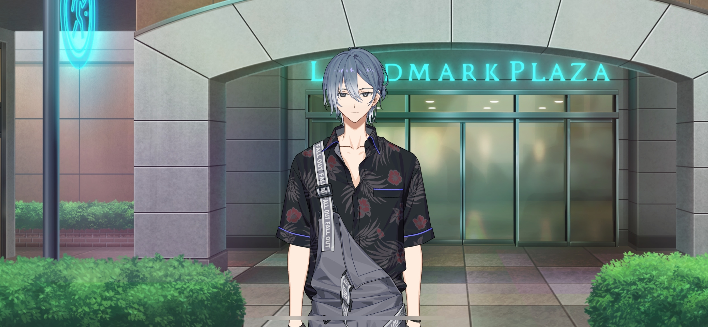
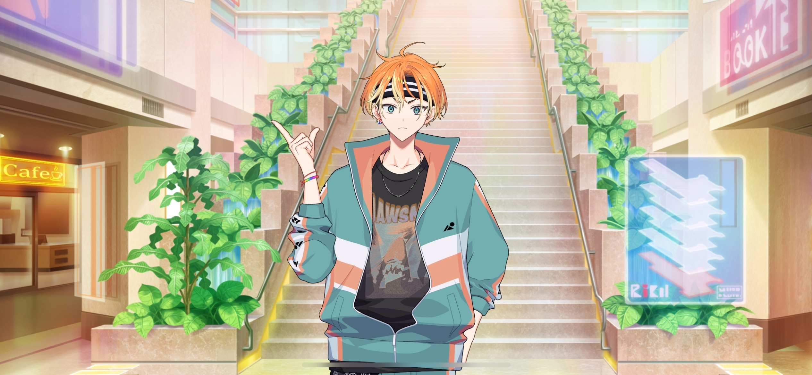
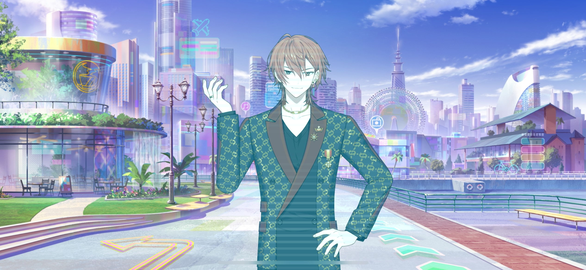

import "@/styles/series/18trip.scss";

<Divider loc="Landmark Plaza"/>

<Bubble character="Nagi" name="Florist">
Is this a good place to drop you off?
</Bubble>

<Bubble mc>
Yeah, here’s good! Thank you so much, uh…

Sorry, I never asked for your name.
</Bubble>

<Bubble character="Nagi" name="Florist">
Oh, uh… Just take this.
</Bubble>

<Bubble mc>
What’s this?
</Bubble>

<Bubble character="Nagi" name="Florist">
Card for my shop. Stop by when you have the time.

I always have flowers if you want some. You can come in if you have laundry to do, too.
</Bubble>

<Bubble mc>
Laundry? And flowers…? At the same place…?
</Bubble>

<Bubble character="Nagi" name="Florist">
See you, I gotta go.
</Bubble>

<Bubble mc>
Oh, thank you again!

…HAMA nice trip!
</Bubble>

<Bubble character="Nagi" name="Florist">
…HAMA nice trip, too.
</Bubble>

<Bubble mc>

(...He was interesting.)

Okay… I need to keep looking for Kafka!
</Bubble>

<Divider loc="Landmark Plaza - First Floor"/>

<Bubble mc>
Hmm… I don’t see him here.

(Where did you go, Kafka…)

If I can find the next page from that old travel guide…
</Bubble>

<Bubble character="Akuta" name="Boy with Headband">
Hey, you!
</Bubble>

<Bubble mc>
Huh… Me?
</Bubble>

<Bubble character="Akuta" name="Boy with Headband">
Yeah! Can you do me a huge favor?

Take this camera and get this shot of me!
</Bubble>

<Bubble mc>
Wh… Uh… Huh?!
</Bubble>

<Bubble character="Akuta" name="Boy with Headband">
A’ight, here we go…

&lt;No, wait!!&gt;
 {/* should be in big caps */}
</Bubble>

<Bubble mc>
Huh? What is he…
</Bubble>

<Bubble character="Akuta" name="Boy with Headband">
&lt;You can’t go up those stairs yet! Nooooo!!&gt;
</Bubble>

<Bubble character="Security Guard A">
Hey, hold it!
</Bubble>

<Bubble character="Akuta" name="Boy with Headband">
&lt;Dammit… The space dimension overjourney device won’t finish charging at this rate…&gt;
</Bubble>

<Bubble character="Security Guard B">
What are you talking about… Get away from the stairs! You’re not allowed up there if you don’t respect the dress code!
</Bubble>

<Bubble character="Akuta" name="Boy with Headband">
&lt;I get it already! We won’t be able to withstand an incomplete overjourney with this equipment…!&gt;

Hey, are you getting this? Get a good shot!
</Bubble>

<Bubble mc>
Wh… Is he talking to me…?
</Bubble>

<Bubble character="Akuta" name="Boy with Headband">
&lt;Let me go! I can’t let him leave on his own!&gt;
</Bubble>

<Bubble character="Security Guard A">
Wh…! This kid’s stronger than he looks…!
</Bubble>

<Bubble character="Security Guard B">
Calm down!!
</Bubble>

<Bubble character="Akuta" name="Boy with Headband">
Woah…?!
</Bubble>

<Bubble mc>

(Oh… They let him go…?)

</Bubble>

<Bubble character="Akuta" name="Boy with Headband">
Phew… Guess we’re done here.

Hey! Didja get that?! Didja?!
</Bubble>

<Bubble mc>
Uh… Sorry. I was kind of surprised, so I didn’t…
</Bubble>

<Bubble character="Akuta" name="Boy with Headband">
Man, reallyyy! We gotta do one more take, then…
</Bubble>

<Bubble mc>
No, wait! The security guards are gonna catch you again!
</Bubble>

<Bubble character="Akuta" name="Boy with Headband">
Well, yeah, that’s what I want! This is scene 87, where the main character shakes off the dudes trying to stop him and crosses the multiverse to go help his friend!
</Bubble>

<Bubble mc>
Uh, I don’t know what you’re filming here, but I think you should tone it down a little… The guards are already on edge as it is.
</Bubble>

<Bubble character="Akuta" name="Boy with Headband">
Aw, come on! I was this close to getting a super crazy emotional scene from that, you know!
</Bubble>

<Bubble mc>
…Huh?

What are you holding?
</Bubble>

<Bubble character="Akuta" name="Boy with Headband">
Oh, this? It’s just a bunch of rolled up paper but… It’s my megaphone! Every director needs one of these bad boys!
</Bubble>

<Bubble mc>
No, I mean the actual paper… The one on top. Can I look at it?
</Bubble>

<Bubble character="Akuta" name="Boy with Headband">
Yeah, sure! I just picked it up since it flew down from somewhere upstairs.
</Bubble>

<Box type="paper">
The Landmark Tower is the symbol of HAMA! If you go to the Sky Garden you can see all of HAMA from above.

I saw your hospital from there when I went for a school field trip once. But I couldn’t really tell which room was yours.
</Box>

<Bubble mc>
This is… Another page from my travel guide…
</Bubble>

<Bubble character="Akuta" name="Boy with Headband">
Woah, you went up there for a field trip? We don’t get to do that these days.
</Bubble>

<Bubble mc>
Huh, why not?
</Bubble>

<Bubble character="Akuta" name="Boy with Headband">
Well, like… Just look.
</Bubble>

<Bubble character="Renga" hologram>
&lt;Located on the 2nd floor of the Landmark Plaza. Burger Emperor’s specialty dish, diamond fries—only 34,000 yen!&gt;

&lt;Cut from premium potatoes imported from Noirmoutier for 40,000 yen per kilogram, these fries are soaked in water straight from a source 450 meters under the Andes for exactly 38.8 seconds before being fried to perfection by a world-class chef!&gt;
</Bubble>

<Bubble mc>

(Nishizono Renga… I met him at the airport yesterday! And 30,000 yen for some french fries?! Is this an ad for a 5-star burger restaurant?!)

</Bubble>

<Bubble character="Renga" hologram>
&lt;Experience the high-ranking service you deserve here at Landmark, where we offer only the most gorgeous urban luxury[^1] to the elite.&gt;
</Bubble>

<Bubble character="Akuta" name="Boy with Headband">
You see? No way they’d let little kids run around a swanky place like this anymore.
</Bubble>

<Bubble mc>
No way…!
</Bubble>

---

[^1]: In the original, Renga throws in a lot of buzzwords such as "gorgeous," "urban," and "high-rank" without thinking about them too much, which makes the sentence sound a bit nonsensical, or as if he doesnt know what hes talking about.
