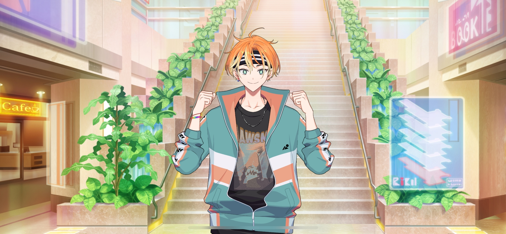

import "@/styles/series/18trip.scss";

# The Journey in Our Memories

<Divider loc="Landmark Plaza - First Floor"/>

<Bubble character="Akuta" name="Boy with Headband">
But dude, if I could go all the way up to the observation floor like you did, I could get the sickest shots ever! Man, I can only dream!
</Bubble>

<Bubble mc>
You’ve never been to the Sky Garden?
</Bubble>

<Bubble character="Akuta" name="Boy with Headband">
Didn’t you hear? They do this crazy background check to make sure you’re rich enough for them before they let you in. No way a guy like me could get in there.
</Bubble>

<Bubble mc>
That’s insane…
</Bubble>

<Bubble character="Akuta" name="Boy with Headband">
You used to be able to get up there if you just paid 1,000 for a ticket! Man, I really wish I went back then!
</Bubble>

<Bubble mc>
Yeah… But when I was a kid, even 1,000 yen was a little out of the question for me, so we weren’t able to go up there by ourselves.
</Bubble>

<Bubble character="Akuta" name="Boy with Headband">
Seriously? That sucks, for real.
</Bubble>

<Bubble mc>
So we went somewhere else… I think we went to the top of some other building to see the HAMA port…

…Huh? Wait, where was that again…? I don’t remember…!

(Kafka might be there right now…)

</Bubble>

<Bubble character="Akuta" name="Boy with Headband">
……

Whatdja see out there?
</Bubble>

<Bubble mc>
Like… the view from that building?
</Bubble>

<Bubble character="Akuta" name="Boy with Headband">
Yeah. If you can remember anything you saw around there, I might know where it is.
</Bubble>

<Bubble mc>
Wait, really?!
</Bubble>

<Bubble character="Akuta" name="Boy with Headband">
Yep! Y’know, I’m trying to be a intergalactic movie director, so I know HAMA better than anyone else in the universe!
</Bubble>

<Bubble mc>

(He sure is exaggerating a lot…)

Thank you! I’ll tell you what I can remember, so I appreciate all the help I can get!
</Bubble>

<Bubble character="Akuta" name="Boy with Headband">
Okay! But I’m not gonna help you for free. You gotta be my camera operator for real next time, got it?
</Bubble>

<Bubble mc>
Ahaha… Well, as long as you don’t cause any trouble, I’d be glad to help.
</Bubble>

<Bubble character="Akuta" name="Boy with Headband">
Aw, hell yeah! I’ll hold you to that!

So, you remember anything?
</Bubble>

<Bubble mc>
Uh, well… I’m pretty sure that building had a bento shop on the first floor…
</Bubble>

<Divider fb="start" />

<Bubble mc>
It’s so late…
</Bubble>

<Bubble character="Kafka">
……
</Bubble>

<Bubble mc>
Are you tired, Kafka?
</Bubble>

<Bubble character="Kafka">
…Yeah.
</Bubble>

<Bubble mc>
Huh? Are you okay?!

(I remember now… Kafka sat himself down in front of that building and didn’t want to move.)

Um, Kafka… Are you hungry? Do you wanna get a bento?
</Bubble>

<Bubble character="Kafka">
No…
</Bubble>

<Bubble mc>
Then, uh… do you want some water?
</Bubble>

<Bubble character="Kafka">
I’m okay.
</Bubble>

<Bubble mc>
Kafka…

(I didn’t know what to do, so I…)

(I took Kafka’s hand and led him up the stairs at the side of the building…)

</Bubble>

<Divider fb="end" />

<Divider loc="HAMA Ward 3 Building"/>

<Bubble mc>
Ah… This is it. It still looks the same…

(I remember that Sakujiro-san was trying to track us down that entire day, and we didn’t find out until afterwards.)

(But in the end, Kafka and I were both able to go on our trip together. We learned how travel can change people’s lives…and we both grew to love HAMA.)

(I worked hard to make this travel guide just because I wanted to make someone smile. I wonder if my job as a tour guide ever made me feel that same way…)

</Bubble>

<Divider loc="HAMA Ward 3 Building - Staircase"/>

<Bubble mc>
Haha… These stairs are more narrow than I remember. They looked so much bigger to us as kids.

(Going up these steps holding my travel guide brings back memories of when Kafka and I were doing the same with our hands linked together. I really just…)

I just wanted to see Kafka smile.

(That feeling hasn’t changed, even now, I… No, maybe it’s the opposite now.)

(Those memories taught me that I want to live to make people smile. They made me who I am today. …Hey…)

</Bubble>

<Bubble mc>
…Kafka.
</Bubble>
