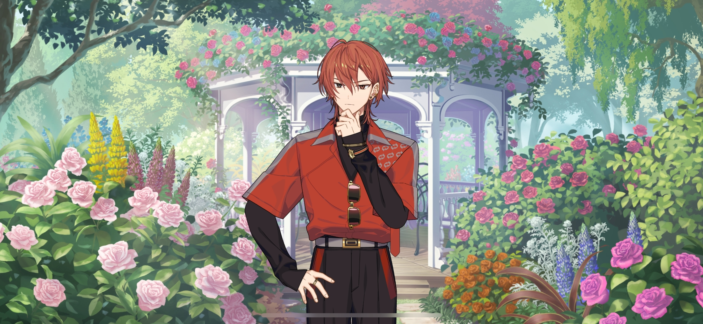
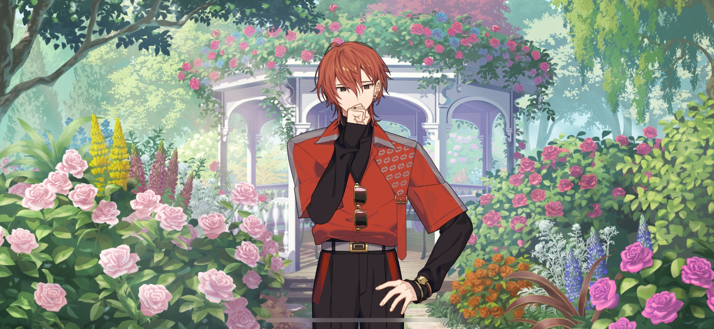
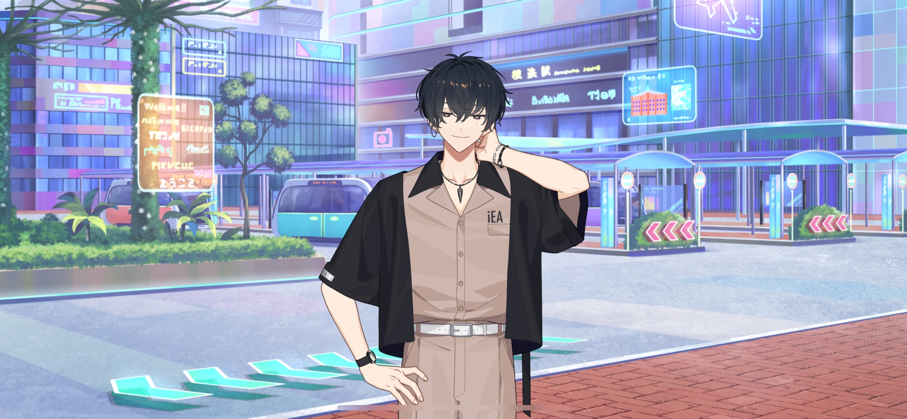
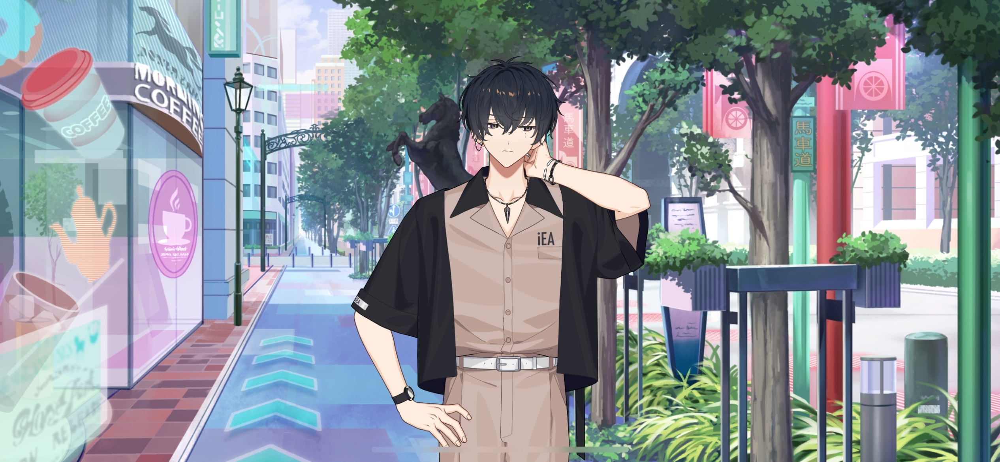
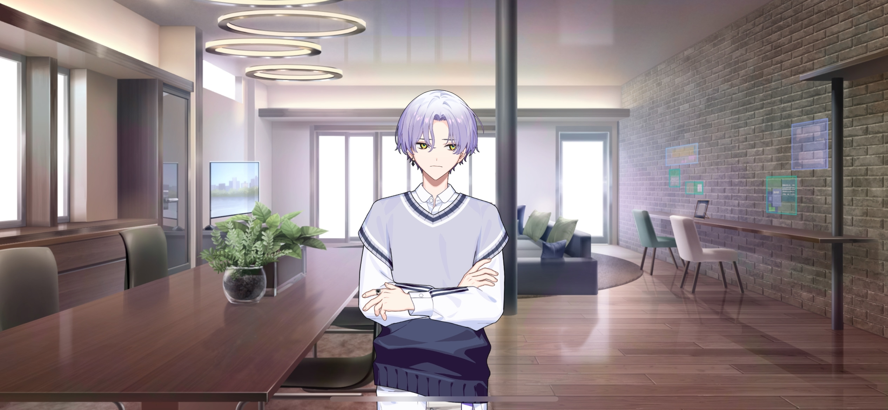

import "@/styles/series/18trip.scss";

# Family Situations

<Divider loc="Nishizono Household - Rose Garden" />

<Bubble character="Renga">
Okay, next… “Before the buds appear, add extra fertilizer. Disbud so nutrients can be concentrated…”

Ugh, I don’t get this. Growing roses is too hard. I don’t know a single thing…

Grandmother never had to read this book to take care of them…

“Disbudding refers to removing unnecessary younger buds and leaving only a few…”

&ast;sigh…&ast; Unnecessary, huh?

(If Grandmother were still alive, she would probably think the same way about me.)

</Bubble>

<Divider fb="start" />

<Bubble character="Renga’s Grandmother">
Renga, have you lost your mind? Do you truly intend to work in a disgraceful industry such as entertainment instead of attending college?
</Bubble>

<Bubble character="Renga">
…It’s not disgraceful. I’m doing this for the Nishizono family’s sake…!
</Bubble>

<Bubble character="Renga’s Grandmother">
Silence! You’re simply avoiding academia because you’re so certain you can’t succeed in it!

&ast;sigh&ast; You’re nothing but a disappointment. Why on god’s earth do you only learn the most useless things…?
</Bubble>

<Divider fb="end" />

<Bubble character="Renga">

(…Grandmother probably saw my entire existence as worthless…)

If I were a rose, I wonder if she would’ve cared for me…
</Bubble>

<Narration>
&ast;rustling&ast;
</Narration>

<Bubble character="Renga">
……
</Bubble>

<Bubble character="Butler">
Excuse me, Young Master Renga. I have brought the liquid fertilizer you requested.
</Bubble>

<Bubble character="Renga">
O-Oh, right. Do I just pour it near the roots?
</Bubble>

<Bubble character="Butler">
Yes, that’s correct. Ah, but please take care to refrain for the seedling over there.
</Bubble>

<Bubble character="Renga">
…? So I shouldn’t pour any on that one?
</Bubble>

<Bubble character="Butler">
That seedling is quite special, and it has already grown buds.
</Bubble>

<Bubble character="Renga">
…Oh, you’re right. They’re yellow.
</Bubble>

<Bubble character="Renga">
…Aren’t these the roses that Grandmother always kept in her room?
</Bubble>

<Bubble character="Butler">
My, I am glad to hear that you remember. This bush was bred by the great mistress herself. It is very valuable and exclusive to this garden.
</Bubble>

<Bubble character="Renga">
Really…? I didn’t know.
</Bubble>

<Bubble character="Butler">
Its name is…

……
</Bubble>

<Bubble character="Renga">
Hm?
</Bubble>

<Bubble character="Butler">
Well, never mind that. I tried my hand at drying flowers. I hope it is to your liking.
</Bubble>

<Bubble character="Renga">
Ah… It’s the rose I had in my room… I thought it wilted already.
</Bubble>

<Bubble character="Butler">
You seemed to treasure it very much, so I preserved it.
</Bubble>

<Diff g="m">
<Bubble character="Renga">
I see… That’s nice…

(The chief at HAMA Tours gave this to me… I was kind of mean to him, but he told me that it had the power to make people happy. He just wanted to cheer me up.)

(But I don’t know…how to be happy.)

</Bubble>
</Diff>
<Diff g="f">
<Bubble character="Renga">
I see… That’s nice…

(The chief at HAMA Tours gave this to me… I was kind of mean to her, but she told me that it had the power to make people happy. She just wanted to cheer me up.)

(But I don’t know…how to be happy.)

</Bubble>
</Diff>

<Bubble character="Butler">
Oh, good day, Master. Are you perhaps out on a walk?
</Bubble>

<Bubble character="Renga">
…!
</Bubble>

<Bubble character="Renga’s Father">
Ah… Ahem. I didn’t notice you were there.
</Bubble>

<Bubble character="Butler">
Yes, the young master is taking excellent care of the great mistress’s rose garden.
</Bubble>

<Bubble character="Renga’s Father">
…Hm.
</Bubble>

<Bubble character="Renga">
…I’m gonna go fertilize the other seedlings.
</Bubble>

<Bubble character="Butler">
Ah, Young Master…
</Bubble>

<Bubble character="Renga’s Father">
…Renga.
</Bubble>

<Bubble character="Renga">
Yes?
</Bubble>

<Bubble character="Renga’s Father">
……
</Bubble>

<Bubble character="Renga">
……
</Bubble>

<Bubble character="Renga’s Father">
……
</Bubble>

<Bubble character="Butler">
Master would like to tell you that he is looking forward to seeing the special rose bush bloom. He understands that tending to roses is quite difficult, but he has faith in you.

Is that correct, Master?
</Bubble>

<Bubble character="Renga’s Father">
M-Mhm!
</Bubble>

<Bubble character="Renga">
Ah, okay. I’ll do my best.
</Bubble>

<Bubble character="Butler">
Those roses were very important to the great mistress. I am sure she would be overjoyed to hear that you are taking care of them, Young Master.
</Bubble>

<Bubble character="Renga">

(…I see. But would she really be happy to see someone like me taking care of something so important to her?)

</Bubble>

<Bubble character="Renga’s Father">
……
</Bubble>

<Bubble character="Butler">
Master wholeheartedly agrees.
</Bubble>

<Bubble character="Renga’s Father">
Mhm! Mm…!
</Bubble>

<Bubble character="Butler">
He also wishes you well for your move-in at the HAMA House tomorrow. He hopes you can make good friends.
</Bubble>

<Bubble character="Renga’s Father">
Ahem…!
</Bubble>

<Bubble character="Renga">
Friends…

I wouldn’t call him that yet, but…there’s one guy I’ve been hanging out with. We had dinner together the other day…
</Bubble>

<Bubble character="Butler">
&ast;gasp&ast; That is excellent news!! Congratulations, Young Master!!
</Bubble>

<Bubble character="Renga’s Father">
…!!!
</Bubble>

<Bubble character="Renga">
S-Stop, it’s not like it means anything. We’re not friends… Well, uh, maybe he sees me as a friend, but that's it!
</Bubble>

<Bubble character="Butler">
I see, I see! How exciting it must be to live with a dear friend!
</Bubble>

<Bubble character="Renga">
N-N-N-No, it’s not…

Uh, once I get paid, I’ll take you two to the place he showed me…

It’s called an izakaya! They sell yakitori for 99 yen a piece.
</Bubble>

<Bubble character="Butler">
Master and I would love to accompany you.
</Bubble>

<Bubble character="Renga’s Father">
Ahem…
</Bubble>

<Bubble character="Renga">

(There’s no way Father thinks that… But if I can make these roses bloom…)

(It might make them happy. Not just Father, but…Grandmother too…)

</Bubble>

<Divider loc="Yokohama Station" />

<Bubble character="Angry Beauty">
Excuse me?! Explain yourself!
</Bubble>

<Bubble character="Ten">
Explain what? Can’t a guy move out in peace?
</Bubble>

<Bubble character="Angry Beauty">
You think I’m just gonna lie down and take that?! You said we’d live together because we started dating!
</Bubble>

<Bubble character="Ten">
Huh? You seriously believed that? What, you never had the thought that maybe I was just sweet-talking you?
</Bubble>

<Bubble character="Angry Beauty">
HUH?! Watch your tone, fucking scumbag! &ast;slap&ast;
</Bubble>

<Bubble character="Ten">
…Feel better now?
</Bubble>

<Bubble character="Angry Beauty">
…You piece of…!
</Bubble>

<Bubble character="Ten">
Woah, hands off the plant.
</Bubble>

<Bubble character="Angry Beauty">
Ahh! &ast;thud&ast;

…What the hell’s wrong with you? Is that plant more important to you than me…?!

Moving out of the way just so you could see me fall… I’m literally bleeding!
</Bubble>

<Bubble character="Ten">
Oh, it’s _my_ fault now? Even though you started it?
</Bubble>

<Bubble character="Angry Beauty">
H-How could you say that…? Up until yesterday, you were so…
</Bubble>

<Bubble character="Ten">
Nice to you? You can find other nice guys anywhere. Not that big of a deal.

Alright, thanks for letting me stay. Seeya.
</Bubble>

<Divider loc="HAMA Streets" />

<Bubble character="Ten">
&ast;sigh&ast; Dunno why I gotta deal with crazy chicks like that in my private life too. I already get enough of that at my job. They’re always so easy otherwise.
</Bubble>

<Narration>
&ast;crows cawing&ast;
</Narration>

<Bubble character="Ten">
Oh, gotta report in.

Hey, everything’s good on my end.

Pretty easy job this time. There’s not much to dealing with nobodies like that. The other thing?

Ah… Well, I’ll get it at some point. Looking forward to that double pay we talked about.

But there’s one guy who might suss me out, so I’ll try and be careful.

His name? Uh… Oguro Kafka, or something?

Yeah, the little boy genius who lived.
</Bubble>

<Divider loc="Oguro Household" />

<Bubble character="Rihito">
&ast;sigh…&ast; I’m worried. You’re really leaving for the dorms tomorrow?
</Bubble>

<Bubble character="Kafka">
That’s the eighth time you’ve asked me. Could you give it a rest already?
</Bubble>

<Bubble character="Rihito">
But they just finished your surgery. I wanted to do some father-son bonding now that you’re out of the hospital…
</Bubble>

<Bubble character="Kafka">
Let me guess, you wanted to go shopping, see a movie, or go to the zoo?
</Bubble>

<Bubble character="Rihito">
I wanted us to go to an amusement park and ride the Ferris wheel too!
</Bubble>

<Bubble character="Kafka">
&ast;sigh&ast; Sakujiro…
</Bubble>

<Bubble character="Sakujiro">
Master Rihito, please do not worry. I will be at Young Master Kafka’s side, close enough to feel his breathing.
</Bubble>

<Bubble character="Rihito">
I wanna be that close too… You’re going to send me emails with daily updates on his body temperature, heart rate, and nutritional intake, right?!
</Bubble>

<Bubble character="Kafka">
What’s the point of keeping track of that…? We have a gym in the dorm, so you don’t have to worry about it so much.
</Bubble>

<Bubble character="Rihito">
But, still… Your dad’s worried that you might overwork yourself.
</Bubble>

<Bubble character="Kafka">
Ugh, alright. I have to go get ready for tomorrow, so I’m done eating. Sakujiro, keep him company for me.
</Bubble>

<Bubble character="Rihito">
Kafka-kun…
</Bubble>

<Bubble character="Sakujiro">
Master Rihito, I will be keeping a close eye on Young Master Kafka. If anything occurs, I will contact you immediately.
</Bubble>

<Bubble character="Rihito">
…Mm, I know. Kafka’s 20. He’s not a kid anymore. But I’m still worried for him.

He has to work so hard because I was a doormat when I was mayor…
</Bubble>

<Bubble character="Rihito">
He looks more like you by the day, honey. That’s why I worry so much…Rinka.
</Bubble>
