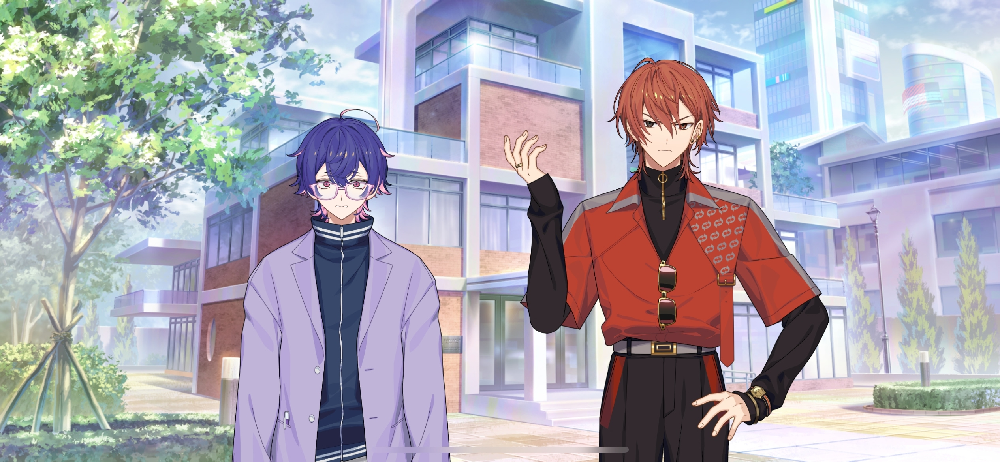
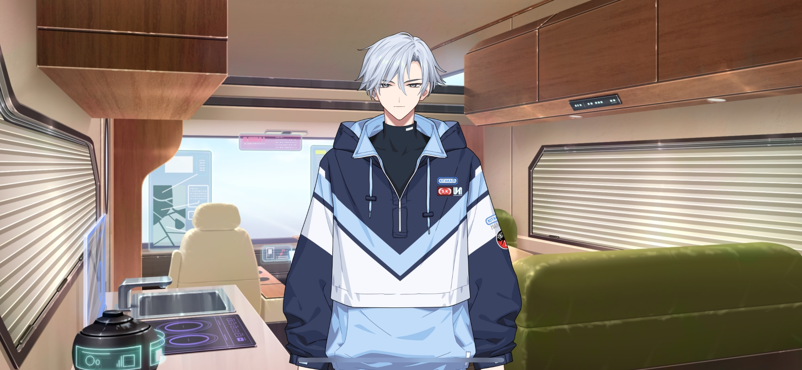
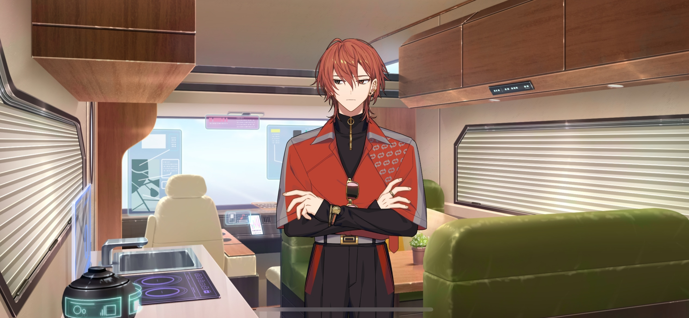
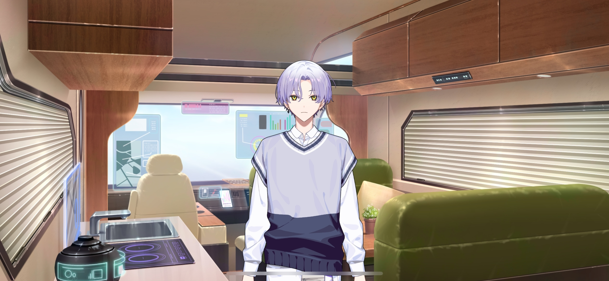

import "@/styles/series/18trip.scss";

# Morning of the Departure

<Divider loc="HAMA House" />

<Bubble character="Renga">
HUH?! The hell do you mean, Yachiyo?!
</Bubble>

<Bubble character="Yachiyo">
I-I’m sorry, I’m so, so sorry!!
</Bubble>

<Bubble character="Renga">
Shut up! I went outta my way to clear a space in my schedule for _this?!_
</Bubble>

<Bubble character="Liguang">
&ast;sigh&ast; Quit throwing a tantrum. It won’t change the fact that we don’t have a minibus to take.
</Bubble>

<Bubble character="Renga">
Wh… Liguang, stop acting like I’m the only one mad here!!
</Bubble>

<Bubble character="Yachiyo">
Almighty Liguang, my savior!! I can’t believe you would defend me…! May I have the honor of calling you boss…?!
</Bubble>

<Bubble character="Liguang">
Urg…
</Bubble>

<Bubble mc>

(Liguang is the last person I’d expect to back away from someone in fear like that…)

</Bubble>

<Bubble character="Yachiyo">
Almighty Liguang?
</Bubble>

<Bubble character="Kafka">
Liguang works best with people who are highly skilled. I guess he’s scared of Yachiyo’s overwhelming levels of clumsiness.
</Bubble>

<Bubble mc>
You’re saying it’s so bad that it’s something to fear…? I see.
</Bubble>

<Bubble character="Kafka">
&ast;sigh&ast; But this certainly isn’t good. The plan was to take a minibus to KOBE, but I didn’t have a plan B in case we didn’t reserve one.
</Bubble>

<Bubble mc>

(It’s my fault for letting my guard down. I knew that Yachiyo-kun tends to let things slip through the cracks…)

</Bubble>

<Bubble character="Yachiyo">
I can only atone with my death…!! I have to cut open my stomach…!!
</Bubble>

<Bubble character="Ten">
We can just take the bullet train instead. It’s faster that way anyway.

Want me to get us seats?
</Bubble>

<Bubble character="Kafka">
No, it’s fine. I specifically wanted us to drive there, so I’d rather not take the train. Hmm, what now…
</Bubble>

<Bubble mc>
Hm? Is that…?
</Bubble>

<Bubble character="Yukikaze">
Sakujiro-san’s in it.
</Bubble>

<Bubble character="Sakujiro">
Back, back… Mr. President, I just had this prepared for you. Please, feel free to take this camper van.

I also had the HAMA Tours logo digitally printed on its side.
</Bubble>

<Bubble character="Kafka">
Wow, Sakujiro. You always come in clutch, even for the smallest things.&nbsp;♪
</Bubble>

<Bubble mc>

(I wouldn’t really call that “small!” How did he find a whole van that fast?!)

</Bubble>

<Bubble character="Sakujiro">
It has already passed my safety inspection. However, this van is an older model, thus, it does not have a self-driving function. I recommend those who are licensed to take turns driving.
</Bubble>

<Bubble character="Renga">
Ugh… You have to drive it manually…? How am I supposed to stay classy in that thing?
</Bubble>

<Bubble mc>
Uh, can everyone who has a driver’s license raise their hands?
</Bubble>

<Bubble character="Ten">
……

(I’ll pretend I don’t have one. I really don’t wanna drive this thing.)

</Bubble>

<Bubble character="Kafka">
So it’s Chief, Yukikaze, Liguang, and Yachiyo. Could I ask the four of you to drive for us?
</Bubble>

<Bubble character="Yachiyo">
P-P-P-P-Please, allow me to do all the driving…!! I’m the one who forgot to rent the minibus!!
</Bubble>

<Bubble mc>
That would be nice, but…are you sure? It’s a pretty big van, so it won’t be easy to drive.
</Bubble>

<Bubble character="Yachiyo">
I’m a country boy from up north! I’m used to driving everywhere, so I can handle it…!! I think.
</Bubble>

<Bubble mc>

(He thinks…?)

</Bubble>

<Bubble character="Kafka">
If you want to, I’ll allow it. We’re already behind schedule, so let’s get moving.
</Bubble>

<Bubble character="Sakujiro">
Have a wonderful trip, everyone. I shall send you off with a dance praying for your great fortune.
</Bubble>

<Bubble mc>
Ahaha… See you later.
</Bubble>

<Divider loc="Camper Van" />

<Bubble character="Yukikaze">
Looks like it fits all seven of us well.
</Bubble>

<Bubble mc>
I’ve never been in a camper van before. There’s so much stuff!
</Bubble>

<Bubble character="Renga">
…There’s a rice cooker and a fridge. Even a working sink. If I found something like this on the side of the road when I was a kid, it would’ve helped a lot…
</Bubble>

<Bubble mc>

(Side of the road? But Renga-kun’s family is pretty rich. They even have that big mansion… Maybe that’s why he’s never seen something like this.)

</Bubble>

<Bubble character="Kafka">
Oh, now _this_ is nice. Not something you see every day. It really makes you feel like you’re going on a trip! I’d love to spend a night in here.
</Bubble>

<Bubble character="Ten">
No way. My back would hurt like hell.
</Bubble>

<Bubble mc>

(Everyone’s seated and buckled in.)

Okay, Yachiyo-kun. We’re ready to g&NoBreak;—
</Bubble>

<Narration>
&ast;engine revving&ast;
</Narration>

<Bubble mc>
Uwah?!
</Bubble>

<Narration>
&ast;thud&ast;
</Narration>

<Bubble character="Renga">
Ouch! Yachiyo, you little… Warn us before you start driving!
</Bubble>

<Bubble character="Yachiyo">
If you don’t wanna die, then stop talking… I am a cheetah… I am a puma… I am a laser… I am the fastest being in the world…
</Bubble>

<Bubble character="Renga">
There’s a red light!! Red means stop&NoBreak;—
</Bubble>

<Narration>
&ast;screeching&ast; &ast;thud&ast;
</Narration>

<Bubble character="Renga">
Agh!
</Bubble>

<Bubble character="Liguang">
…Ugh.
</Bubble>

<Bubble character="Yukikaze">
What beautiful skill. Enough to land a quadruple axel.
</Bubble>

<Bubble character="Kafka">
Yachiyo! Stop stop STOP! You’re gonna kill us before we even make it to KOBE!
</Bubble>

<Bubble character="Yukikaze">
I guess you could say we ko-be dead before we arrive.
</Bubble>

<Bubble character="Kafka">
Ugh… I just got chills. Could you leave those at the ice rink instead of giving them to me…?
</Bubble>

<Divider timeskip />

<Bubble character="Renga">
I… I really thought I was a goner.
</Bubble>

<Bubble character="Yachiyo">
I-I’m so sorry… My personality changes when I get in the driver’s seat…
</Bubble>

<Bubble mc>

(I couldn’t really tell any difference, to be honest…)

</Bubble>

<Bubble character="Yachiyo">
Oh, since we have a sink and a stove, I’ll make everyone some tea!!
</Bubble>

<Bubble character="Liguang">
Hey, don’t move, Fukeuki…
</Bubble>

<Narration>
&ast;water spraying&ast;
</Narration>

<Bubble character="Yachiyo">
Hyahah!!
</Bubble>

<Bubble character="Renga">
Urgh!! Why’d it only get on me?!
</Bubble>

<Bubble character="Liguang">
……

Now we have _two_ catastrophe magnets…
</Bubble>

<Bubble character="Renga">
Huh?! You better not be talkin’ about me!
</Bubble>

<Bubble character="Liguang">
……
</Bubble>

<Bubble character="Renga">
Hey, don’t ignore me! Take off your earbuds and listen!
</Bubble>

<Bubble character="Ten">
Renga-san, being drenched in water makes you look even more handsome.
</Bubble>

<Bubble character="Renga">
Oh, r-really?
</Bubble>

<Bubble mc>

(I-I can’t focus on driving with all that noise in the back…! I hope I don’t crash.)

</Bubble>

<Bubble character="Kafka">
Ahaha, this is so fun. A trip isn't a trip without its troubles.

With you driving and me in the passenger seat, it feels like it’s just the two of us.
</Bubble>

<Bubble mc>

(Kafka’s so strong to be able to ignore all the chaos so easily…)

</Bubble>

<Divider timeskip />

<Bubble character="Kafka">
Oh, we made it out of HAMA!

…This is the first time I’ve been out of the city. It’s just as you’ve always told me, Chief. Trips are so exciting!
</Bubble>

<Bubble mc>
……

(Kafka looks so happy. As long as I get to see him smile like that, this trip can survive even the worst hardships.)

(Alright! Let’s focus on getting everybody to KOBE safe and sound!)

</Bubble>
