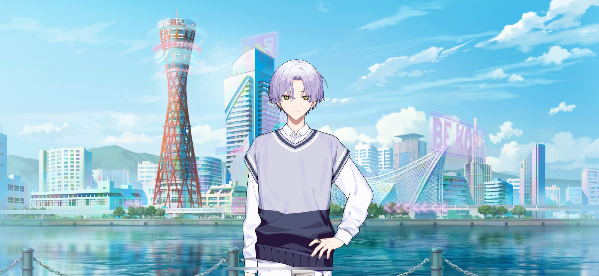
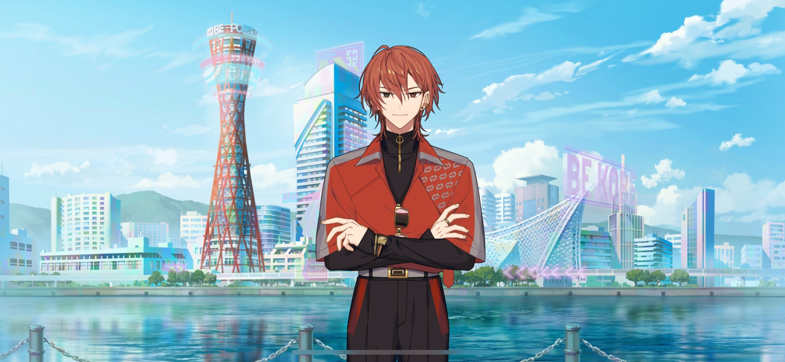
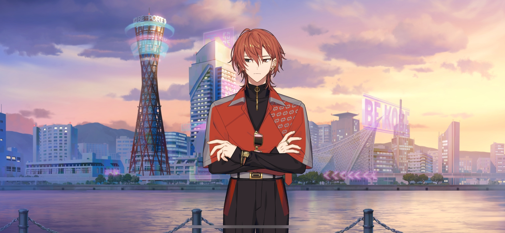
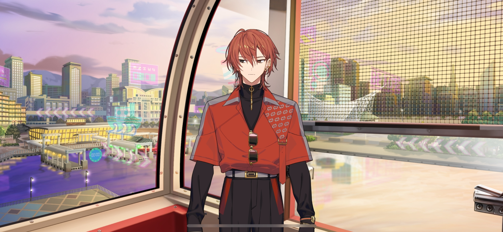

import "@/styles/series/18trip.scss";

# Bumps in the Road

<Divider loc="KOBE - Meriken Park" />

<Bubble mc>

(We ran into some trouble at the beginning, but we made it to KOBE! We checked into our hotel too… Now we can finally explore!)

</Bubble>

<Bubble character="Kafka">
Let’s start by checking out the harbor. Some parts are similar to HAMA, so it’ll be good reference material.
</Bubble>

<Bubble character="Ten">
Cool. Renga-san, let’s look around together.
</Bubble>

<Bubble character="Renga">
Y-Yeah…! That’s fine with me. But just this once…!
</Bubble>

<Bubble mc>
It does kind of remind me of HAMA, but…
</Bubble>

<Bubble character="Kafka">
Something on your mind, Chief?
</Bubble>

<Bubble mc>
There are a lot of women around here. Everybody looks really upbeat and happy.
</Bubble>

<Bubble character="Liguang">
I came to KOBE to survey the area before the current Ward 0 mayor took over. It wasn’t this prosperous back then.

It seems as though the new Ward 0 mayor succeeded in reinvigorating the city’s tourism industry.
</Bubble>

<Bubble mc>

(I see… I didn’t know a new mayor could change so much about the city. Liguang-san seems to know a lot about tourism.)

</Bubble>

<Narration>
&ast;cheering&ast;
</Narration>

<Bubble character="KOBE Fan A">
Minamo, we missed you so much!
</Bubble>

<Bubble character="KOBE Fan B">
We’re back in town! We wanted to get another fill of KOBE!
</Bubble>

<Bubble character="Minamo" name="???">
Oh, Satou-san and Tanaka-san. It’s been three months, hasn’t it? Has work lightened up for you two? I’m happy to see you here again.
</Bubble>

<Bubble character="KOBE Fan A">
Heheh, this time, we fully booked out the Oshikiri Minamo Tour Plan for two whole days!
</Bubble>

<Bubble character="KOBE Fan B">
All to make loooots of new, precious memories with you!
</Bubble>

<Bubble character="Minamo" name="???">
Really? I’m so glad to hear that. I’m looking forward to seeing you tomorrow.
</Bubble>

<Bubble character="Renga">
W-What’s going on…
</Bubble>

<Bubble character="Kafka">
That’s…Oshikiri Minamo. He’s the KOBE Ward 2 mayor. He’s very popular for his hospitality services, so it might be worth it to try and replicate what he does.
</Bubble>

<Bubble character="Renga">
Huhhh? You want us to kiss up to our guests like that? A Nishizono would never be caught doing something so unclassy!
</Bubble>

<Bubble character="Liguang">
Tch… An unaccomplished moron like you shouldn’t speak. Who do you expect to win over with that pompous attitude?
</Bubble>

<Bubble character="Renga">
Huh?! Liguang, you tryna pick a fight with me again?!

People should visit us because they actually love HAMA, not because they wanna be pampered!
</Bubble>

<Bubble character="Liguang">
You must live in a fairytale if you believe that HAMA is in a position to cherry-pick who deserves to visit.
</Bubble>

<Bubble character="Renga">
What was that…?!
</Bubble>

<Bubble character="Kafka">
No fightiiiing. Although I will admit that Liguang has a point.

There’s a difference between hospitality and pandering. I think you might be blinded by your pride here, Renga.
</Bubble>

<Bubble character="Renga">
I-I just…! As a Nishizono, I have to carry on HAMA’s history…!

Even if we can’t bring in happy-go-lucky visitors like that, all we need is a high quality tour package, and people will start coming in naturally!
</Bubble>

<Bubble character="Liguang">
Have you no grip on reality? There’s no reasoning with you.
</Bubble>

<Bubble character="Renga">
…Argh, Liguang, you asshole…!
</Bubble>

<Bubble character="Yukikaze">
Can’t you get along for now, my little brothers?
</Bubble>

<Bubble character="Ten">
Let’s just get outta here. People are staring.
</Bubble>

<Bubble character="KOBE Fan C">
Huh, is that Nishizono Renga?
</Bubble>

<Bubble character="KOBE Fan D">
It is! Wait, I saw Kamina Yukikaze too!
</Bubble>

<Bubble character="KOBE Fan B">
I saw him on TV yesterday! Let’s get his autograph!
</Bubble>

<Bubble mc>

(Ah…! They saw us! Oh no, we have to handle this well, or else HAMA’s reputation will take a hit!)

</Bubble>

<Narration>
&ast;cheering&ast;
</Narration>

<Bubble character="Renga">
Wh-What’s wrong with them? They’re coming towards us…
</Bubble>

<Bubble character="Ten">
Uh-oh. I told you.
</Bubble>

<Bubble character="Yukikaze">
Now that I think about it, I forgot to put on my disguise.
</Bubble>

<Bubble character="Renga">
Th-There’s no place to run…!
</Bubble>

<Bubble mc>
Renga-kun! All of you! Let’s do our best to provide hospitality in the name of HAMA!
</Bubble>

<Bubble character="Renga">
H-Huh? I don’t wanna do anything to help out KOBE…
</Bubble>

<Bubble mc>
But you’re a celebrity, right? I know you’re strong enough to handle it!
</Bubble>

<Bubble character="Renga">
…!
</Bubble>

<Divider omotenashi />

<Bubble character="Renga">
Hmph! I expect you to follow me from now on, commoners.
</Bubble>

<Bubble character="KOBE Fan A">
Ahaha! They weren’t kidding! His ego is gigantic!
</Bubble>

<Bubble character="Renga">
Frame my autograph in pure gold! “All that matters to me…is the real thing.”
</Bubble>

<Bubble character="KOBE Fan B">
Oh, my god! He said it! We got to hear THE Nishizono Renga catchphrase in person! I’m so glad I came to KOBE.
</Bubble>

<Bubble character="KOBE Fan C">
See you, Nishizono Renga!
</Bubble>

<Bubble character="Renga">
Stop saying my full name like that!

Dammit, in the end it only helped out KOBE… They probably wouldn’t even consider coming to HAMA…
</Bubble>

<Bubble mc>

(Phew, we made it through… Renga-kun may have a sailor's mouth, but he’s still a celebrity. Everyone walked away happy…)

</Bubble>

<Bubble character="Minamo">
Excuse me… You’re all mayors from HAMA, right? Thank you so much for the help.
</Bubble>

<Bubble character="Renga">
…You’re one of the mayors here, yeah? All you’re doing out here is kissing your guests’ asses, so we ended up doing the same thing.
</Bubble>

<Bubble character="Minamo">
Wh&NoBreak;—
</Bubble>

<Bubble character="Renga">
But they’re all just praising KOBE now. Your unclassy piece of shit method did nothing to help us!
</Bubble>

<Bubble mc>
H-Hey, Renga-kun…!
</Bubble>

<Bubble character="Liguang">
Tch… That’s enough, you dimwit. What are you, a toddler?
</Bubble>

<Bubble character="Renga">
You got a problem, Liguang?! What, I can’t even have an honest opinion now?!
</Bubble>

<Bubble character="Liguang">
Nothing about that is honest. It’s uncouth, unintelligent, and an indicator that you don’t know your place.

What makes you think you have the right to criticize KOBE’s Ward 2 mayor?
</Bubble>

<Bubble character="Renga">
I… I’m a visitor right now! I’m allowed to tell him what I think!
</Bubble>

<Bubble character="Liguang">
If that’s the only thing you can come up with, you’ll stay an imbecile until the day you die. Stop embarrassing yourself!
</Bubble>

<Bubble character="Renga">
Wh…!
</Bubble>

<Bubble character="Yukikaze">
Liguang, stop adding fuel to the fire. It won’t help anyone. Besides, you’re worrying the Ward 2 mayor here.
</Bubble>

<Bubble character="Minamo">
I-I’m so sorry. Did the guests from before do something to upset you…?
</Bubble>

<Bubble character="Liguang">
&ast;sigh…&ast; I need some space.

Oguro, put a leash on that dog over there. If you don't, this ship is doomed to sink, and I won’t help you when it does.
</Bubble>

<Bubble character="Kafka">
&ast;sigh&ast; Now it’s all on me. What to do…
</Bubble>

<Bubble character="Renga">
…What the hell? Why am _I_ the bad guy here?

Fuck it, I’m leaving too!
</Bubble>

<Bubble mc>
Ah… Renga-kun!

Ya-Yachiyo-kun, can you hold down the fort? I’m gonna try and bring Renga-kun back.
</Bubble>

<Bubble character="Yachiyo">
W-Whuhhh, m-me?!
</Bubble>

<Bubble character="Ten">
Ah, I can go talk to him. Y’know, since we’re friends.
</Bubble>

<Bubble character="Kafka">
You need to stay. You came here to observe.

I’ll leave up to you, Chief. Help him cool off a little.
</Bubble>

<Bubble mc>
Thank you, Kafka! I’ll be back!

(Renga-kun did go too far back there, but… Liguang-san’s normally so even-tempered, so why does he only start things when it comes to Renga-kun?)

(I need to focus on bringing Renga-kun back for now!)

</Bubble>

<Divider timeskip />

<Bubble character="Renga">
……
</Bubble>

<Bubble mc>

(There he is…! He still looks upset…)

Renga-kun…
</Bubble>

<Bubble character="Renga">
…! Why’d you follow me?!
</Bubble>

<Bubble mc>
Well…because I’m worried about you?

Let’s go back. We can talk things out…
</Bubble>

<Bubble character="Renga">
…Did you say the same thing to Liguang?
</Bubble>

<Bubble mc>
…Well, umm… I figured Liguang-san would come back on his own once he calmed down…
</Bubble>

<Bubble character="Renga">
…I knew it. You think Liguang’s right and that I’m just being stupid!
</Bubble>

<Bubble mc>

(That’s not… But I guess he’s half right? I do think that Liguang’s reasoning made sense…)

</Bubble>

<Bubble character="Renga">
Whatever. I’ll just look around on my own.
</Bubble>

<Bubble mc>
W-Wait, Renga-kun! Can we at least do it together?
</Bubble>

<Bubble character="Renga">
Why?! Leave me alone!
</Bubble>

<Bubble mc>
W-Wow, you’re stubborn. I just wanted to walk around with you.
</Bubble>

<Bubble character="Renga">
Shut up! I’m just gonna run!
</Bubble>

<Bubble mc>
Ah! He ran off!

(If he’s gonna be like that, then I…!)

</Bubble>

<Divider timeskip />

<Bubble character="Renga">
&ast;pant, pant, pant…&ast; What’s your problem…?
</Bubble>

<Bubble mc>
&ast;pant, pant…&ast; I’m just…doing my job…
</Bubble>

<Bubble character="Pushy Ferris Wheel Operator">
Welcome to the famous KOBE Ferris wheel! Just the two of you?
</Bubble>

<Bubble character="Renga">
…Huh?
</Bubble>

<Bubble character="Pushy Ferris Wheel Operator">
It’ll be 800 yen each! You don’t have tickets? Ah, but the cabin’s already here, so you can just pay after! In you go!
</Bubble>

<Bubble character="Renga">
What? Stop pushi&NoBreak;— Woah!
</Bubble>

<Bubble mc>
Wait, please don’t push u&NoBreak;— Ahh!
</Bubble>

<Bubble character="Pushy Ferris Wheel Operator">
Enjoy your view of KOBE!
</Bubble>

<Divider loc="KOBE Mosaic Ferris Wheel" />

<Bubble character="Renga">
……
</Bubble>

<Bubble mc>
I guess we’re on a Ferris wheel now…
</Bubble>
