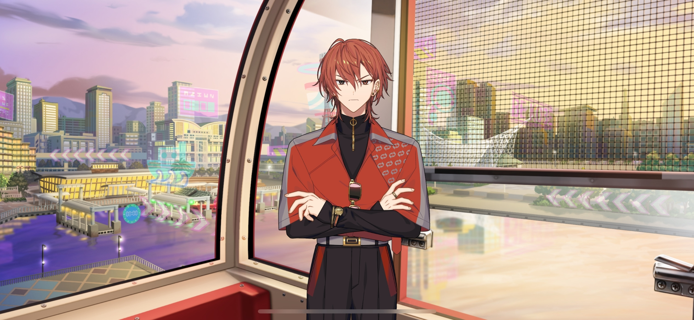

import "@/styles/series/18trip.scss";

# 11 Minutes in the Air

<Divider loc="KOBE Mosaic Ferris Wheel" />

<Box type="radio">
&lt;&NoBreak;This Ferris wheel was built in hopes of recovery from the earthquake and offers a beautiful panoramic view of the Port of KOBE and Mt. Rokko…&NoBreak;&gt;
</Box>

<Bubble character="Renga">
……
</Bubble>

<Bubble mc>

(This is awkward… Renga looks like he’s in an even worse mood.)

…The view from here is so nice! I know we didn’t mean to get on it, but I’m glad we did!

(I need to lighten the mood…)

</Bubble>

<Bubble character="Renga">
…HAMA has a Ferris wheel too.
</Bubble>

<Bubble mc>
Ah, the Cosmo Clock 21, right? I love that one!

The Cosmo Clock ride is about 15 minutes, right? This one’s only 11…
</Bubble>

<Bubble character="Renga">
Huh… I didn’t know that.
</Bubble>

<Bubble mc>
Hm? You’ve never been on it before?
</Bubble>

<Bubble character="Renga">
…Why the hell would I?! It’s in that bastard Liguang’s ward!
</Bubble>

<Narration>
&ast;rattling&ast;
</Narration>

<Bubble mc>
Wah!
</Bubble>

<Bubble character="Renga">
Hyah…
</Bubble>

<Bubble mc>

(Th-That scared me. It swayed because Renga stood up so suddenly…)

</Bubble>

<Bubble character="Renga">
Sor&NoBreak;— Uh, well maybe you shouldn’t have said something so stupid… You expect me to get on a ride for commoners?
</Bubble>

<Bubble mc>

(I don’t think Ferris wheels are specifically a “commoner” thing…)

Ah, then we can just look at the view! The sun’s about to set, so we can see all the pretty lights around the harbor.
</Bubble>

<Bubble character="Renga">
…HAMA has a harbor too.
</Bubble>

<Bubble mc>
U-Uh… Then how about Mt. Rokko?
</Bubble>

<Bubble character="Renga">
I’ve never gone hiking before.
</Bubble>

<Bubble mc>
Really? We’re going to Mt. Rokko in a couple of days. It’s in our guidebook. It’s really beautiful in the spring with all the flowers.
</Bubble>

<Bubble character="Renga">
Flowers…
</Bubble>

<Bubble mc>

(Did I finally get his attention?! Why does it kinda feel like I’m trying to tame a wild animal…)

</Bubble>

<Bubble character="Renga">
…So, uh… Speaking of flowers…
</Bubble>

<Bubble mc>
What about them?
</Bubble>

<Bubble character="Renga">
That one you gave me….
</Bubble>

<Bubble mc>
Oh! The rose?
</Bubble>

<Bubble character="Renga">
Yeah, uh, that. I guess it wasn’t that bad.

Like, uh, it didn’t look bad when I put it up…
</Bubble>

<Bubble mc>

(Hm? Is he trying to thank me…?)

(I don’t know where this is going, but since Renga-kun’s finally talking, I need to follow through!)

Renga-kun, do you like roses?
</Bubble>

<Bubble character="Renga">
…My grandmother does.
</Bubble>

<Bubble mc>
Ah, so did you take it home to give it to her?
</Bubble>

<Bubble character="Renga">
…She’s…

She passed away. Not that long ago…
</Bubble>

<Bubble mc>
…!

(Is that why he was wearing a suit in the rain that day…? Was he coming home from his grandmother’s funeral?)

</Bubble>

<Bubble character="Renga">
Do you know how to…grow roses? Um… I’m taking care of her rose garden at home now…

D-Don’t get the wrong idea! It’s not like we can’t hire a gardener to help or anything!

And I’m not doing it because I really want to… I just… I…
</Bubble>

<Bubble mc>
…Since it’s something important to your family, you probably have to, right?
</Bubble>

<Bubble character="Renga">
Yeah… I’m just doing it to kill time…
</Bubble>

<Bubble mc>
…Um, I know someone who knows a lot about flowers. Do you want me to ask him?
</Bubble>

<Bubble character="Renga">
…!

Seriously?! Will you really?!
</Bubble>

<Bubble mc>

(Huh? He perked up… He acted like it wasn’t, but that rose garden must be really important to him.)

</Bubble>

<Bubble character="Renga">
That'd be great! I’m kinda stupid, so… Ah&NoBreak;—

I mean, I can’t waste my genius on something as insignificant as a rose garden!
</Bubble>

<Bubble mc>
Ahaha…

(Renga-kun’s childish and short-tempered… And not to mention hard to handle, but I have a feeling he’s more than all of that.)

(It makes me a little sad… He seems to be struggling with something. Would it be too much if I told him he should be more honest with himself?)

Oh, I forgot. Here, you can have this.
</Bubble>

<Bubble character="Renga">
What’s this…? A toy?
</Bubble>

<Bubble mc>
It’s a cassette recorder. You can make a recording by pressing this button. I think you should start recording weekly voice journals.
</Bubble>

<Bubble character="Renga">
…Why would I do that when I can just tell you?
</Bubble>

<Bubble mc>
It’ll be nice to keep records of your entries and hear your voice saying them. Please give it a try, as our leader!

(This is what started my friendship with Kafka when we were kids, but… If I told Renga-kun that, he’d think I was babying him.)

(I really think that since you’re only recording your voice, it’s hard to lie. So…I might get to hear his true feelings.)

</Bubble>

<Bubble character="Renga">
&ast;sigh&ast;

Fine, I’ll do it… But only if you remember to hold up your end of the deal too.

Promise me you’re gonna ask the guy you know about roses.
</Bubble>

<Bubble mc>
…!

I promise!
</Bubble>
