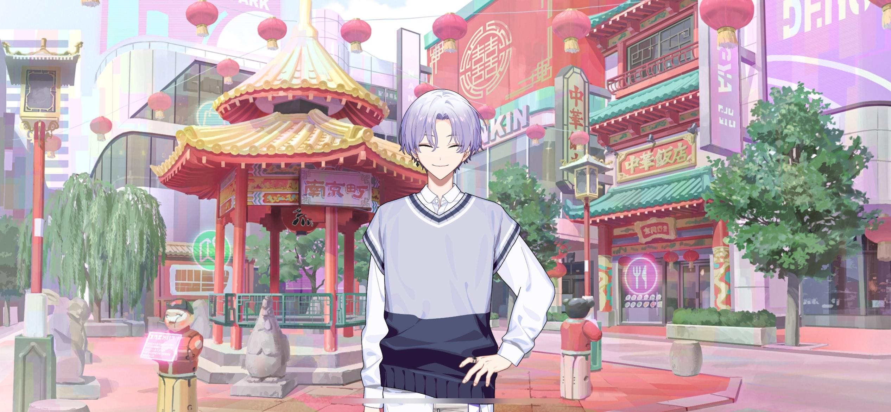

import "@/styles/series/18trip.scss";

# Like Oil and Water

<Divider loc="KOBE - Hotel Room" />

<Narration>
&ast;knocking&ast;
</Narration>

<Bubble mc>
Come in… Oh, Yuki-nii. What’s up?
</Bubble>

<Bubble character="Yukikaze">
I bought some chocolate mousse from the lobby. Do you want to eat it together?
</Bubble>

<Divider timeskip />

<Bubble mc>
Mmm, it’s so nice to have a sweet treat after being out all day! Thanks, Yuki-nii.
</Bubble>

<Bubble character="Yukikaze">
No problem. You were out walking with Renga for a while, right? You deserve it.
</Bubble>

<Bubble mc>
Yeah, I’m glad we were able to talk things out. Did Liguang-san ever end up coming back to you guys?
</Bubble>

<Bubble character="Yukikaze">
Yeah, it didn’t take him long. He calmed down fast.
</Bubble>

<Bubble mc>
I see…

(That makes sense… Renga-kun was kind of in a bad mood the entire time.)

</Bubble>

<Bubble character="Yukikaze">
…What’s wrong? Is something bothering you?
</Bubble>

<Bubble mc>
Ahaha… You can tell?
</Bubble>

<Bubble character="Yukikaze">
Of course I can. I know everything about you.
</Bubble>

<Bubble mc>
…I wonder if Liguang-san and Renga-kun will ever get along… They’re always so hostile towards each other.
</Bubble>

<Bubble character="Yukikaze">
…Yeah.
</Bubble>

<Bubble mc>
Renga-kun’s personality is just kinda like that, but it’s like Liguang-san goes out of his way to bump heads with him.
</Bubble>

<Bubble character="Yukikaze">
I don’t know the details, but I have a feeling that it’s been like that for a while. They were the same when we were in high school.
</Bubble>

<Bubble mc>
They enrolled when you were in your third year, right, Yuki-nii? They didn’t get along even back then?
</Bubble>

<Bubble character="Yukikaze">
The Nishizono and Lu families seem to have a good relationship since they both have a hand in supporting HAMA. Renga and Liguang are the only exceptions.
</Bubble>

<Bubble mc>
…Something big must’ve happened if they hate each other that much.
</Bubble>

<Bubble character="Yukikaze">
I tried asking Liguang about it after we moved into the dorms. I don’t think Renga’s all that bad of a person.

He told me that he thinks Renga isn’t fit to be the heir of the Nishizono family. Apparently that’s why he gets so angry around him…
</Bubble>

<Bubble mc>

(I see… Well, I guess I kind of get it. Renga isn’t exactly the most empathetic guy around…)

(But is that the only reason? If that was really it, I’d expect Liguang-san to just ignore him rather than pick fights.)

</Bubble>

<Bubble character="Yukikaze">
This is just a rumor, but… You know how Liguang was in the student council in high school, right?

Renga wanted to join too, but he was rejected because his grades weren’t good enough.

Previous heads of the Nishizono and Lu families have always been in the student council. But since Renga couldn’t get in, he was made fun of…
</Bubble>

<Bubble mc>
That’s awful…
</Bubble>

<Bubble character="Yukikaze">
On the other hand, Liguang excelled at everything, so they were compared to each other a lot. Renga hates to lose, so that must’ve added to their tension.
</Bubble>

<Bubble mc>

(Is that why Renga-kun wanted to be the leader?)

That must’ve been hard on him… I didn’t expect them to become best friends, but I at least wanted to bridge the gap between them during this trip…
</Bubble>

<Bubble character="Yukikaze">
That would be nice. I’m here to help if you need me.
</Bubble>

<Bubble mc>
Thanks! I’ll definitely let you know!

(If that’s the reason Liguang-san doesn’t like Renga-kun, then…I wonder if things will change between them if Renga-kun improves himself. I wanna help him out.)

</Bubble>

<Divider loc="KOBE - Nankinmachi" />

<Bubble character="Kafka">
Wow, KOBE’s Chinatown is filled to the brim with people!
</Bubble>

<Bubble mc>
Yeah, it’s packed!
</Bubble>

<Bubble character="Ten">
Something smells good. Man, now I’m hungry.
</Bubble>

<Bubble character="Renga">
Hmph… This place looks cheap. HAMA’s Chinatown is way more impressive.
</Bubble>

<Bubble mc>

(He’s putting KOBE down again… I guess that’s a bad habit of his…)

</Bubble>

<Bubble character="Kafka">
Well, that’s what our leader thinks, but how about you, Liguang? Your family oversees our Chinatown.
</Bubble>

<Bubble character="Liguang">
Everything here is cohesive, and all of the restaurants are welcoming and friendly. They also have measures in place to make sure young women feel safe walking around. It makes for good reference material.
</Bubble>

<Bubble character="Renga">
What, you got no pride for your own ward or something? Can’t believe a dump like this is impressing you.
</Bubble>

<Bubble character="Liguang">
Are you a monkey? If you have nothing better to do than complain, you might as well go back to the mountains where you belong.
</Bubble>

<Bubble character="Renga">
Wha…!
</Bubble>

<Bubble character="Ten">
Kinda wanna get a dongpo pork burger. Renga-san, you wanna get one together? Since we’re friends.
</Bubble>

<Bubble character="Renga">
……

Ahem, I guess I don’t mind. Since we’re friends.
</Bubble>

<Bubble mc>
Let’s all get one! This can help with our research too!
</Bubble>

<Divider timeskip />

<Bubble character="Ten">
…Oh, it’s good.
</Bubble>

<Bubble character="Yachiyo">
I-It tastes like heaven… I think I just died and saw the pearly gates for a second… Huhu, here I am, God…
</Bubble>

<Bubble character="Kafka">
Mmm, the pork is really tender. It’s so good. ♪
</Bubble>

<Bubble character="Yukikaze">
Hm, this easily takes home the Yukikaze Medal. It might even be in the running for gold this year.

It could work as gyoza too. Chief, if I made some dongpo pork gyoza, would you eat them?
</Bubble>

<Bubble character="Kafka">
Okay, cut that out. Nobody mentioned gyoza.
</Bubble>

<Bubble character="KOBE Visitor E">
Hey, is that Kamina Yukikaze? Like, the figure skater?
</Bubble>

<Bubble character="KOBE Visitor F">
It is! Wow, his skin is so glassy… And is that Nishizono Renga next to him?!
</Bubble>

<Bubble character="KOBE Visitor G">
Excuse me! Can I get a picture with you?
</Bubble>

<Bubble mc>

(Oh no, here we go again! We need to clear this up…!)

</Bubble>

<Divider omotenashi />

<Bubble character="Yukikaze">
Thank you for the support.
</Bubble>

<Bubble character="KOBE Visitor E">
I’m so excited to see your quads next competition!
</Bubble>

<Bubble character="KOBE Visitor F">
I’m so glad I came to KOBE today. This city’s the best!
</Bubble>

<Bubble character="Renga">
Dammit, why do we have to do all of this to help out KOBE? I’m HAMA’s mayor…
</Bubble>

<Bubble mc>

(Renga’s mood is taking a nosedive again… I guess we stand out a little too much.)

(Is there any way we can walk around without getting noticed?)

</Bubble>

<Bubble character="Yukikaze">
……

Alright, I have an idea. Leave this to me.
</Bubble>

<Bubble character="Renga">
…?
</Bubble>

