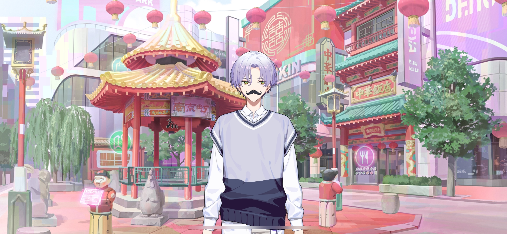
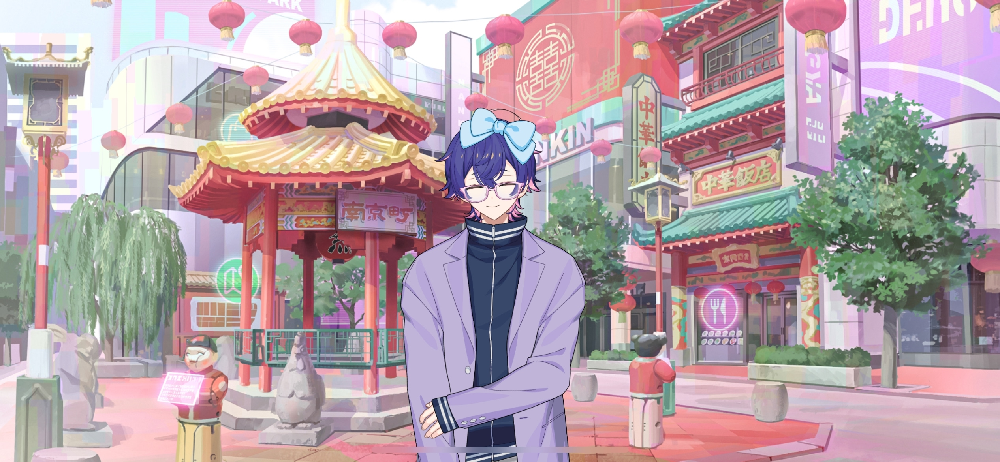
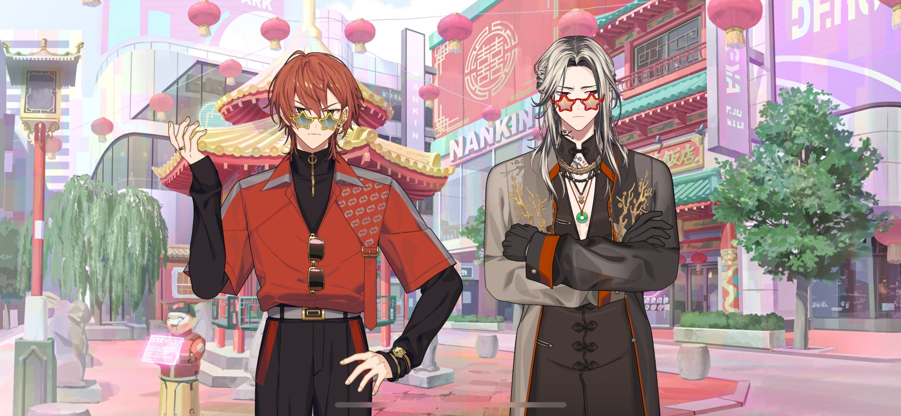
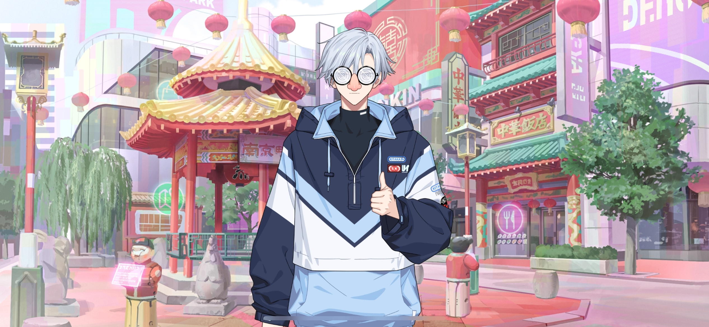

import "@/styles/series/18trip.scss";

# Lady of Chinatown

<Divider loc="KOBE - Nankinmachi" />

<Bubble character="Kafka">
…Um, I get why you and Renga have to, but why do I have to wear this too?
</Bubble>

<Bubble character="Yukikaze">
You look good, Kafka. My “Outing with <Name first /> Disguise Tools” are working well.
</Bubble>

<Bubble character="Kafka">
Huhhh? I don’t want any compliments from you, and that name is pissing me the hell off!
</Bubble>

<Bubble character="Yachiyo">
This bow is so cute… If you just add lace… Ack, snap out of it, Yachiyo! You’re gonna expose your online girl persona…!
</Bubble>

<Bubble character="Ten">
An eyepatch? Seriously? This just makes me stand out more.
</Bubble>

<Bubble character="Renga">
What the hell is this?! Can’t I just wear a cap and mask?!
</Bubble>

<Bubble character="Liguang">
…Tch. I can’t see…
</Bubble>

<Bubble mc>
Well, I don’t think anyone will recognize us with these on, at least…

(Renga-kun and Liguang-san are matching… Yuki-nii, you sure are brave for giving those glasses to them.)

</Bubble>

<Bubble character="Yukikaze">
……
</Bubble>

<Bubble mc>

(He’s giving me a thumbs up. Does that mean he did it on purpose to help them get along?)

(If they realize, it actually might make things worse…! I need to distract them for now.)

Okay, let’s get back t&NoBreak;—
</Bubble>

<Bubble character="Mafia Member A">
Now what’s the brat from the Lurong family doin’ ‘round these parts?
</Bubble>

<Bubble character="Liguang">
……
</Bubble>

<Bubble character="Mafia Member B">
What business does a HAMA kid got in someone else’s territory?
</Bubble>

<Bubble character="Liguang">
…I’m here to observe, not for family business.
</Bubble>

<Bubble character="Mafia Member A">
Huh? You think we’d believe that? Take your ass back to your little city before we dump your body in the harbor!!
</Bubble>

<Bubble character="Liguang">
……
</Bubble>

<Bubble character="Yachiyo">
Hieeee, th-th-they’re actual yakuza membeeers!

I’m gonna die… I’m gonna piss my pants…!!
</Bubble>

<Bubble mc>

(W-W-What do we do?!)

</Bubble>

<Bubble character="Yukikaze">
Hm, they saw through our flawless disguise. They must know Liguang well.
</Bubble>

<Bubble mc>

(Yuki-nii, are you seriously impressed by them right now…?!)

</Bubble>

<Bubble character="Kotonojo" name="???">
What are you doing?
</Bubble>

<Bubble character="Mafia Member A">
…K-Kotonojo-sama?!
</Bubble>

<Bubble character="Kotonojo">
You lot are from Chinto’s territory. This is _my_ garden, so can I ask why you’re messing with _my_ guests?
</Bubble>

<Bubble character="Mafia Member B">
Hyah… I-It’s not what you think, Kotonojo-sama. This guy isn’t just a guest, he’s&NoBreak;—
</Bubble>

<Bubble character="Kotonojo">
HUH?

What did you say? I didn’t hear you. Cat got your tongue? Should I rip it out for you?
</Bubble>

<Bubble mc>

(She looks so pretty and refined, b-but she’s actually really scary…!!)

</Bubble>

<Bubble character="Mafia Member A">
W-W-We’re terribly sorry!! H-Hey, let’s go!
</Bubble>

<Bubble character="Mafia Member B">
A-Ayeah… Pwease enjoy your twip, guys…
</Bubble>

<Bubble character="Liguang">
……
</Bubble>

<Bubble character="Kotonojo">
Hey, sorry about that. You got your hands dirty in our city’s sewage waste. I’m Yuzuriha Kotonojo, KOBE’s Ward 1 mayor.
</Bubble>

<Bubble mc>

(She’s the mayor here…!)

Th-Thank you so much for the help…
</Bubble>

<Bubble character="Kotonojo">
You’d naturally throw away trash if it were in your room, right? That’s all I did.
</Bubble>

<Bubble mc>
Ah… Ahaha… I guess you’re right.

(She doesn’t seem to know that we’re from HAMA. I can’t mention it now… She was scary, but it looks like she treats guests nicely.)

</Bubble>

<Bubble character="Kotonojo">
But now we might receive some trashy reviews because of them… Hey, let me treat you all to some lunch.
</Bubble>

<Bubble mc>
Huh? No, it’s fine…!
</Bubble>

<Bubble character="Kotonojo">
You’re not gonna say no, are you? _Are you?_
</Bubble>

<Bubble mc>

(She’s smiling, but it’s not reaching her eyes…! I feel like she’s threatening us…)

What do we do, Kafka?
</Bubble>

<Bubble character="Kafka">
……

Well, studying your enemy’s moves is important too. Let’s take her up on it.
</Bubble>

<Divider loc="KOBE - Chinese Restaurant VIP Room" />

<Bubble character="Kotonojo">
The food here is beautiful, isn’t it? It’s a shame that it all becomes waste after humans eat it.
</Bubble>

<Bubble character="Yachiyo">
Wow, wow, wow… A VIP room in a fancy Chinese restaurant… This is too much for a poor person to handle…!
</Bubble>

<Bubble character="Renga">
…We have fancy Chinese restaurants in HAMA too…
</Bubble>

<Bubble character="Liguang">
……
</Bubble>

<Bubble character="Yukikaze">
It all looks delicious. Thank you for paying for us, Kotonojo.
</Bubble>

<Bubble character="Ten">
Can I order the shark fin?
</Bubble>

<Bubble character="Kafka">
Alright, let’s eat. ♪
</Bubble>

<Bubble mc>
Y-Yeah…
</Bubble>

<Bubble character="Kotonojo">
So, where are you coming from?
</Bubble>

<Bubble character="Yukikaze">
HAMA. We spent time at the harbor yesterday.
</Bubble>

<Bubble character="Kotonojo">
Ah, then you probably met Minamo. He’s always working around those parts.
</Bubble>

<Bubble mc>
Ah, yes, we did. He was very nice. His hospitality services were really good too…

(Kotonojo-san is friendlier than I thought…)

</Bubble>

<Bubble character="Kotonojo">
I see… So you’re from HAMA. I’m surprised you came from so far away.

KOBE is in a different dimension compared to a run-down city like HAMA.
</Bubble>

<Bubble character="Renga">
…Huh?
</Bubble>

<Bubble mc>
Um…
</Bubble>

<Bubble character="Kotonojo">
Ah, I wasn’t badmouthing all of you. The reason why HAMA is a trash heap is because of its incompetent mayors.

I heard they have a new Ward 0 mayor, but that’s it. An idiot born in a place like HAMA could never do anything to save it.

I feel bad for all of you for being born in that dumpster.
</Bubble>

<Bubble mc>

(Sh-She’s saying all of this because she doesn’t know they’re mayors…right?)

</Bubble>

<Bubble character="Renga">
Kh… Grr…
</Bubble>

<Bubble mc>

(Renga-kun really wants to say something back…! He’s literally shaking…)

</Bubble>

<Bubble character="Yachiyo">
Shudder shudder shudder… I-I’m gonna piss my pants again…
</Bubble>

<Bubble character="Yukikaze">
I see. You’re very honest, Kotonojo. But HAMA is a nice city.
</Bubble>

<Bubble character="Ten">
Ah, I’ll take some fried live abalone too.
</Bubble>

<Bubble character="Kotonojo">
Well, HAMA wasted all of its great tourist attractions and doesn’t treat its guests well like we do, so it was bound to fail.

After all, why go to HAMA when you can have a better time anywhere else in JPN?
</Bubble>

<Bubble character="Liguang">
……
</Bubble>

<Bubble character="Kotonojo">
Is something wrong? I’m talking to you, in the weird glasses.
</Bubble>

<Bubble character="Liguang">
It’s nothing.
</Bubble>

<Bubble character="Kotonojo">
The boy with the mustache seems like he has something to say as well.
</Bubble>

<Bubble character="Kafka">
Really now? Are you sure you’re not trying to _make_ me say something?
</Bubble>

<Bubble character="Kotonojo">
Hah, well, whatever. This is KOBE, a beautiful city, unlike HAMA. Enjoy your time here.
</Bubble>
