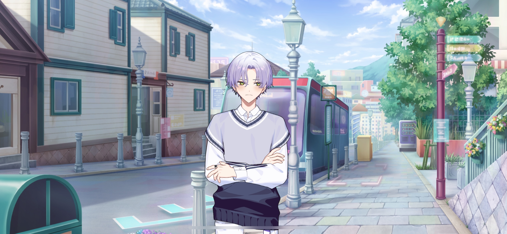
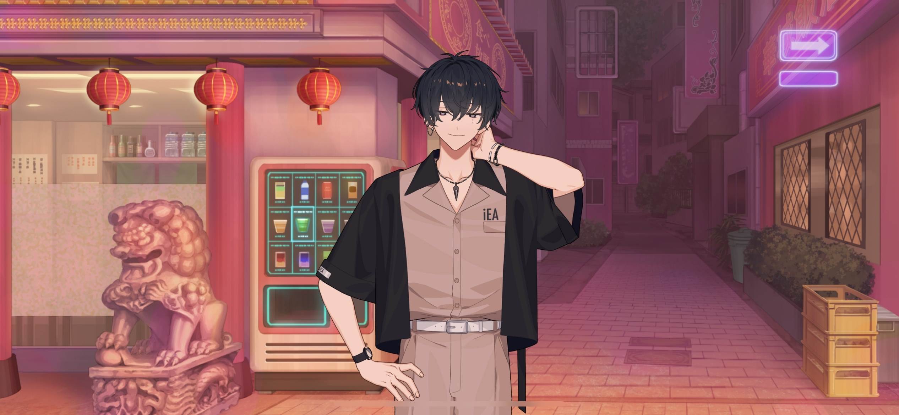

import "@/styles/series/18trip.scss";

# Working from the Shadows

<Divider loc="KOBE - Kitano-cho Historic District" />

<Bubble mc>

(Phew… We finally got away from Kotonojo-san. I’m glad she bought us lunch, but it was hard hearing her rip on HAMA the whole time…)

</Bubble>

<Bubble character="Renga">
Dammit, that asshole… Just kept on talking shit…
</Bubble>

<Bubble character="Kafka">
Well…she did make some points. Phew…
</Bubble>

<Bubble character="Yukikaze">
…? Kafka, you look pale. Are you okay?
</Bubble>

<Bubble character="Kafka">
It’s just too sunny and hot here. Since this area has a lot of history, we should loo&NoBreak;—

Ugh…
</Bubble>

<Bubble mc>
Kafka?!
</Bubble>

<Bubble character="Yukikaze">
……

Kafka, do you have a fever? You’re burning up.
</Bubble>

<Bubble character="Kafka">
I said I’m fine. I’m just tired after climbing the hill. Let go…
</Bubble>

<Bubble character="Yukikaze">
No. I’m carrying you.
</Bubble>

<Bubble character="Kafka">
…Put me down…!
</Bubble>

<Bubble mc>
Kafka, calm down!

…It does seem like a fever.
</Bubble>

<Bubble character="Kafka">
It’s not that bad…
</Bubble>

<Bubble character="Renga">
H-Hey. Is he okay?
</Bubble>

<Bubble character="Ten">
Uh-oh. It’s pretty hilly here, so maybe we should take a break.
</Bubble>

<Bubble character="Liguang">
It hasn’t been long since Oguro had his surgery. We should go back to our hotel.
</Bubble>

<Bubble character="Kafka">
Huh? I don’t wanna. It’s still the middle of the day.
</Bubble>

<Bubble character="Yukikaze">
Let’s go back, Chief.
</Bubble>

<Bubble mc>
Okay. Let’s put a hold on our plans for now, everyone. You guys can look around on your own. Yuki-nii and I are gonna take Kafka back to the hotel.

Yachiyo-kun, sorry to push this on you, but can you take the reference pictures that we mentioned in the guidebook?
</Bubble>

<Bubble character="Yachiyo">
H-Hokay! I can do that! President Oguro, w-will you be okay?
</Bubble>

<Bubble character="Kafka">
…Damn. Why’d I have to get a fever now, of all times?
</Bubble>

<Bubble mc>
Traveling takes a lot out of you already, so you shouldn’t push yourself. Let’s go.
</Bubble>

<Bubble character="Yukikaze">
See you tomorrow, everyone.
</Bubble>

<Divider loc="KOBE - Nankinmachi Alleyway" />

<Bubble character="Mafia Member A">
Fuck, Kotonojo-sama should’ve known that was Liguang from the Lurong family. Why’d we have to stop?
</Bubble>

<Bubble character="Mafia Member B">
I still remember that time they came into our territory and fucked shit up. I found Liguang’s hotel. Let’s raid ‘im.
</Bubble>

<Bubble character="Mafia Member C">
If those HAMA deer found out one of their top guns got attacked, they'd be scared shitless!
</Bubble>

<Narration>
&ast;laughter&ast; &ast;punch&ast;
</Narration>

<Bubble character="Mafia Member A">
Aurgh…!
</Bubble>

<Bubble character="Mafia Member B">
Wh-What’s your deal…?!
</Bubble>

<Bubble character="Sojun">
Excuse me.
</Bubble>

<Narration>
&ast;punch&ast;
</Narration>

<Bubble character="Mafia Member B">
Ugh!!
</Bubble>

<Bubble character="Mafia Member C">
Agh…
</Bubble>

<Bubble character="Mafia Member D">
_Dàgē…!_
</Bubble>

<Narration>
&ast;clack&ast;
</Narration>

<Bubble character="Sojun">
…!
</Bubble>

<Bubble character="Ten" unknown>
Hup.
</Bubble>

<Bubble character="Mafia Member D">
Dwah…!
</Bubble>

<Narration>
&ast;thud&ast;
</Narration>

<Bubble character="Mafia Member D">
_Qù sǐ ba…_ Ugh…
</Bubble>

<Bubble character="Sojun">
…Murakumo Ten. Why are you here?
</Bubble>

<Bubble character="Ten">
Come on, that’s all I get as thanks?
</Bubble>

<Bubble character="Sojun">
You got in the way.
</Bubble>

<Bubble character="Ten">
I heard you were gonna be around these parts, so I came here to ask for my pay. You can add a “getting in the way” bonus, if you wanna.
</Bubble>

<Bubble character="Sojun">
&ast;sigh&ast; We’ll have it masked and sent to your account.

Have you been protecting Liguang-sama?
</Bubble>

<Bubble character="Ten">
Well, that’s not part of my job, now is it? I’m just here to stake out your target.

Besides, does he really need my help? He could kill someone just by looking at them.

Anyway, thanks for the business. Look forward to seeing you again soon.
</Bubble>

<Bubble character="Sojun">
&ast;sigh…&ast; Is the information from Nishizono Renga really so important that we had to hire the likes of him…?

(No, I am Liguang-sama’s faithful blade. I have no need for thoughts.)

</Bubble>

<Bubble character="Mafia Member A">
Urgh… Fuck… Where’d those assholes go…?
</Bubble>

<Bubble character="Kotonojo">
Hey, trash heap.
</Bubble>

<Bubble character="Mafia Member B">
Ack… Kotonojo-sama…
</Bubble>

<Bubble character="Kotonojo">
Sticking your nose where it doesn’t belong, I see. I assume that means you’d like Chinto to be kicked out of the Oryukai?
</Bubble>

<Bubble character="Mafia Member A">
N-N-N-Not at all! This was all our idea, just the four of us…!!
</Bubble>

<Bubble character="Kotonojo">
Is that so…?
</Bubble>

<Narration>
&ast;punch&ast;
</Narration>

<Bubble character="Mafia Member A">
P-Please!! We’ll get on our knees…! You can even cut off our fingers…!
</Bubble>

<Bubble character="Kotonojo">
I don’t need your filthy fucking fingers!!!

You. Be my chair.
</Bubble>

<Bubble character="Mafia Member B">
Y-Yes, of course…!
</Bubble>

<Bubble character="Kotonojo">
…I see Sojun is still acting as the Lurong family’s guard dog. But I’m more curious about that other guy who showed up…

(When I met him at lunch, I thought he was just a frivolous little brat, but…he has skill.)

Ahhh… Ahh, I want him.

I want him so bad.

I want him… I want him, I want him, I want him…

(But he’s on Liguang’s side for now. I’ll wait for my chance.)

And when it finally comes…how should I play with you, Murakumo Ten…? Haha.
</Bubble>
