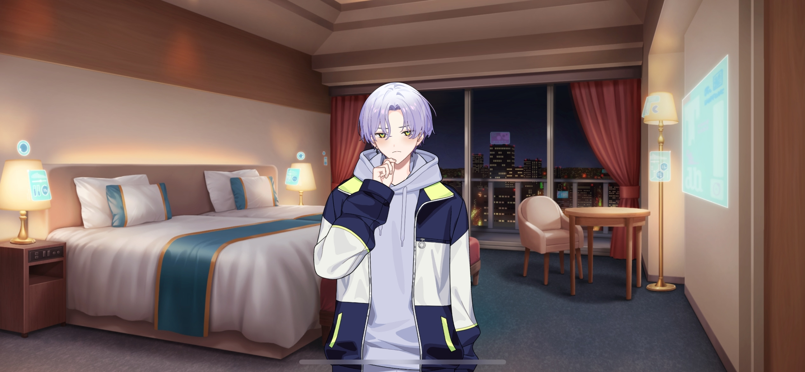
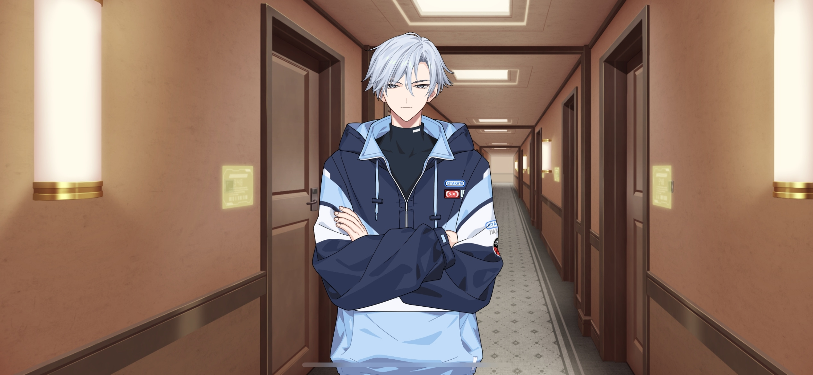

import "@/styles/series/18trip.scss";

# Ten Million Dollar Night View

<Divider loc="KOBE - Hotel Room" />

<Bubble mc>
I’m so glad we brought Sakujiro-san’s special medicine with us. It looks like your fever’s down, Kafka.
</Bubble>

<Bubble character="Kafka">
I just wanted to enjoy the trip…but I had to go and get a fever. I didn’t even move around that much. This body does nothing but piss me off…

It’s so pathetic. I hate it.
</Bubble>

<Bubble mc>
Kafka…

Don’t be like that! We still have lots of time to go on other trips. We promised that we’d spend the rest of our lives playing together, right?
</Bubble>

<Bubble character="Kafka">
…!
</Bubble>

<Bubble character="Kafka">
Chief… You need to stop saying those things without knowing how I feel…

…I’ll start getting the wrong idea.
</Bubble>

<Bubble mc>
Huh?
</Bubble>

<Bubble character="Kafka">
I’m going to sleep. I’m going to Mt. Rokko tomorrow no matter what.
</Bubble>

<Bubble mc>
Okay. Good night, Kafka.
</Bubble>

<Bubble character="Kafka">
Good night… Chie…

……
</Bubble>

<Bubble mc>

(I hope he gets better by tomorrow.)

</Bubble>

<Divider loc="KOBE - Hotel Hallway" />

<Bubble character="Yukikaze">
Chief, was Kafka doing alright?
</Bubble>

<Bubble mc>
Oh, I didn’t know you were outside waiting, Yuki-nii. Yeah, the medicine seems to be working. He’s sleeping well. You can go do your own thing now, if you want.
</Bubble>

<Bubble character="Yukikaze">
I see. That’s good to hear. I’ll be going for a run around the area.
</Bubble>

<Bubble mc>
Have fun. I’m gonna take a walk around too.
</Bubble>

<Divider loc="KOBE - Meriken Park" />

<Bubble mc>
Phew. The harbor’s so pretty at night…

(Since Kafka’s feeling better, he should be good for tomorrow. But I’m more worried about…)

(Renga-kun. He didn’t really seem super excited to go to Mt. Rokko when I mentioned it during the Ferris wheel ride… I don’t feel like he’s getting closer to anyone…)

(Yuki-nii tried his best to help by giving him matching glasses with Liguang-san, but meeting Kotonojo-san kind of threw a wrench into things.)

(Ah…! It’s the Royal Princess! They’re doing bay cruises here… I wanna go on one!)

Excuse me, do you still have room for one adult?
</Bubble>

<Bubble character="Liguang">
Hm? Are you planning on getting on too?
</Bubble>

<Bubble mc>
…! Liguang-san!
</Bubble>

<Divider loc="KOBE - Royal Princess" />

<Bubble mc>
Wow… The ocean breeze feels so nice. Why’d you decide to take the cruise, Liguang-san?
</Bubble>

<Bubble character="Liguang">
My ward offers cruises too. This could make a good reference.

It looks like KOBE was able to use its power to furnish this ship pretty well. We could use something like this in HAMA.
</Bubble>

<Bubble mc>

(Liguang-san is so polite and diligent when Renga-kun isn’t involved… He takes the tourism industry really seriously.)

</Bubble>

<Bubble character="Liguang">
Hey, I bought these from over there. Do you drink?
</Bubble>

<Bubble mc>
Oh, huh? You got one for me?
</Bubble>

<Bubble character="Liguang">
Heh... It’s not much. Just a beer.
</Bubble>

<Bubble mc>

(Wow, I almost never see him smile. He’s easier to talk to than usual… Maybe it’s because we’re on this cruise.)

I’ll take it, thank you so much. Ah, should we do the Oath of the Peach Garden thing?[^1] Haha, just kidding…
</Bubble>

<Bubble character="Liguang">
……
</Bubble>

<Bubble mc>

(Guess he didn’t like that one… Tough crowd.)

</Bubble>

<Bubble character="Liguang">
It’s a beautiful night…but HAMA won’t lose to this view.
</Bubble>

<Bubble mc>
I agree. I’d love to see HAMA cruises grow even more!

……
</Bubble>

<Bubble character="Liguang">
What’s wrong? You look like you have something on your mind.
</Bubble>

<Bubble mc>
Well, it’s just…

Um, I’m sorry if I’m overstepping, but I wanted to ask you about Renga-kun…
</Bubble>

<Bubble character="Liguang">
……
</Bubble>

<Bubble mc>
I-I heard the two of you used to be close through your families.
</Bubble>

<Bubble character="Liguang">
……
</Bubble>

<Bubble mc>
So I was wondering why… Uh…
</Bubble>

<Bubble character="Liguang">
……

&ast;sigh&ast;
</Bubble>

<Bubble mc>

(D-Did I make him mad…? But this is the only chance I’ll have to ask him…!)

</Bubble>

<Bubble character="Liguang">
So this is about that moron… I suppose we’ve gotten the rest of you involved in our arguments a decent amount.

My family has been close to the Nishizonos for a while. But I don’t think he deserves to be their head.

He doesn’t seem to realize that himself, and that aggravates me.
</Bubble>

<Bubble mc>
Hm… Is there a reason why you think that way…?
</Bubble>

<Bubble character="Liguang">
&ast;sigh&ast;

The previous Ward 3 mayor was his grandmother, Nishizono Reika. She was a great help to the previous Ward 4 mayor, my mother.
</Bubble>

<Bubble mc>
Renga-kun’s grandmother…?
</Bubble>

<Bubble character="Liguang">
Yeah. She had a wonderful personality&NoBreak;—strict where it counted while still being loving. She did a lot for me when I was young.

Although that imbecile is idiotic at his core, he was doing well while he was taking Reika-sama’s advice. But it didn’t last for long.

He started to ignore her at some point… In addition to that, he was unable to pull his own weight as a student, so he became Reika-sama’s greatest shame.

…He was only able to attend our high school as a substitute. Someone that pathetic only humiliates himself further by fighting with me.

Reika-sama passed while shouldering his reputation, but he still had the nerve to act depressed at her funeral… Just looking at him embarrassed me.
</Bubble>

<Bubble mc>
The funeral…

(That must’ve been that one rainy day. So Liguang-san attended it too…)

</Bubble>

<Bubble character="Liguang">
Reika-sama was never able to repair her relationship with him. It must have been a great disappointment to the entirety of Ward 3.
</Bubble>

<Bubble mc>
…What happened for their relationship to get so bad?
</Bubble>

<Bubble character="Liguang">
He was just childish. He insisted on living without considering Reika-sama’s feelings.
</Bubble>

<Bubble mc>
…But Renga-kun’s still taking care of his grandmother’s rose garden. He’s trying really hard…
</Bubble>

<Bubble character="Liguang">
Hah, it’s too late for him to atone. Besides, those roses will all die under his care.
</Bubble>

<Bubble mc>
Um, could you tell me more about Renga-kun and his grandmother? Please!
</Bubble>

<Bubble character="Liguang">
……
</Bubble>

<Divider timeskip />

<Bubble mc>
I didn’t know his grandmother felt that way…

Um, could I tell Renga-kun about this?
</Bubble>

<Bubble character="Liguang">
For what reason?
</Bubble>

<Bubble mc>
He has a short fuse, but I think something might be bothering him… If I tell him what his grandmother thinks, he might change.
</Bubble>

<Bubble character="Liguang">
You can’t teach that dog any new tricks. And there’s no need to. He’s already sunk to rock bottom.
</Bubble>

<Bubble mc>

(I wonder… If Renga-kun changes, would Liguang-san finally see him as an equal?)

(I couldn’t possibly ask him that, but I want it to happen someday. Especially since there was a time when they could’ve been friends.)

</Bubble>

---

[^1]: An event from _Romance of the Three Kingdoms,_ in which Liu Bei, Guan Yu, and Zhang Fei took an oath of fraternity in the Peach Garden. Often referenced to symbolize eternal friendship or brotherhood, as the three of them vow to spend their lives together and to be struck down by the heavens if they ever betray one another.
