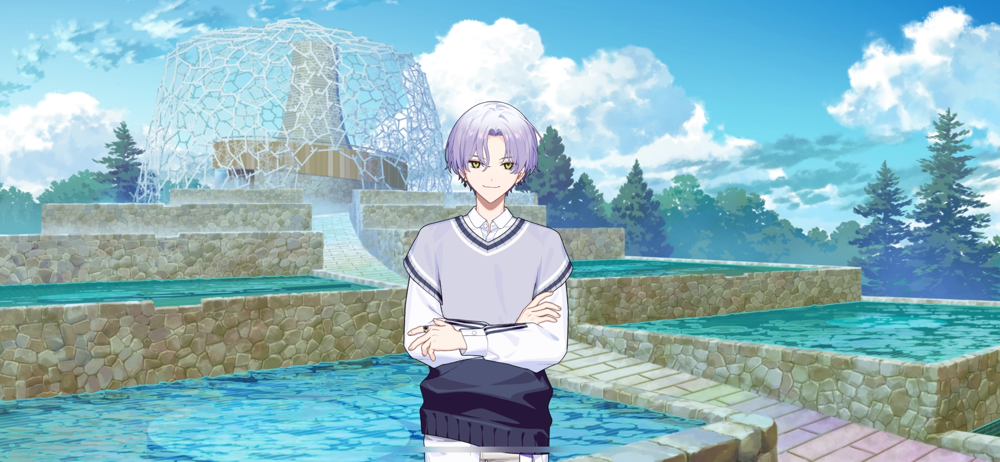
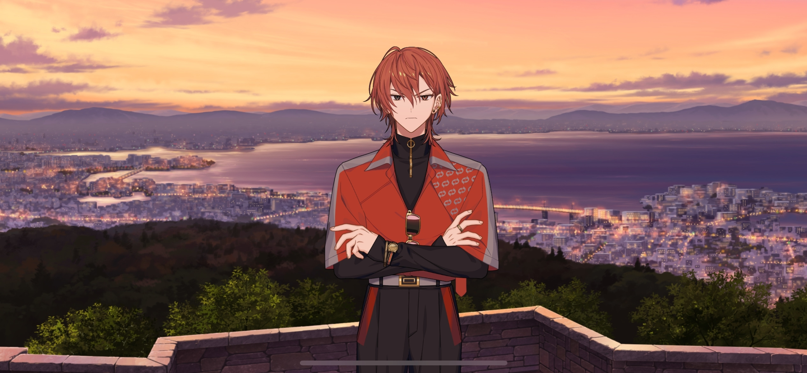
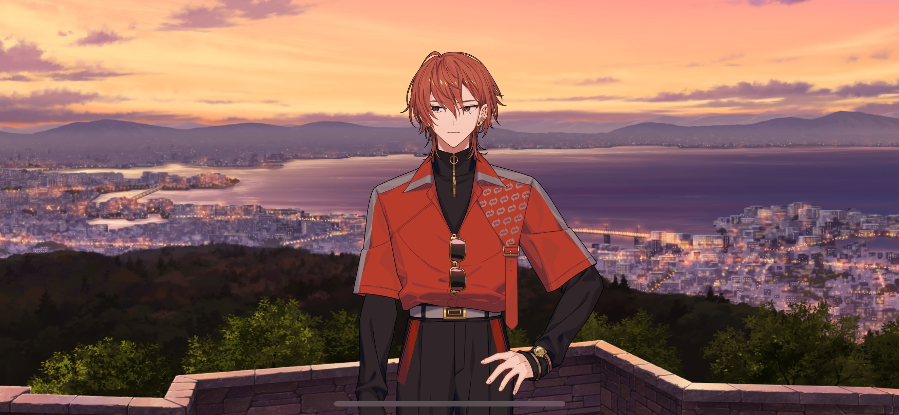

import "@/styles/series/18trip.scss";

# The Rose Garden Left Behind

<Divider loc="KOBE - Rokko-Shidare Observatory" />

<Bubble mc>

(We’re at the last stop for our KOBE trip! I’m happy to see that Kafka is feeling better enough to join us. But…)

(I still wanna tell Renga-kun about what Liguang-san said yesterday. I can’t stop thinking about it…)

</Bubble>

<Bubble character="Renga">
What’s this? An observation deck? Hmph, HAMA has places with nice views too…
</Bubble>

<Bubble mc>

(We made it all the way to the lantern festival without a chance for me to bring it up. Plus, Renga-kun’s still in a bad mood…)

</Bubble>

<Bubble character="Koharu" name="???">
Howdy there!
</Bubble>

<Bubble character="Kafka">
That’s…
</Bubble>

<Bubble character="Koharu">
Tengen Koharu. Folks call me the charismatic KOBE Ward 0 mayor. Pleased to meet ya!

Been waitin’ for y’all, HAMA Tours.
</Bubble>

<Bubble mc>

(Huh, he knows who we are…?!)

</Bubble>

<Bubble character="Kafka">
Well, well…

Thank you for the warm welcome. I’m Oguro Kafka, HAMA’s Ward 0 mayor.
</Bubble>

<Bubble character="Koharu">
Khaha! Ain’t needa be so formal. Heard our Ward 1 mayor caused y’all some trouble yesterday, so I wanted t’ say sorry!
</Bubble>

<Bubble mc>
You’re talking about…Yuzuriha Kotonojo, right?

(If the Ward 0 mayor came to apologize, does that mean Kotonojo-san said all of that _knowing_ that she was talking to HAMA’s mayors? I can’t believe it…)

</Bubble>

<Bubble character="Kafka">
I see. It sounds like news travels fast in KOBE.
</Bubble>

<Bubble character="Yachiyo">
Shiver shiver… He probably has a lot of power… I-Is he scary too…?!
</Bubble>

<Bubble character="Ten">
Are you gonna buy us lunch too?
</Bubble>

<Bubble character="Koharu">
Kotonojo’s a real smart one, but as stubborn as a bull. I’d love to take y’all to the lantern festival t’ make up for it!
</Bubble>

<Bubble character="Renga">
Huh? We didn’t ask you…
</Bubble>

<Bubble character="Koharu">
Well, sun’s already settin’. Y'all were fixin’ to go anyway, so might as well hightail it on over there ‘fore it’s too late!
</Bubble>

<Bubble mc>

(He doesn’t leave any room for argument…)

</Bubble>

<Divider timeskip />

<Bubble character="Koharu">
Bam!&nbsp;☆ This right here’s our famous KOBE drone lantern. Ya use this lil’ microcassette to record a message an’ throw the whole thing into the sky…

Your voice will play from way up high and deliver your feelings far an’ wide… Romantic, ain’t it?
</Bubble>

<Bubble character="Yukikaze">
Hm. I expected them to be lit using a flame, but they fly using drones instead?
</Bubble>

<Bubble character="Koharu">
Well usin’ fire’s dangerous as all get out. An’ these are biodegradable lanterns made t’ dissolve in the ocean, so we ain’t gotta worry about alla them microplastics.
</Bubble>

<Bubble character="Liguang">
…So they’re made from that new material invented a few years ago. Every region in JPN uses the same material for their special events.
</Bubble>

<Bubble character="Koharu">
Well, I’ll be. Sounds like y’already knew! Figures, it was a real big deal on Spinet. We started rakin’ in a whole lotta revenue once we started producin’ it locally. Khaha!
</Bubble>

<Bubble character="Liguang">
……
</Bubble>

<Bubble character="Koharu">
Y'gotta work on improvin' the local economy if you wanna boost tourism. It ain’t all ‘bout attractin’ new guests. Gotta get two birds with one stone.
</Bubble>

<Bubble character="Kafka">
I see. I agree with you on that.
</Bubble>

<Bubble character="Koharu">
Alright! Get on with makin’ those recordings, y’all!
</Bubble>

<Bubble character="Kafka">
You’re pushy, aren’t you? Well, whatever. Is there something specific we should say?
</Bubble>

<Bubble character="Koharu">
This festival was my idea, so say anythin’ y’all want. But I reckon most folks make a wish.
</Bubble>

<Bubble character="Yukikaze">
Hm… Maybe I should make a wish so I can do the program I want to…
</Bubble>

<Bubble character="Liguang">

(I’ll wish to find him as soon as possible. Then…)

…No, never mind. I’ll wish for my family’s health.
</Bubble>

<Bubble character="Ten">
A wish, huh? Man, I got so many I dunno what to say.

(This sucks. I’ll just pretend to record something.)

</Bubble>

<Bubble character="Yachiyo">
I wanna go to another ido&NoBreak;— No, I can’t! Debt repayment first and foremost!
</Bubble>

<Bubble character="Kafka">

(…I’ll wish for my body to hold out until HAMA’s fully revitalized.)

</Bubble>

<Bubble mc>

(What should I say? Should I wish for our tour to be a success?)

</Bubble>

<Bubble character="Koharu">
……

Chief, you should wish for your mayor buddies t’ take things a lil’ more seriously.
</Bubble>

<Bubble mc>
…Huh?
</Bubble>

<Bubble character="Koharu">
Y’gotta throw out all the bad apples. Keepin’ the likes a’ them around prolly ain’t the best idea.
</Bubble>

<Bubble mc>
?!
</Bubble>

<Bubble character="Koharu">
I reckon you’re the only one here who can change things.
</Bubble>

<Bubble mc>

(What…? What’s he trying to say?)

</Bubble>

<Bubble character="Koharu">
Khaha! Just tryna be nice.
</Bubble>

<Bubble character="Renga">
……
</Bubble>

<Bubble character="Koharu">
Nishizono Renga, you havin’ a hard time thinkin’ of one?
</Bubble>

<Bubble character="Renga">
…How do you know my name? Are you a fan?
</Bubble>

<Bubble character="Koharu">
Ahaha, nah. I jus’ know every ward mayor’s name, is all.
</Bubble>

<Bubble character="Liguang">
…I’ve heard rumors that the KOBE Ward 0 mayor is quite the genius. Looks like they’re true.
</Bubble>

<Bubble character="Koharu">
Oh, hearin’ that’s got me over the moon, Lu Liguang.
</Bubble>

<Bubble character="Renga">
Gh…
</Bubble>

<Bubble character="Koharu">
If y’a’int got a wish, whole lotta folks like t’ leave messages for their passed loved ones.

Like a goldfish that up an’ died after they brought it home from a festival! Why don’t ya take that for a spin?&nbsp;♪
</Bubble>

<Bubble mc>

(H-His example’s a little grim… But if that’s an option, Renga-kun could…)

</Bubble>

<Bubble character="Renga">
……

Who cares if my message is gonna be played in the sky? It wouldn’t reach them. Dead people can’t hear.

So what’s the point?
</Bubble>

<Bubble character="Liguang">
Tch… You’re always like this.
</Bubble>

<Bubble character="Renga">
Huh? Like what…?
</Bubble>

<Bubble character="Liguang">
Are you not satisfied until you disparage everything in your line of sight? Does it distract you from your own shortcomings? I suppose even the incompetent have the capacity to complain.
</Bubble>

<Bubble character="Renga">
……
</Bubble>

<Bubble character="Liguang">
You’re angry because you know I’m right. You spend all of your time posing as a critic to denunciate others, but have you done anything worthy of praise yourself?

If your skills start and end at being able to kick up a fuss, then you’re better off quitting. Nobody needs someone like that around.

Nobody needs you.
</Bubble>

<Bubble character="Renga">
…!

Sh… Shut the fuck up! Who the hell would do something this stupid?!
</Bubble>

<Bubble mc>
Renga-kun!
</Bubble>

<Bubble character="Liguang">
Tch… Throwing a tantrum again. This is why I can’t stand him.
</Bubble>

<Bubble character="Koharu">
Woah, y’all were goin’ at it real good.

Nishizono Renga, you’re runnin’ towards the bathroom over there! Head t’ your right if ya wanna avoid folks!
</Bubble>

<Bubble mc>

(Ugh… Why does this always happen? I need to find Renga-kun and bring him back!)

</Bubble>

<Divider loc="KOBE - Lookout Terrace" />

<Bubble character="Renga">
Liguang, that asshole…
</Bubble>

<Bubble mc>
…Renga-kun.
</Bubble>

<Bubble character="Renga">
……

What do you want? Are you here to nag me or something?
</Bubble>

<Bubble mc>
……
</Bubble>

<Bubble character="Renga">
…Say something.
</Bubble>

<Bubble mc>
…I don’t know what to say. But I want to hear how you really feel, Renga-kun.
</Bubble>

<Bubble character="Renga">
…I always say what I feel.
</Bubble>

<Bubble mc>
I don’t think you do… There’s something important you want to tell your grandmother, right?
</Bubble>

<Bubble character="Renga">
I already said that there’s no point.
</Bubble>

<Bubble mc>
But that means you still have something you want to say. Are there any feelings you want to express to her?
</Bubble>

<Bubble character="Renga">
…Who cares if there are?!
</Bubble>

<Bubble mc>
Don’t say that! Why don’t you try telling her?
</Bubble>

<Bubble character="Renga">
Why the hell are you telling me all of this?! It won’t mean anything…!

Because I couldn’t say it before…
</Bubble>

<Bubble character="Renga">
I had a chance to, but I didn’t… So why… Why now…

……
</Bubble>

<Bubble mc>
Renga-kun.
</Bubble>

<Bubble character="Renga">
What’s wrong with me? I’m Nishizono Renga, so I… I can’t cry like this…

……

…I know already. I know that Liguang’s always right.
</Bubble>

<Bubble mc>
…!
</Bubble>

<Bubble character="Renga">
But so what?!

If I agree with him, then… Then I really _will_ be unwanted.
</Bubble>

<Bubble mc>
Unwanted…? Who told you that?
</Bubble>

<Bubble character="Renga">
…I don’t need anyone to tell me to know it’s true. Everyone around me, my dad, my grandmother, they always… That’s why…

When my grandmother was in critical condition…I was taking care of her, but I couldn’t say anything.

If I did and she regained consciousness…

She would tell me that she regrets bringing me into the Nishizono family.

She would tell me to get out, that nobody wants me around. And…

I was never able to tell her “thank you” or “I’m sorry” just because of something that selfish! I can’t live with myself like that…!
</Bubble>

<Bubble mc>
……
</Bubble>

<Bubble character="Renga">
I don’t know what the hell I was supposed to do! I tried so hard, but in the end I’m just stupid, and I… I couldn’t become the grandson she wanted me to be.

I always fought with her, and I kept making her hate me more… But I still inherited the most from her…

She left me the rose garden she loved so much… I wish I could ask her why she did that, but I can’t anymore…

I keep living with the regret that I never said anything to her, but I don’t deserve to be sad about this…

…I guess I don’t know anything because I’m so stupid. Liguang’s right. All I do is complain… But…

Nishizono Renga, the celebrity, has a big ego and lots of fans… I can’t think of anything else I’ve succeeded at…

If I can’t be proud about that, then I don’t know why I should even be alive…
</Bubble>

<Bubble mc>
……

(I didn’t know Renga-kun’s struggles were so deeply-rooted…)

(He feels like he’s not good enough. And to distract himself from that feeling, he puts up a front…)

</Bubble>

<Bubble character="Renga">
I never intended to tell anyone all of this… Dammit…
</Bubble>

<Bubble mc>
Renga-kun.
</Bubble>

<Bubble character="Renga">
…?
</Bubble>

<Bubble mc>
Come with me.
</Bubble>

<Bubble character="Renga">
N-No, I’m not going back looking like this…
</Bubble>

<Bubble mc>
Just do it! I promise…with all my heart that I’ll be on your side…!!
</Bubble>
