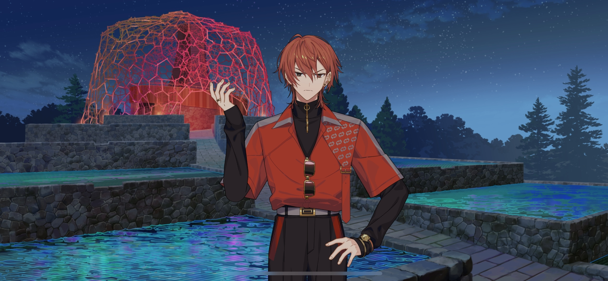
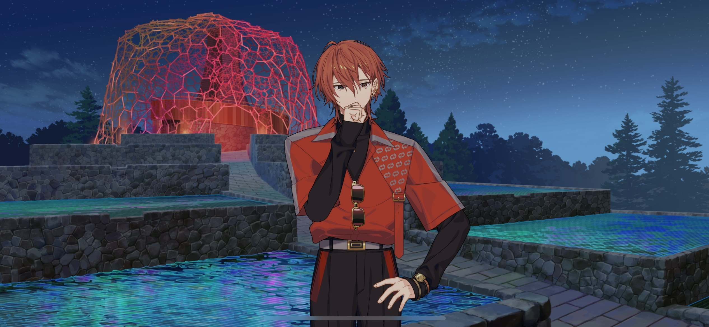
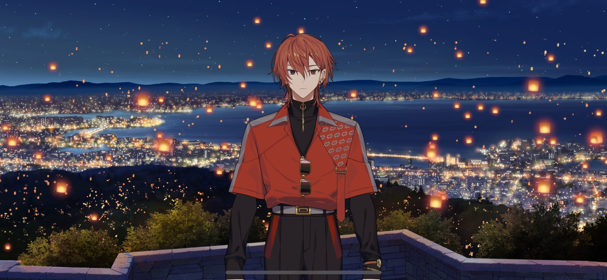

import "@/styles/series/18trip.scss";

# My Grandson

<Divider loc="KOBE - Rokko-Shidare Observatory" />

<Bubble character="Renga">
Would you let go…?! I don’t wanna go back…
</Bubble>

<Bubble character="Koharu">
Well, I’ll be. Look who’s back! Alright, let’s get those lanterns…
</Bubble>

<Bubble mc>
Liguang-san.
</Bubble>

<Bubble character="Liguang">
…What is it?
</Bubble>

<Bubble character="Renga">
……
</Bubble>

<Bubble mc>
You told me yesterday, right? Renga-kun’s grandmother… Reika-san supported him going into entertainment.
</Bubble>

<Bubble character="Liguang">
……
</Bubble>

<Bubble character="Renga">
…Huh?! Th-There’s no way that’s true…
</Bubble>

<Bubble mc>
It is. I heard it myself. Right, Liguang-san?
</Bubble>

<Bubble character="Liguang">
……
</Bubble>

<Bubble character="Renga">
…Quit it already.

You don’t need to make something up to make me feel better…
</Bubble>

<Bubble character="Liguang">
&ast;sigh…&ast; You need to learn some gratitude.
</Bubble>

<Bubble character="Renga">
Wh…!
</Bubble>

<Bubble character="Liguang">
…This is a video that my younger sister, Linxing, sent me. It was taken when everyone met at my house before Reika-sama passed away.

I’m not showing you this for _your_ sake. It’s out of respect for Reika-sama.
</Bubble>

<Bubble character="Reika" hologram>
&lt;&NoBreak;Oh, and would you look at this? It’s one of Renga’s recent photoshoots. Isn’t it lovely? He just looks so handsome in this pose!&NoBreak;&gt;
</Bubble>

<Bubble character="Linxing" hologram>
&lt;&NoBreak;Granny Reika, you bought copies for us _again?&NoBreak;&gt;_
</Bubble>

<Bubble character="Reika" hologram>
&lt;&NoBreak;Why, of course! I have one for each of you. I need one for my scrapbook, one for viewing, and one for storage.&NoBreak;&gt;
</Bubble>

<Bubble character="Liguang’s Mother" hologram>
&lt;&NoBreak;I watched the show that you told me to watch, Reika-chan. Renga-kun did a great job. It was adorable how he got confused sometimes.&NoBreak;&gt;
</Bubble>

<Bubble character="Linxing" hologram>
&lt;&NoBreak;Dontcha think Renga-san would be more popular if he was more honest?&NoBreak;&gt;
</Bubble>

<Bubble character="Reika" hologram>
&lt;&NoBreak;Linxing, don’t say mean things about him. He’ll do everything his own way… And there’s no need to worry. He’ll figure out the easiest path for him soon enough.&NoBreak;&gt;

&lt;&NoBreak;He’s my grandson, after all. I’ve taught him everything he knows since he was little. He’s already a seed, all that’s left is for him to sprout.&NoBreak;&gt;
</Bubble>

<Bubble character="Liguang’s Mother" hologram>
&lt;&NoBreak;Wouldn’t it be better to tell him that yourself?&NoBreak;&gt;
</Bubble>

<Bubble character="Reika" hologram>
&lt;&NoBreak;…I can’t. He reminds me of myself, so I know how rebellious he is towards family. But that’s okay.&NoBreak;&gt;

&lt;&NoBreak;If Renga can find what he wants to do by rebelling against me… I don’t mind having an argument here and there.&NoBreak;&gt;
</Bubble>

<Bubble character="Renga">
Huh…?
</Bubble>

<Bubble character="Liguang">
Do you finally realize how much of a fool you were?
</Bubble>

<Bubble character="Renga">
…No, that’s… She told me herself that she wants me to give up on the entertainment industry…
</Bubble>

<Bubble character="Liguang">
How many years ago was that?
</Bubble>

<Bubble character="Renga">
…It… But, did Grandmother really…?
</Bubble>

<Bubble character="Liguang">
…I advise that you stop embarrassing yourself further, or Reika-sama won’t find peace.
</Bubble>

<Bubble character="Renga">
…Grandmother, you saw me as your grandson…
</Bubble>

<Bubble character="Renga">
Grandmother… I’m so sorry…
</Bubble>

<Bubble mc>
……
</Bubble>

<Bubble character="Koharu">
I ain’t really followin’, but sounds like y’got everything squared off. Ain’t that nice?

If you still got somethin’ to say to your nana, why don’t ya record it?
</Bubble>

<Bubble character="Renga">
I don’t know…what to say…
</Bubble>

<Bubble mc>
…I think you should say what you wanted to tell her the most, Renga-kun.

It doesn’t matter if it’ll reach her or not. The most important thing is that you’re able to be honest with her.
</Bubble>

<Bubble character="Renga">
……

Then…I’ll tell her “thank you…” And that I’ll change, so she doesn’t have to worry about me anymore.
</Bubble>

<Bubble mc>
…Yeah!
</Bubble>

<Divider loc="KOBE - Lookout Terrace" />

<Bubble character="Announcer">
&lt;&NoBreak;3… 2… 1…! Hundreds of lanterns filled with the wishes of many have been set off into the KOBE skies.&NoBreak;&gt;
</Bubble>

<Bubble mc>
…Wow. It’s so pretty. It’s like we’re in a fairytale.
</Bubble>

<Bubble character="Renga">
……
</Bubble>

<Bubble mc>
…I hope your message reaches her.
</Bubble>

<Bubble character="Renga">
……

Um… I’m…s-sorry for being in a bad mood this whole time.
</Bubble>

<Bubble mc>

(&ast;gasp&ast; I’ve never seen Renga-kun be so honest…! It took me back, but I’m so happy…)

</Bubble>

<Bubble character="Renga">
Also, uh… Tha&NoBreak;— Uh, th… Than…

I’m grateful…to you.

And…Liguang. I…mean it to you too.
</Bubble>

<Bubble character="Liguang">
……
</Bubble>

<Bubble mc>

(He’s ignoring him… Well, I don’t expect them to become best friends right off the bat…)

</Bubble>

<Bubble character="Renga">
……

Uh… I haven’t really sorted out all of my feelings yet. And I’m still kind of all over the place, so…

I’m gonna go take a walk around.
</Bubble>

<Bubble mc>
Ah… Renga-kun.
</Bubble>

<Bubble character="Ten">
Renga-san, I’ll go with you.
</Bubble>

<Bubble character="Yukikaze">
I don’t know what happened, but…I’m glad to see that Renga was able to say what he really felt.
</Bubble>

<Bubble mc>
Yuki-nii… That’s true, but…
</Bubble>

<Bubble character="Kafka">
Looks like that assertive side of yours helped out this time. I’d say you did a pretty good job.
</Bubble>

<Bubble mc>
Yeah…

(But it might’ve been too much for Renga-kun to handle. Did hearing his grandmother’s true feelings make him feel even sadder…?)

</Bubble>

<Bubble character="Liguang">
You don’t have to worry about anything. I’m certain he’s thinking about something else unrelated.
</Bubble>

<Bubble mc>
Huh…? Ah, did I say all of that out loud?
</Bubble>

<Bubble character="Liguang">
I don’t need to hear it to know. You’re worried that Renga’s left with even more regrets now that he knows how his grandmother feels, right?
</Bubble>

<Bubble mc>
Right on the money… Hm? Wait, what do you mean by “something else unrelated…?”
</Bubble>

<Bubble character="Liguang">
…He’s a fake.

That thought must be weighing heavy on his mind.
</Bubble>

<Bubble mc>
…A fake?
</Bubble>
