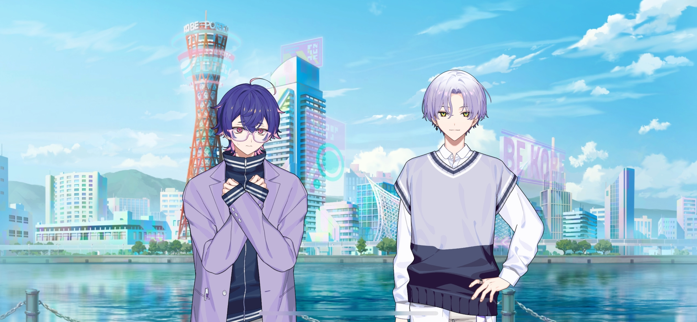
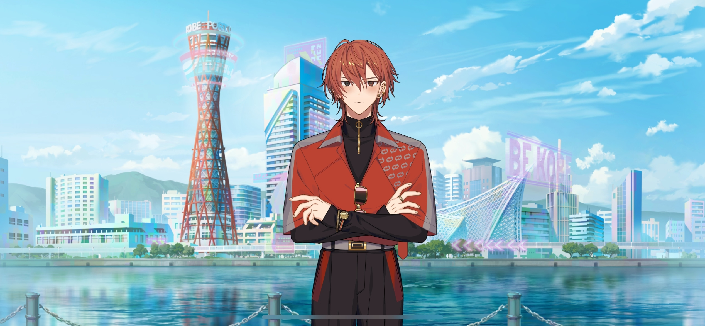
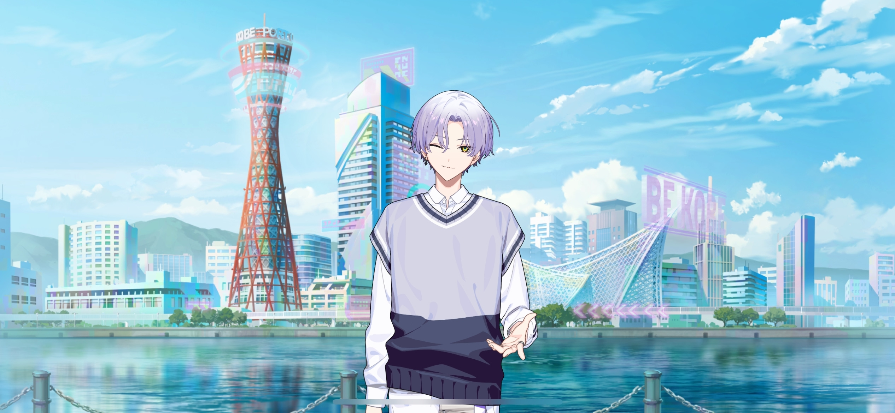

import "@/styles/series/18trip.scss";

# KOBE Mayor Encounter!

<Divider loc="KOBE - Meriken Park" />

<Bubble mc>

(It’s our last day here… All we have to do is get some souvenirs. I hope everyone got something out of this trip.)

(This was our first study trip as a company… We still have a lot to learn. But I hope it was a success in some ways, at least.)

</Bubble>

<Bubble character="Kafka">
Since it’s our last day, I want to see _everyone_ participate.
</Bubble>

<Bubble character="Yachiyo">
Y-Yesshir! I’ll do my best, Mr. President.

O-Okay, everyone!! We’re here to buy souvenirs today! After we’re all done, let’s meet at the camper van…!

&ast;pant, pant…&ast; I-I said it.
</Bubble>

<Bubble character="Kafka">
I’m not going to praise you for that.
</Bubble>

<Bubble character="Yachiyo">
Sh-Shoooock!! Of course, I’m pathetic… I should even be thankful for any insults you give me…!
</Bubble>

<Bubble mc>

(Kafka… I know you want to give Yachiyo work to do, but I don’t think a single trip is enough to see him grow. But we still have lots of time ahead of us…!)

</Bubble>

<Bubble character="Ten">
M’kay, we should look around for places to shop, Renga-san.
</Bubble>

<Bubble character="Renga">
Ah, yeah. Let’s go…

I wanna buy something for my father and our butler…
</Bubble>

<Bubble mc>

(I thought he was feeling down again when he wanted to walk around alone last night, but…it looks like he’s doing better today.)

</Bubble>

<Bubble character="Renga">
Ah… Chief.
</Bubble>

<Bubble mc>
Do you need something, Renga-kun?
</Bubble>

<Bubble character="Renga">
Um, good morning. Also…about yesterday… Th-Tha&NoBreak;— Th…

……
</Bubble>

<Bubble character="Renga">
That’s…! That’s a really big ant down there…!
</Bubble>

<Bubble mc>
Huh?! Uh, yeah, you’re right.
</Bubble>

<Bubble character="Renga">
Th-Th… The ant! It’s black…
</Bubble>

<Bubble mc>

(I guess he can’t bring himself to say “thank you…” But he weirdly reminds me of…)

(A little puppy…)

Oh, I wanted to ask. Did you figure things out after your walk yesterday?
</Bubble>

<Bubble character="Renga">
Huh? Ah, yeah! Mm.

I thought that maybe I’d try finding a way to do things that’s more my style.
</Bubble>

<Bubble mc>
I see! I’ll be with you all the way!

(Renga-kun’s so much more honest with his feelings than before… Maybe this is who he really is.)

</Bubble>

<Bubble character="Koharu">
Hoooowdy!&nbsp;♪&NoBreak;♪
</Bubble>

<Bubble character="Kafka">
Ugh… Why are _you_ here…?
</Bubble>

<Bubble character="Koharu">
‘Cuz I know everythin’ that goes on around this city.

Lemme see…
</Bubble>

<Bubble character="Renga">
Wh-What do you want…?
</Bubble>

<Bubble character="Koharu">
Mm-hm, I got it now. Good for you!
</Bubble>

<Bubble character="Renga">
H-Huh?
</Bubble>

<Bubble character="Koharu">
You’re lookin’ better today. Glad t’ know that KOBE left ya with a smile on your face.

And g’mornin’ to y’all too!
</Bubble>

<Bubble character="Yukikaze">
G’mornin’, Koharu. I’m surprised you knew we were here.
</Bubble>

<Bubble character="Liguang">
……
</Bubble>

<Bubble character="Ten">

(I kinda don’t like this guy…)

</Bubble>

<Bubble character="Kafka">
So what do you want this time?
</Bubble>

<Bubble character="Koharu">
Oh, I brought y’all some visitors.
</Bubble>

<Bubble character="Kotonojo">
Hmph… I came here at Koharu’s request, but I didn’t expect to meet you sad sacks again.
</Bubble>

<Bubble character="Minamo">
Um, good morning. I’m so sorry for the bother while you’re out shopping.
</Bubble>

<Bubble character="Yachiyo">
Hyoih, it’s the scary girl from the other day…
</Bubble>

<Bubble character="Ten">
Hey, it’s the hot guy mayor we met on our first day.
</Bubble>

<Bubble character="Kotonojo">
Minamo, be my chair. I’m tired of standing.
</Bubble>

<Bubble character="Minamo">
Huh…? I don’t think this is the best place for that…!
</Bubble>

<Bubble character="Koharu">
Not in front of our guests, Kotonojo.
</Bubble>

<Bubble character="Kafka">
Why are they here?
</Bubble>

<Bubble character="Koharu">
Kotonojo said some real nasty things to y’all, right? Thought y’all’d like an apology.
</Bubble>

<Bubble character="Kotonojo">
I see no reason why I should give them one.
</Bubble>

<Bubble character="Koharu">
Kotonojo, y’know you can’t be runnin’ your mouth like that. If ya wanna say somethin’ mean, keep it fair ‘n’ square. It jus’ ain’t pretty otherwise.
</Bubble>

<Bubble character="Kotonojo">
Hmph…
</Bubble>

<Bubble character="Koharu">
If you wanna keep bein’ ugly, be my guest.
</Bubble>

<Bubble character="Kotonojo">
…Hm.
</Bubble>

<Bubble character="Minamo">
Kotonojo, you should apologize.
</Bubble>

<Bubble character="Kotonojo">
I don’t take orders from chairs.
</Bubble>

<Bubble character="Koharu">
Khaha! Sorry ‘bout that, y’all. Kotonojo’s still one a’ my best buds, believe it or not.
</Bubble>

<Bubble mc>

(So she’s not gonna apologize after all…)

</Bubble>

<Bubble character="Minamo">
Um, I wanted to thank all of you for the other day…
</Bubble>

<Bubble character="KOBE Fan A">
Oh, it’s Minamo! Good morning, Minamo!
</Bubble>

<Bubble character="KOBE Fan B">
Oh, my god, isn’t that Koharu and Kotonojo too? No way!
</Bubble>

<Bubble character="KOBE Fan C">
Ah, it’s Nishizono Renga and Kamina Yukikaze! I met them the other day!&nbsp;♪ Over here, everyone!
</Bubble>

<Bubble character="KOBE Fan D">
Liguang and Kafka are with them too… I just got to know them a few days ago!
</Bubble>

<Narration>
&ast;cheering&ast;
</Narration>

<Bubble character="Minamo">
A-Ahh… Not this again…
</Bubble>

<Bubble character="Kafka">
Okay, everyone. Let’s show everyone what HAMA’s all about. Consider this as a practice session!
</Bubble>

<Bubble mc>

(Renga-kun flew off the handle the last time this happened… Will we be okay?)

</Bubble>

<Bubble character="Renga">
……

Done having your fill of KOBE already? I’ll give you the privilege of being able to create memories with THE Nishizono Renga!
</Bubble>

<Divider omotenashi />

<Bubble character="Kafka">
Visit HAMA next time, okay? It’s a promise.&nbsp;♪
</Bubble>

<Bubble character="Yukikaze">
Come watch me skate when you have the time.
</Bubble>

<Bubble character="Liguang">
If you’re in the area and want recommendations for Chinese restaurants, I can show you.
</Bubble>

<Bubble character="Ten">
Come to HAMA if you wanna have a fun time with me.
</Bubble>

<Bubble mc>

(They’re all promoting HAMA this time while still keeping the guests happy and engaged!)

(But what about Renga-kun…?)

</Bubble>

<Bubble character="Renga">
We’re thinking of remodeling the Landmark Tower in Ward 3. Would you like to come visit?
</Bubble>

<Bubble character="KOBE Fan A">
If you want us to, we could think about it for our next trip…
</Bubble>

<Bubble character="Renga">
R-Really?! I do, I want you to!
</Bubble>

<Bubble character="KOBE Fan A">
Huh?! You’re nicer in real life than you are on TV! If you really want us to, then maybe we will.
</Bubble>

<Bubble character="KOBE Fan B">
Renga, can you say the thing? Your catchphrase!
</Bubble>

<Bubble character="Renga">
Yeah…

“All that matters to me…is the real thing.”
</Bubble>

<Narration>
&ast;cheering&ast;
</Narration>

<Bubble character="KOBE Fan B">
Well, since he’s treating us so well, now we have to go! We’ll stop by when the remodeling is done!
</Bubble>

<Bubble character="Renga">
…! I’ll be waiting for you!
</Bubble>

<Bubble character="Kafka">
…Renga’s changed. When we first got here, he kept talking about how he didn’t want to “pamper” anyone.
</Bubble>

<Bubble mc>
Yeah… I remember that.

(He’s gotten much more positive since he heard Reika-san’s true feelings. Maybe I was overstepping, but I’m kinda glad I did…)

</Bubble>

<Bubble character="Yachiyo">
Everyone’s shining more brightly than usual… This feeling in my chest… Could it be…?
</Bubble>

<Bubble mc>

(Hm? I wonder what Yachiyo-kun’s talking about over there…)

</Bubble>

<Bubble character="Minamo">
Um, thank you so much for the help again. You’re all very good at providing hospitality.
</Bubble>

<Bubble character="Kotonojo">
Minamo, don’t just throw out compliments without thinking. You’ll leave yourself vulnerable.
</Bubble>

<Bubble character="Koharu">
Sometimes that’s jus’ what the doctor ordered if ya wanna make a profit, Kotonojo.

But anyway, thanks, y’all! They ain’t here today, but we got other ward mayors in this city. I’d love for y’all to meet ‘em next time.
</Bubble>

<Bubble character="Renga">
“Next time…?” You’re expecting to see us here again?
</Bubble>

<Bubble character="Koharu">
Y’all made some nice mem’ries here, right? Consider KOBE your home away from home.

Everybody’s welcome here. Come back whenever!
</Bubble>

<Bubble character="Renga">
…!
</Bubble>

<Bubble character="Kafka">
Thanks for the offer, but I think the next time we meet will be in HAMA. We’ll be the ones teaching _you_ when that time comes.
</Bubble>

<Bubble character="Koharu">
Oh, rearin’ an’ ready to go, ain’tcha! I like that ‘bout you. I’ll be lookin’ for some fun over there, so I’m expectin’ a lot.

I’m bored as all get out facin’ against these other cities who ain’t even worth the challenge.&nbsp;♪

But KOBE ain’t gonna stop here. We’re gonna keep on growin’.
</Bubble>

<Bubble character="Kafka">
Well, growing is something anyone can do. Don’t worry about HAMA. We’ll keep _evolving_ over here.
</Bubble>

<Bubble character="Koharu">
Khaha! I get you, I get you! Lookin’ forward to our lil’ rivalry this year!
</Bubble>

<Bubble character="Kafka">
Yes, of course. Likewise.&nbsp;♪
</Bubble>

<Bubble mc>

(Koharu-san’s really coming for Kafka’s throat… But I guess he _is_ the person who brought so much traffic to KOBE.)

(He may be pushy, but he has a bright energy that makes him hard to hate. Maybe that’s one of the reasons why so many people like KOBE…)

</Bubble>

<Bubble character="Kotonojo">
…Hey, Liguang.
</Bubble>

<Bubble character="Liguang">
……
</Bubble>

<Bubble character="Kotonojo">
Your little pawn will be in my hands soon enough.
</Bubble>

<Bubble character="Liguang">
Ah… If you mean _that,_ it was never mine to begin with.
</Bubble>

<Bubble character="Ten">
Renga-san, look. Minamo-san gave us a bunch of souvenirs as thanks.
</Bubble>

<Bubble character="Renga">
Oh, ah… Is this KOBE-exclusive ink? Our butler would love this. Th-Th-Th… Tha…

I appreciate it!
</Bubble>

<Bubble character="Minamo">
I’m so glad you like them.
</Bubble>

<Bubble mc>

(Wow… He still can’t say “thank you,” but he can at least _feel_ thankful… I’m getting kind of emotional…)

(A lot has happened, but I think everyone learned something in the end. Our trip was a success…!)

</Bubble>
