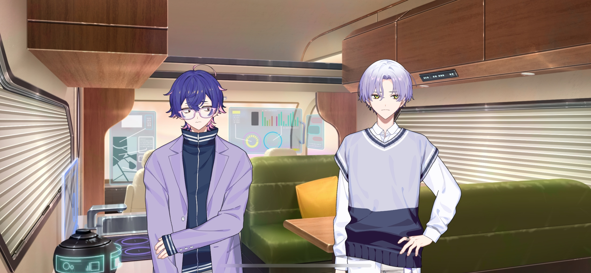
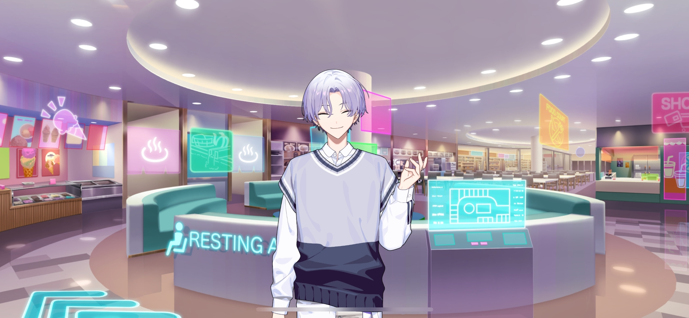
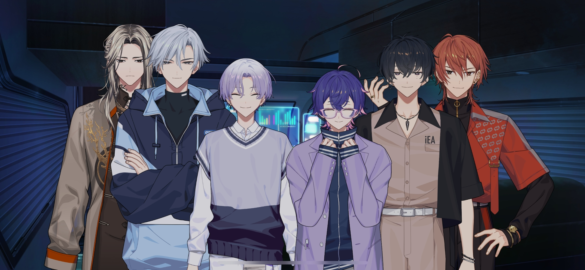
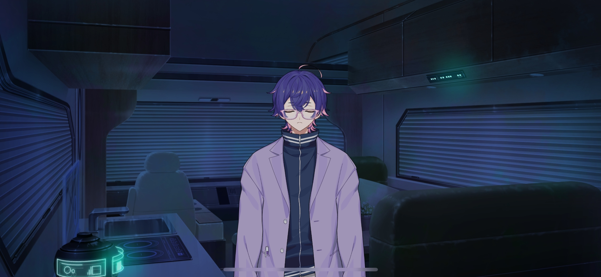

import "@/styles/series/18trip.scss";

# When I Call Your Name

<Divider loc="Camper Van" />

<Bubble mc>

(The trip went really well… but I can’t believe that even more guests came up to us after that, and now we’re stuck in traffic…!!)

</Bubble>

<Bubble character="Kafka">
Ugh… I’m exhausted…
</Bubble>

<Bubble character="Yachiyo">
I… I th-think I’m gonna throw up…
</Bubble>

<Bubble character="Yukikaze">
Chief, everyone looks tired. Let’s take a break at the rest area up there.
</Bubble>

<Bubble mc>
Y-Yeah, you’re right! I’ll head in!
</Bubble>

<Divider loc="Large Rest Area" />

<Bubble character="Kafka">
That felt soooo good! I didn’t expect to find an onsen here!
</Bubble>

<Bubble character="Ten">
They let you spend the night in your car here. We should just stay and get back on the road in the morning. That way, we won’t be stuck in all that traffic.
</Bubble>

<Bubble character="Liguang">
Staying the night… I can’t say I’m too fond of the idea…
</Bubble>

<Bubble character="Kafka">
That’s a great idea! Let’s do it!
</Bubble>

<Bubble character="Renga">
H-Huh…? Sleeping in a car kinda sucks. It’s too cramped.
</Bubble>

<Bubble character="Kafka">
Come on, let’s do it! I’ve always wanted to give it a try. A sudden change of plans adds some spice to the trip, right?
</Bubble>

<Bubble character="Yukikaze">
I’m fine with it. Everyone will feel more rested if we continue in the morning.
</Bubble>

<Bubble character="Liguang">
If Oguro says so.
</Bubble>

<Bubble character="Renga">
I mean… I’ve slept in cars on the side of the road before, so…
</Bubble>

<Bubble mc>

(Hm? He’s slept in cars before…? What does he mean by that…?)

</Bubble>

<Bubble character="Kafka">
Sounds like we’re all in. Let’s get some stuff for dinner while we’re here.&nbsp;♪
</Bubble>

<Divider loc="Camper Van Interior" />

<Bubble character="Kafka">
Eating inside a camper van sounds so fun.
</Bubble>

<Bubble character="Yukikaze">
I warmed up the pork buns Koharu gave us in the microwave. Feel free to take one.
</Bubble>

<Bubble character="Yachiyo">
…Mm, i-it’s soooo gooooood… God’s holy benevolence has blessed the tongues of the pauper…
</Bubble>

<Bubble character="Renga">
Woah… I’ve never had something like this. They sell these at convenience stores, right? It’s so good…

&ast;munch, munch…&ast;
</Bubble>

<Bubble character="All">
&ast;munch, munch…&ast;
</Bubble>

<Bubble mc>
I’m kinda full already. What did everyone think of the trip?
</Bubble>

<Bubble character="Kafka">
I’m glad we were able to confirm what we already knew from our data. There were some bumps in the road, but it wasn’t all bad.
</Bubble>

<Bubble character="Yukikaze">
The food was great, and I learned a lot… I’m so happy I was able to go with you, Chief.
</Bubble>

<Bubble character="Kafka">
Hello? Can you take this seriously?
</Bubble>

<Bubble character="Yukikaze">
I am…
</Bubble>

<Bubble character="Ten">
Hmm… Yeah. It was good.
</Bubble>

<Bubble mc>

(Why do I feel like he just can’t be bothered to answer…? Well, he just became a mayor recently, after all.)

What did you think, Liguang-san?
</Bubble>

<Bubble character="Liguang">
…There were things that I could integrate into my own ward. It was a fine trip.
</Bubble>

<Bubble character="Renga">
I…

Hey, can I talk about something? I’ve been thinking about it since yesterday… There's something I need to tell you guys.
</Bubble>

<Bubble mc>
…!
</Bubble>

<Bubble character="Renga">
I kinda forced myself into the leader position, but I didn’t really think about the responsibilities that came with it… I feel bad about that.
</Bubble>

<Bubble character="Liguang">
&ast;sigh&ast;
</Bubble>

<Bubble character="Renga">
I had a feeling that HAMA could never beat KOBE as it is now, and that hurt.

So, um… I know I always try to make myself look good, but… I realized that I couldn’t do anything if I kept my feelings locked up, so…I just wanna be honest.

Ward 3 is in a really bad state right now. Even though I put all of my earnings into it, we’re still in the red…

It’s been like this for a while, but it’s only gotten worse since I took over as mayor. I…made some wrong moves…

A-And the Nishizono family…doesn’t have anyone who can help. All we have is our butler, who keeps wanting to stay with us even though we don’t pay him much…

I’m making money with my TV appearances, but my family hasn’t been doing well for a long time… We try to keep our image, but all of our cars and clothes are rented…

I didn’t like having to lie, but everyone knew me as the rich guy, so I had to keep it up if I wanted to make money. But I know I can’t change anything if I keep doing that.
</Bubble>

<Bubble character="Yachiyo">
Renga-san’s a pauper…just like me…?!
</Bubble>

<Bubble character="Renga">
…I know I’m the most useless guy here. I need everyone’s help if I want to revive HAMA.

I… I want my grandmother to be at peace. I want our tour to succeed.

…Please.
</Bubble>

<Bubble mc>
Renga-kun…
</Bubble>

<Bubble character="Renga">
Please lend me your power…!
</Bubble>

<Bubble character="Kafka">
…I like your determination, Renga. We’ll make this a success together.
</Bubble>

<Bubble character="Yukikaze">
We’re here to help whenever you need us.
</Bubble>

<Bubble character="Renga">
…Ah… Tha&NoBreak;— Th…

I’m grateful…!
</Bubble>

<Bubble character="Ten">
Hm…

M’kay, so how ‘bout a toast now that Renga-san’s turning over a new leaf?
</Bubble>

<Bubble mc>
Yeah, that’s a good idea! Cheers!
</Bubble>

<Narration>
&ast;clink&ast;
</Narration>

<Bubble mc>

(Renga-kun’s been through a lot… Now that I think about it, I’ve overheard him say some weird things here and there.)

(If he’s comfortable talking about that with the Morning Team…that must mean he trusts us. I’m happy to know that!)

</Bubble>

<Divider timeskip />

{/* <Narration>
&ast;snoring&ast;
</Narration> */}

<Bubble character="Yachiyo">
…Mmm… Hrm… Bow down, peasants…
</Bubble>

<Bubble character="Renga">
……

(Everyone’s asleep… I should try and be quiet…)

</Bubble>

<Bubble character="Liguang">
……

(…I didn’t expect that idiot to reveal his own pathetic condition…)

(But that shouldn’t change the plan…)

&ast;sigh&ast; This is ridiculous. He sowed the seeds for this disaster himself, and yet…

…No, it’s none of my concern.
</Bubble>

<Bubble character="Renga">
…Phew. Maybe I shouldn’t have said all of that. Now they all know that my family’s poor… It’s embarrassing to admit.

(...But it’s better this way. If I wasn’t so full of myself, I could’ve realized Grandmother’s true feelings sooner.)

(I don't wanna have any more regrets. I need to be more honest… I wanna do my best.)

(There’s only one thing I have that I can give back to Grandmother…)

</Bubble>

<Narration>
&ast;cassette tape running&ast;
</Narration>

<Bubble character="Renga">
…Uh, this is my weekly report thing. The Morning Team went to KOBE this week to do some research…
</Bubble>

<Divider timeskip />

<Bubble character="Renga">
…And that’s everything I learned while I was there. Yeah… Also, I keep thinking about the thing the KOBE Ward 0 mayor said.

I was surprised when he said he wanted us to come back. I love HAMA, so I always wanna try and show it off, but…

That’s not what traveling is all about. I was happy to hear that he welcomed us…

I want HAMA to feel like a second home people can come back to… So I wanna change myself.
</Bubble>

<Narration>
&ast;click&ast;
</Narration>

<Bubble character="Renga">
…Nishizono Renga. Smart, strong, and perfect… I couldn’t become him…

(But I can’t lose any more of this place I have. Even if I seem pathetic, even when the time comes…)

</Bubble>

<Bubble character="Renga">
…Can I really change? If I do, will someone praise me for it? Hey, Renga…
</Bubble>
