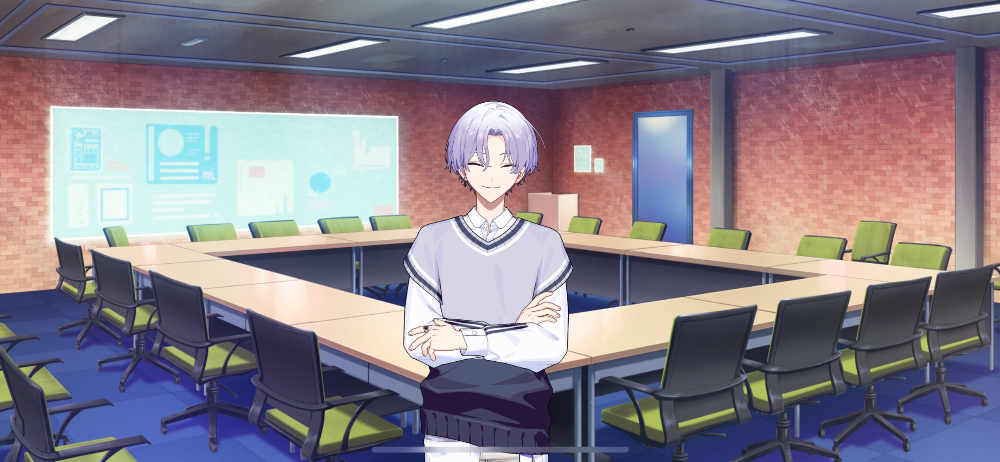

import "@/styles/series/18trip.scss";

<Divider loc="HAMA Tours - Meeting Room" />

<Bubble character="Kafka">
Mhmm, it really feels like things are taking off now that all of our starting members are here.

But to make it clear, this is a company, not a school club. We’re here to get work done. I’d like to start off by introducing the restoration strategy I have in mind. Is everyone okay with that?
</Bubble>

<Bubble character="Yachiyo">
…Uh— E-Excuse me…?

Can I ask what a…“designated tourism region” is…?
</Bubble>

<Bubble character="Kafka">
……
</Bubble>

<Bubble character="Sakujiro">
Starting from square one, I see.
</Bubble>

<Bubble character="Yachiyo">
I-I-I-I-I’m so sorry!!!!
</Bubble>

<Bubble mc>

(He was born and raised in JPN, but doesn’t know what a designated tourism region is? He must be really sheltered.)

</Bubble>

<Bubble character="Kafka">
Sakujiro, pull it up.
</Bubble>

<Bubble character="Sakujiro">
Of course, Mr. President. Fuefuki-kun, this is “What is Tourism?” It is an educational video created for young children.
</Bubble>

<Bubble mc>

(That’s…the thing they show all of us in preschool…)

</Bubble>

<Bubble character="Mister Bunny" hologram>
&lt;Hey, kids! I’m Mister Bunny!&gt;
</Bubble>

<Bubble character="Miss Lion" hologram>
&lt;And I’m Miss Lion! And today…&gt;
</Bubble>

<Bubble character="Mister Bunny & Miss Lion" hologram>
&lt;We’re gonna learn about tourism!&gt;
</Bubble>

<Bubble character="Miss Lion" hologram>
&lt;Hey, Mister Bunny, why do they call JPN a “tourism nation?”&gt;
</Bubble>

<Bubble character="Mister Bunny" hologram>
&lt;That’s a great question, Miss Lion! JPN actually isn’t the only tourism nation! There are tons of other countries all over the world that are called that, too!&gt;

&lt;A long time ago, people made looooots of cool machines using the power of science, so now everyone can go on vacations all of the time! That’s why everyone loves to travel!&gt;
</Bubble>

<Bubble character="Miss Lion" hologram>
&lt;Everyone in the world is taking vacations?!&gt;
</Bubble>

<Bubble character="Mister Bunny" hologram>
&lt;Yep! JPN wanted the new friends visiting us to have a good time, so we made something called the “Ministry of Tourism!”&gt;

&lt;The places lots of people really like to go to are called “designated tourism regions,” and JPN helps those places out in a bunch of ways!&gt;
</Bubble>

<Bubble character="Miss Lion" hologram>
&lt;Wooow! Do they make taxes cheaper?&gt;
</Bubble>

<Bubble character="Mister Bunny" hologram>
&lt;Yeah! Every tourism region has a special person called the Ward 0 mayor who has a ton of political power!&gt;
</Bubble>

<Bubble character="Miss Lion" hologram>
&lt;Political power is so cool! Can the Ward 0 mayor do anything? Can they destroy the whole town?&gt;
</Bubble>

<Bubble character="Mister Bunny" hologram>
&lt;Ahaha! That’s a funny joke, Miss Lion! But, yes, maybe they can!&gt;

&lt;The biggest things the Ward 0 mayor does is choose other ward mayors and choose how the region does tourism to welcome new friends!&gt;

&lt;They can also choose if the town lives or dies!&gt;
</Bubble>

<Bubble character="Miss Lion" hologram>
&lt;Wooow, I wanna be Ward 0 mayor and get political power, too!&gt;
</Bubble>

<Bubble mc>

(…It’s a little darker than I remember it being…)

</Bubble>

<Bubble character="Yachiyo">
Th-Th-Th-Th-The Ward 0 mayor has all the power…!
</Bubble>

<Bubble character="Daniel">
Ohhh, I get it. Didn’t know all that about the Ward 0 mayor.
</Bubble>

<Bubble mc>

(You, out of all people, should know! You literally worked for a travel agency before this…!)

</Bubble>

<Bubble character="Kafka">
And since I’m the Ward 0 mayor…
</Bubble>

<Bubble character="Yachiyo">
Hyah! W-Will you destroy the whole town…?!
</Bubble>

<Bubble character="Kafka">
Well, they did say that whether the town lives or dies is up to the mayor. And HAMA was on its last breath when my dad was overseeing things…
</Bubble>

<Bubble mc>

(Kafka, don’t smile like that, it’s scaring me…)

</Bubble>

<Bubble character="Kafka">
They didn’t mention it in the video, but there are challenges to being a tourism region.

In exchange for receiving aid from the federal government, we’re placed under supervision of the capital. Our auditor was sent from there, the Tokyo Ward 8 mayor.
</Bubble>

<Bubble mc>
Shigematsu Hakkei, right? He was at the inauguration.
</Bubble>

<Bubble character="Kafka">
Right. Mayors who also act as auditors like him usually come to the regions they’re supervising pretty often to see what’s going on. If it’s not up to their standards of hospitality, the place gets a bad review instantly. Think of them like your annoying in-laws.
</Bubble>

<Bubble character="Nayuki">
But we’ve stopped accepting financial aid from Tokyo, right? They shouldn’t be able to have a say in our tourism policies anymore.
</Bubble>

<Bubble character="Kafka">
Exactly. ♪ The plan is to basically perform life-saving surgery on HAMA’s tourism industry for the next year.

If it fails and we don’t reach the visitor quota, HAMA will lose its status as a designated tourism region, and I’ll lose my status as mayor.
</Bubble>

<Bubble mc>
So reaching the visitor quota is our biggest goal…
</Bubble>

<Bubble character="Kafka">
To achieve that, I’ve come up with a plan to bring HAMA back to life. I call it “NEO HAMA-18.”
</Bubble>

<Bubble character="Nayuki">
It says here that our benchmark is…KOBE-9?
</Bubble>

<Bubble character="Yachiyo">
Bench…mark?
</Bubble>

<Bubble character="Sakujiro">
In other words, a model, an example, or a final goal that one aims to achieve.
</Bubble>

<Bubble character="Yachiyo">
Oh! I-I gotta write that down…!!
</Bubble>

<Bubble mc>
Can I ask why KOBE-9?
</Bubble>

<Bubble character="Kafka">
It’s simple. Both KOBE and HAMA are port cities, and have been seen as rivals for a very long time. But right now, KOBE is pulling ahead of us.
</Bubble>

<Bubble character="Nayuki">
Didn’t KOBE overhaul their tourism policies a few years ago? They changed it to supply a more direct style of hospitality to their visitors.
</Bubble>

<Bubble character="Kafka">
They did. In a world where nearly everything is made easier with automation, what people want when they travel is something fresh that they can’t experience in their everyday lives.

And that has nothing to do with cutting-edge technology.
</Bubble>

<Bubble mc>

(He’s right…!)

</Bubble>

<Bubble character="Kafka">
The reason why HAMA is failing is that we’ve implemented so many policies to attract new visitors that we were unable to provide adequate hospitality to the large number of guests we received.

In order to dig ourselves out of this hole, we need to focus on quality over quantity, like KOBE does.
</Bubble>

<Bubble character="Nayuki">
It sounds simple, but I think it’s a very solid plan. But does that mean we won’t be able to focus on pulling in new visitors anymore?
</Bubble>

<Bubble character="Kafka">
I’m glad you asked that, Nayuki. ♪

When considering only the domestic travelers, the percentage of people who live in JPN and travel frequently doesn’t fluctuate very much.

Every city in the country is fighting for a slice of the pie. That’s why the best way to go about this is to ensure that HAMA’s visitors keep coming back.

In past years, our visitors would just come in once and leave for good. That won’t work. We need to convert all of HAMA into a place worth coming back to and turn people into long-term fans. That’s why…I’d like to find additional ward mayors.
</Bubble>

<Bubble mc>
More ward mayors…?
</Bubble>

<Bubble character="Kafka">
HAMA currently only has 3 mayors, but I plan to have one for each of the 18 wards.
</Bubble>

<Bubble character="Nayuki">
But as the Ward 0 mayor, you act as their leader. Wouldn’t it be overwhelming with so many of them?
</Bubble>

<Bubble character="Kafka">
You think I can’t handle it?
</Bubble>

<Bubble character="Nayuki">
…You have a point.
</Bubble>

<Bubble character="Kafka">
For now, we should focus on setting things up with the mayors we already have. Sakujiro, pull it up.
</Bubble>

<Bubble character="Sakujiro">
Of course, Mr. President. Click.
</Bubble>

<Bubble mc>
…We’re splitting the 18 wards into 4 areas? “Morning, Noon, Evening, Night…?”
</Bubble>

<Bubble character="Kafka">
Exactly. I named them after the times of day so people get the feeling that they can enjoy HAMA from morning to night. ♪

Yachiyo, Sakujiro, Nayuki, and Daniel, I’d like the four of you to split up and help out one team each. To keep things simple, we’ll call you “conductors.”
</Bubble>

<Bubble character="Yachiyo">
Hu-Huhhhhh?! I-I can’t do something like that!!
</Bubble>

<Bubble mc>

(I’m…not really sure if Yachiyo-kun will be okay.)

</Bubble>

<Bubble character="Kafka">
Don’t worry, I’ll be working with you, Yachiyo. I’ll also have our chief oversee all four of the teams.
</Bubble>

<Bubble mc>
O-Okay, got it.

(That’s a lot of pressure, but… I told him I’d do anything to help. I can do this…!)

</Bubble>

<Bubble character="Nayuki">
I understand that you’d like to split HAMA into sections and form four different units, but can I ask why?
</Bubble>

<Bubble character="Kafka">
I’d like to work with each ward mayor in tandem to form high-quality tour plans. We can’t afford to work apart, since we don’t have infinite resources to pour into the tourism industry over the course of only one year.
</Bubble>

<Bubble mc>

(That makes sense… We don’t have enough time to create new institutions, and we can’t just poof in new sightseeing spots in town.)

</Bubble>

<Bubble character="Kafka">
But there’s one thing we do have. What do you think that is?
</Bubble>

<Bubble character="Yachiyo">
Uh… Uhhh…
</Bubble>

<Bubble mc>
One thing we do have…?
</Bubble>

<Bubble character="Daniel">
Is it your money, Mr. President? Gaha, just kiddin’!
</Bubble>

<Bubble character="Nayuki">
…Ah, I see. I know what you mean.
</Bubble>

<Bubble character="Kafka">
We have human resources.
</Bubble>

<Bubble mc>

(Ah…!)

</Bubble>

<Bubble character="Kafka">
Like I said before, people don’t travel looking for advanced technology.

It’s something that you can’t quantify, something that seems completely random. Something that seems to have no pattern to it. I’m talking about humans.

I’m placing all of my bets on what each ward mayor can do as humans. Nothing leaves a stronger impression on you than the people you meet.
</Bubble>

<Bubble character="Nayuki">
If that’s where you’d like to take this, I’ll support you.

But will the current ward mayors agree to cooperate? Up until now, each ward has been acting independently.
</Bubble>

<Bubble character="Kafka">
You’re talking to the Ward 0 mayor here.

If they don’t agree, I’ll make them agree.
</Bubble>
