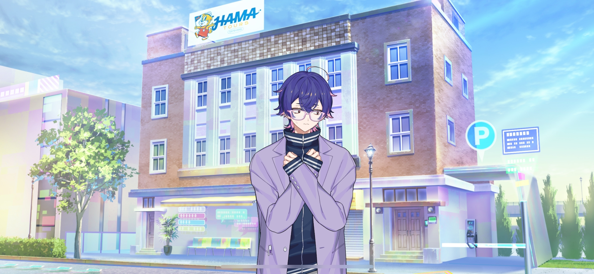
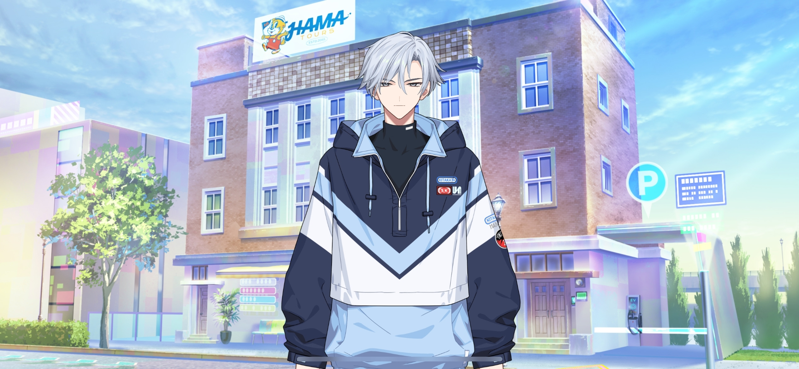
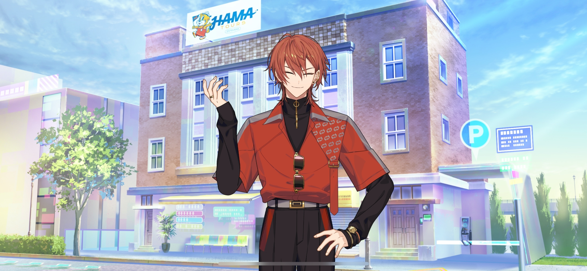
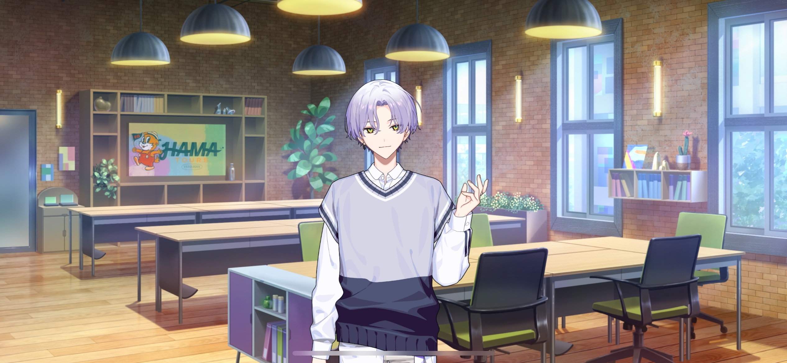

import "@/styles/series/18trip.scss";

<Divider loc="HAMA Tours" />

<Bubble mc>

(Three days passed by in the blink of an eye. We’re supposed to be meeting the current ward mayors today…!)

</Bubble>

<Bubble character="Yachiyo">
Ughhhh… I’m so nervous. I can’t believe I’m in charge of the Morning Team… I-I’m gonna throw up…
</Bubble>

<Bubble mc>
L-Let’s take it easy, okay, Yachiyo-kun? Kafka’s gonna be there to help you out, right?
</Bubble>

<Bubble character="Yachiyo">
R-Right. Urgh… I have to look at my notes again!

W-We’re supposed to wait in front of the office to meet the ward mayors… Okay! When they show up, greet them… Huh, what?!

G-G-G-Greet them?! What do I say to them?! Like, “howdy-hey?!” “What’s shakin’, bacon?!”
</Bubble>

<Bubble mc>
I think a simple “good morning” would be fine…

(Phew… I’m a little nervous, too. But I’ve already met the current ward mayors before.)

</Bubble>

<Bubble character="Yachiyo">
Mutter mutter… My notes on the ward mayors…

The Ward 2 mayor is professional figure skater Kamina Yukikaze… Gyah! A famous person right off the bat?!
</Bubble>

<Bubble mc>
Ward mayors are basically walking advertisements for their city, so they’re usually people who are already well-known.
</Bubble>

<Bubble character="Yachiyo">
Ward 3 is Nishizono Renga… Eek! That egocentric model?! W-W-W-W-What do I do?! He can’t be caught dead near a pauper like me!
</Bubble>

<Bubble mc>
……
</Bubble>

<Bubble character="Yachiyo">
And the Ward 4 mayor is Lu Liguang… The second in power in the Lu family that rules over Chinatown… I-I-I-I-Isn’t he practically a criminal…?!
</Bubble>

<Bubble mc>
Well, maybe…? I think we should meet them first before judging…
</Bubble>

<Bubble character="Yachiyo">
Kamina Yukikaze alone is a superstar athlete and a living national treasure! Ahhh, what now… How are you so calm, Chief?!
</Bubble>

<Bubble mc>
Uh, let’s just take a deep breath, Yachiyo-kun…
</Bubble>

<Narration>
&ast;car pulling up&ast;
</Narration>

<Bubble character="Yachiyo">
Agh!! That’s…!!
</Bubble>

<Bubble character="Yukikaze">
……
</Bubble>

<Bubble character="Yachiyo">
Kamina Yukikaze…!! The national treasure, the pinnacle of beauty!! The Ice Prince himself…!! I-I-It’s really him…
</Bubble>

<Bubble character="Yukikaze">
……
</Bubble>

<Bubble character="Yachiyo">
H-H-He smiled…?!?!
</Bubble>

<Bubble character="Yukikaze">
I missed you… &ast;hug&ast;
</Bubble>

<Bubble character="Yachiyo">
AH?@R?HFS?Y@^U#?????!!?!?
</Bubble>

<Bubble mc>

(He’s losing it even though I’m the only one getting hugged right now…)

Yuki-nii, sorry. Can you let go? Yachiyo-kun looks a little freaked out…
</Bubble>

<Bubble character="Yukikaze">
Hm? Ah, good morning. Do you work here?
</Bubble>

<Bubble character="Yachiyo">
Uh- wh- h- Ka- Chi-...?!
</Bubble>

<Bubble mc>

(“What? How do you know Kamina Yukikaze, Chief?” How did I understand that…?)

He’s actually my cousin. Sorry, I should’ve told you that before…
</Bubble>

<Bubble character="Yachiyo">
Dwuhh?! You- cou- li- Ka-?!
</Bubble>

<Bubble mc>

(“Dwuhh, you’re cousins with the living national treasure Kamina Yukikaze?!”)

</Bubble>

<Bubble character="Yukikaze">
I wanted to see you as soon as I came back to JPN. The wait felt so long.
</Bubble>

<Bubble mc>
Sorry about that, Yuki-nii. I had a ton of stuff to do once the company started up. How was the competition?
</Bubble>

<Bubble character="Yukikaze">
…Lonely, since you weren’t there to watch me.
</Bubble>

<Bubble character="Kafka">
Okay, break it up, you’re waaaay too close.
</Bubble>

<Bubble mc>
Woah, Kafka. Don't just squeeze in like that, it's dangerous.
</Bubble>

<Bubble character="Kafka">
<Diff g="m">Are you crazy? Who would hug someone immediately after seeing them? And you’re not allowed to hold his hand either. No touching.</Diff>
<Diff g="f">Are you crazy? Who would hug someone immediately after seeing them? And you’re not allowed to hold her hand either. No touching.</Diff>
</Bubble>

<Bubble character="Yukikaze">
It’s been a while, Kafka. I heard your surgery was a success. Congratulations. If you feel left out, I can give you a hug, too.
</Bubble>

<Bubble character="Kafka">
Huh? I’m gonna smack you.
</Bubble>

<Bubble mc>

(Here they go again… Kafka always starts things with Yuki-nii…)

(I knew that this would happen as soon as I heard that Kafka would be helping out the current ward mayors…)

</Bubble>

<Narration>
&ast;car pulling up&ast;
</Narration>

<Bubble mc>
Ah, there’s another car… It looks expensive. Is that one of the other two mayors?
</Bubble>

<Narration>
&ast;tires screeching&ast;
</Narration>

<Bubble mc>

(And another one pulled up right behind it…?! Y-You could kill someone driving like that…!)

</Bubble>

<Bubble character="Renga">
Hell yeah! Eat my ass, Liguang! I told you I’d get here first!!
</Bubble>

<Bubble character="Liguang">
&ast;sigh&ast; Idiot…
</Bubble>

<Bubble character="Renga">
What’d you just call me?!
</Bubble>

<Bubble mc>

(Here we go again… These two can never give it a rest…)

</Bubble>

<Bubble character="Yachiyo">
Woah, it’s Nishizono Renga in the flesh… Even Lu Liguang looks like a supermodel… Wow, wow, wow…
</Bubble>

<Bubble mc>
Ward 3 mayor Nishizono Renga and Ward 4 mayor Lu Liguang, right? Nice to meet you… Well, I guess it’s not our first time meeting each other. Um, I’m the chief here at HAMA Tours.
</Bubble>

<Bubble character="Liguang">
…Ah, it’s you again… I remember you from the airport.
</Bubble>

<Bubble mc>

(No way, Liguang-san actually remembers me?)

</Bubble>

<Bubble character="Renga">
…! You’re…
</Bubble>

<Bubble mc>
Ah, uh, hello.
</Bubble>

<Bubble character="Kafka">
Looks like everyone’s here. Let’s take this inside.
</Bubble>

<Bubble character="Renga">
……
</Bubble>

<Bubble mc>

(Renga-kun keeps…staring at me… Did I do something wrong…?)

</Bubble>

<Bubble character="Renga">
Hey…
</Bubble>

<Bubble mc>
Um, yes?
</Bubble>

<Bubble character="Renga">
Well… Uh…

I put the rose up. That’s all I wanted to say.
</Bubble>

<Bubble mc>

(…!)

(I didn’t expect that. He actually took it home with him…)

</Bubble>

<Divider loc="HAMA Tours - Office Floor" />

<Bubble character="Kafka">
That’s the gist of my plans for NEO HAMA-18. Any questions?
</Bubble>

<Bubble character="Liguang">
……
</Bubble>

<Bubble character="Yukikaze">
This is amazing, Kafka. Only someone with your brains could come up with this.
</Bubble>

<Bubble character="Kafka">
Huh? Why are you out here stating the obvious? Whatever. I’ll assume you have no problems with it.
</Bubble>

<Bubble character="Renga">
…I don’t like it.
</Bubble>

<Bubble mc>
…!
</Bubble>

<Bubble character="Renga">
I respect you as the Ward 0 mayor, but Ward 3 will rebuild HAMA on its own!
</Bubble>

<Bubble character="Liguang">
…Hah, there’s always someone like you who tries to hold everyone else back.
</Bubble>

<Bubble character="Renga">
Huh?! Say that again to my face!
</Bubble>

<Bubble mc>

(Hmm, but isn’t Renga-kun the person behind the weird remodeling of the Landmark? I don’t know if we can trust him…)

</Bubble>

<Bubble character="Liguang">
I also can’t agree with this. The plan is logical, but having me work with a simpleton like him is anything but.
</Bubble>

<Bubble character="Yukikaze">
I have no issues with it. I’m just happy to be able to work alongside <Name first />.
</Bubble>

<Bubble character="Kafka">
Okay, nobody asked. And you’re not supposed to call people by their first names in the workplace. Titles only.
</Bubble>

<Bubble character="Yukikaze">
Ah, I see. In that case, I mean Chief.
</Bubble>

<Bubble character="Kafka">
&ast;sigh&ast; Well, I didn’t expect everyone to be on the same page. But I want you all to think long and hard about your place in the pyramid.
</Bubble>

<Bubble character="Liguang">
……
</Bubble>

<Bubble character="Renga">
Huh?! What do you mean by that?!
</Bubble>

<Bubble character="Kafka">
The Ward 0 mayor has the ability to dismiss other mayors.
</Bubble>

<Bubble character="Renga">
Di-Dismiss? What language is that…?
</Bubble>

<Bubble character="Liguang">
&ast;sigh&ast; _Bèndàn…_
</Bubble>

<Bubble mc>
Renga-kun, if you get dismissed, that means you’re fired…
</Bubble>

<Bubble character="Renga">
…Fired…

Hah, I-I knew that!!

Wait…! Is that a threat?!
</Bubble>

<Bubble character="Kafka">
…I want you to calm down and really think about it. HAMA hasn’t hit the visitor quotas for the past two years. If we don’t do something revolutionary, it’s over.

Renga and Liguang, both of you have been working hard on restoring your own wards for these two years, right? So you know better than anyone else that things have changed.

If we can’t make a breakthrough and end up losing our tourism region title, all of us will lose our posts as mayor. Don’t you think it would be best to try something new?
</Bubble>

<Bubble character="Liguang">
…Is that the thought process behind this plan of yours?
</Bubble>

<Bubble character="Kafka">
Let’s test the waters with just the Morning Team for now. If our first tour goes poorly, you can all abandon the project.

Give me a chance. Please.
</Bubble>

<Bubble mc>

(Kafka…! He’s bowing to them…)

</Bubble>

<Bubble character="Renga">
Well, uh… Umm…
</Bubble>

<Bubble character="Liguang">
……

Fine. I’ll listen to you until we see some progress.
</Bubble>

<Bubble mc>

(…! Liguang-san… He’s more upstanding than he looks…!)

</Bubble>

<Bubble character="Renga">
Well, fine… I guess if I have to… I’ll give you a chance…
</Bubble>

<Bubble character="Liguang">
Get off your high horse.
</Bubble>

<Bubble character="Renga">
Huh?! Why do _you_ care?!
</Bubble>

<Bubble mc>

(…And they’re fighting again.)

</Bubble>

<Bubble character="Yachiyo">
Wahwahwah… A-Are you sure these two will be okay working together…?
</Bubble>

<Bubble character="Kafka">
Friendship truly is beautiful.
</Bubble>

<Bubble mc>

(Huh? Are you sure that can apply to them?)

</Bubble>

<Bubble character="Kafka">
Ah, maybe I should’ve gotten _that_ ready beforehand.
</Bubble>
