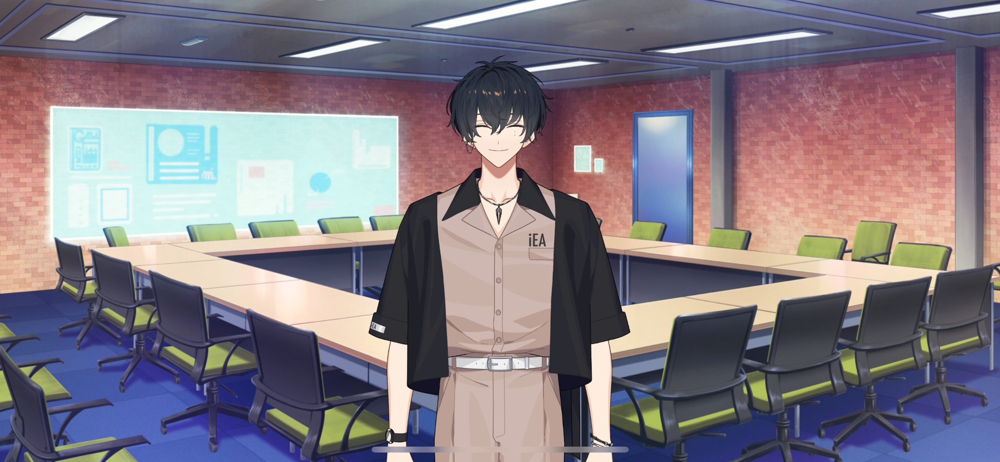
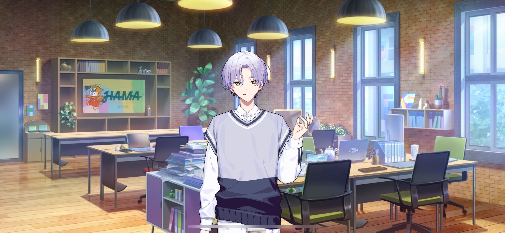
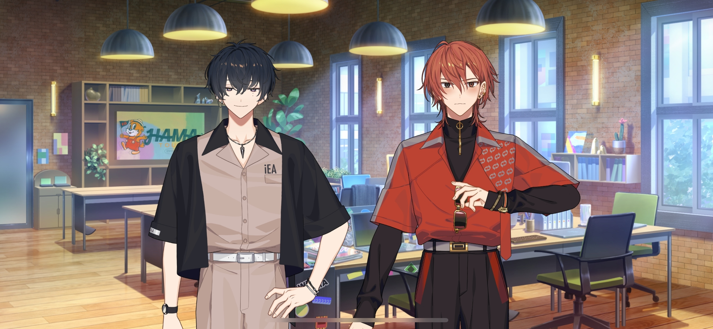
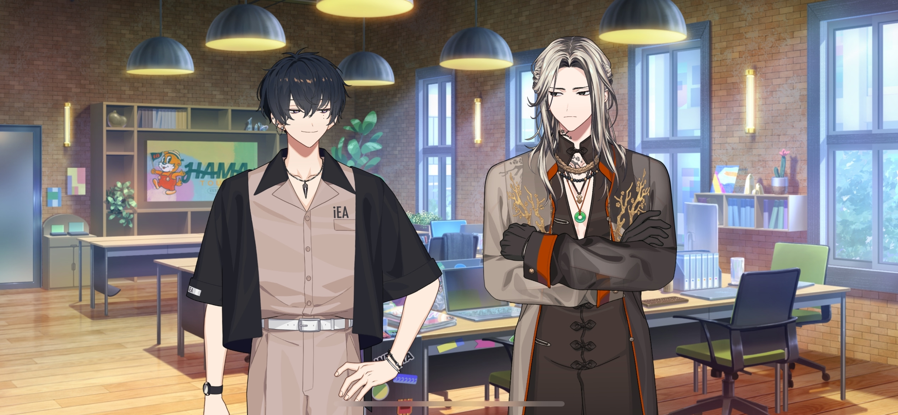
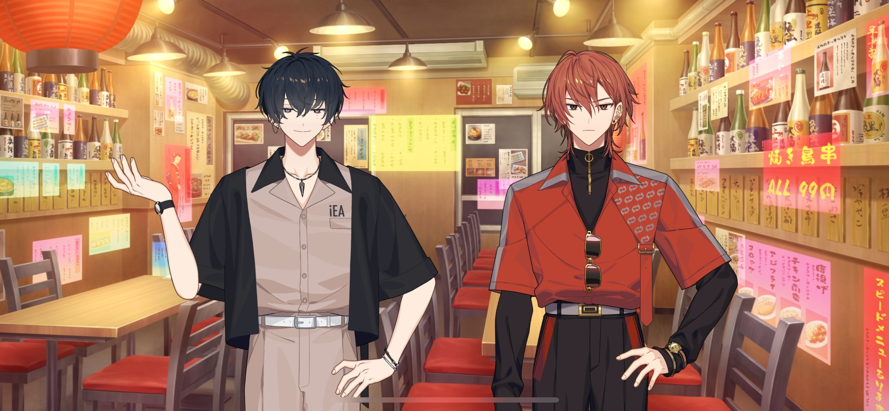
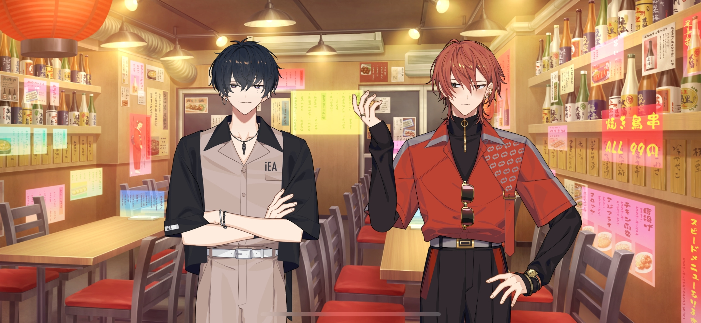
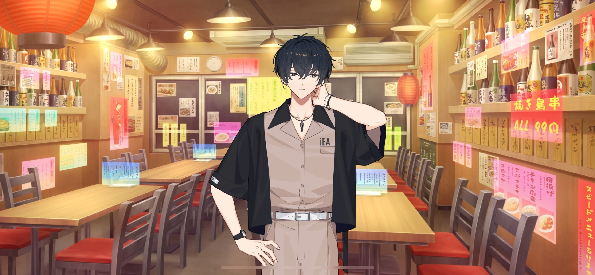

import "@/styles/series/18trip.scss";

# Ward 1 Mayor Audition

<Divider loc="HAMA Tours - Meeting Room" />

<Bubble character="Kafka">
With that being said, we’re going through the final interviews for the Ward 1 mayor audition process today.
</Bubble>

<Bubble mc>

(I was worried that we wouldn’t get anyone, but we got over 200 applicants! We managed to narrow it down to four…)

</Bubble>

<Bubble character="Renga">
Nobody’s skillset stands out to me from these resumes. Do we really have to pick one out of these four?
</Bubble>

<Bubble character="Liguang">
Your skillset doesn’t stand out very much either.
</Bubble>

<Bubble character="Renga">
Huh?! Liguang, you asshole, you wanna say that again?!
</Bubble>

<Bubble character="Yukikaze">
Hmm. The resumes look fine to me. The interview will let us know who the best fit is.
</Bubble>

<Bubble character="Yachiyo">
O-Okay, I’ll b-b-b-b-b-bring in the applicants for the interview…!!
</Bubble>

<Bubble character="Kafka">
Yachiyo, that’s the window. If you fall from here, you’ll die. The door is on the other side of the room.
</Bubble>

<Bubble character="Yachiyo">
Hahyah…
</Bubble>

<Bubble character="Applicant A">
I applied because! I heard that ward mayors get a discount in restaurants!
</Bubble>

<Bubble character="Liguang">
You heard wrong. Leave.
</Bubble>

<Bubble character="Applicant B">
I don’t really know anything about HAMA, but I live in Tokyo, so, I mean, that's close enough, right?
</Bubble>

<Bubble character="Renga">
Don’t apply if you don’t know what you’re talking about! We don’t want people with no love for HAMA. Rejected!
</Bubble>

<Bubble character="Applicant C">
Uh, you’re the chief here, right…? I really enjoyed your tour when you worked at the other travel agency… I’d like to get to know you as a coworker rather than a customer this time…
</Bubble>

<Bubble mc>
Ah, I remember you from the Europe tour!
</Bubble>

<Bubble character="Kafka">
Rejected. Get out.
</Bubble>

<Bubble character="Yukikaze">
Sorry, the exit is that way. Take care on your way home.
</Bubble>

<Bubble mc>

(What?! He seems perfectly fine… Not only does Kafka want him gone, but Yuki-nii does too?!)

</Bubble>

<Bubble character="Ten" name="???">
Oh, am I the only one left? Niiice, didn't mean for that to work out.

I’m Murakumo Ten. I’m a college student, but I’m looking for work. The reason why I wanna be ward mayor is, well… ‘cuz I want a job?

Thought that would make me look good if I wrote it on the application.
</Bubble>

<Bubble character="Renga">
Does this guy even care…? He probably doesn’t have any love for HAMA, and he wants to be mayor…?
</Bubble>

<Bubble character="Liguang">
……
</Bubble>

<Bubble character="Kafka">
Hmm… Ten-kun, it says here that your family runs a sushi restaurant? You also said you can filet fish, is that true?
</Bubble>

<Bubble character="Ten">
Oh, yeah. I can do any kinda fish you want. I can do sashimi, three-piece filets, all that stuff.
</Bubble>

<Bubble character="Kafka">
Nice to know. I like to fish, so it would be good to have someone around who can handle them.

Alright, you’re hired. Done and done.
</Bubble>

<Bubble character="Renga">
H-Hey, are you sure?! Doesn’t he feel kinda insincere to you?!
</Bubble>

<Bubble character="Ten">
Oh, sweet. By the way, what’s the hourly for a ward mayor?
</Bubble>

<Bubble character="Yukikaze">
We don’t get paid hourly; we’re considered outsourcers. I’m looking forward to working with you, my new little brother.
</Bubble>

<Bubble character="Ten">
“Little brother…?” You got a weird sense of humor there, bro. I don’t really get it, but it sounds good to me.
</Bubble>

<Bubble character="Yachiyo">
Murakumo Ten… College student, looking for a job… Must be tough… I know how it feels…
</Bubble>

<Bubble character="Renga">
……
</Bubble>

<Bubble mc>

(Renga doesn’t look very happy. I guess he does feel a little superficial. Liguang probably won’t like this ei&NoBreak;—)

</Bubble>

<Bubble character="Liguang">
…If that’s your final decision, I’m fine with it.
</Bubble>

<Bubble mc>

(Huh? He actually went along with it…)

</Bubble>

<Divider loc="HAMA Tours - Office Floor" />

<Bubble character="Kafka">
Okay, everyone. This is Murakumo Ten, who passed our vetting process for Ward 1 mayor. Let’s give him a warm welcome.
</Bubble>

<Bubble character="Ten">
Nice to meetcha. I’ll work 'bout as much as you pay me.
</Bubble>

<Bubble character="Sakujiro">
I see you have caught our president’s discerning eye. We have high hopes for you.
</Bubble>

<Bubble character="Daniel">
Oh, a college student, huh? You’re a young one. Make sure to fill in the gaps for me while you’re here.
</Bubble>

<Bubble character="Kafka">
You already met the other mayors at the interview, but since we’re going to be working together from now on, make sure to memorize everyone’s names before you leave today.
</Bubble>

<Bubble character="Ten">
I have a good memory, so I got you there. By the way, I just realized, but almost everyone here’s a celebrity, huh?
</Bubble>

<Bubble character="Renga">
…Tch, I can’t stand this guy…
</Bubble>

<Bubble mc>

(Renga-kun’s in a really bad mood…! I hope a fight doesn’t break out…)

</Bubble>

<Bubble character="Ten">
Kamina Yukikaze, and… Oh, Nishizono Renga. I watched _City Explorers_ the other week.
</Bubble>

<Bubble character="Renga">
…! Wait, the show I was on?
</Bubble>

<Bubble character="Ten">
Yes! You were great when they filmed your reaction cam.

I could really feel your celebrity charisma. I think people like you who can stand their ground are pretty cool.
</Bubble>

<Bubble character="Renga">
Ah, uh, tha&NoBreak;—

I mean! Of course you do. I was born to be a celebrity.
</Bubble>

<Bubble character="Ten">
I really respect you. Crazy that I’m working in the same team as you now. It’s an honor, I mean it.
</Bubble>

<Bubble character="Renga">
Y-You respect…_me?!_

A-Ahem! Well, since I _am_ more experienced as a mayor, I don’t mind giving you some pointers.
</Bubble>

<Bubble character="Ten">
Woah, seriously? Nice. You wanna go out for drinks later, then?
</Bubble>

<Bubble character="Renga">
Drinks…?! Y-You’re inviting me… _Me,_ out for drinks…?!

Ahem. F-Fine. Consider yourself lucky that you can spend time with someone like me…!
</Bubble>

<Bubble character="Ten">
Niiice, glad I didn’t get rejected.
</Bubble>

<Bubble mc>

(How did those two get so close all of a sudden…? Is Renga-kun easy to please, or is Ten-kun just good with people?)

(I’m not complaining, though. It’s nice to see them getting along!)

</Bubble>

<Bubble character="Liguang">
……
</Bubble>

<Bubble character="Ten">
……
</Bubble>

<Bubble character="Nayuki">
Murakumo-kun, before you leave, could you fill out the outsourcing contract? We just need your information, we’ll handle the rest of it from there.
</Bubble>

<Bubble character="Ten">
‘Kayyy. Well, see you later, Renga-san.
</Bubble>

<Bubble character="Renga">
Y-Yeah. I’ll be nice and wait for you.
</Bubble>

<Divider loc="Budget-Friendly Izakaya" />

<Bubble character="Ten">
This is the place I usually go to for drinks. Sorry, it’s prolly not bougie enough for a celebrity like you.
</Bubble>

<Bubble character="Renga">
It’s fine… I don’t mind. Even I should experience the commoner life every now and then.

O-Only 99 yen for one skewer of yakitori? That’s crazy… I could buy 10 of them at that price…

This place is pretty crowded. So this is what an izakaya’s like.
</Bubble>

<Bubble character="Ten">
……
</Bubble>

<Bubble character="Renga">
&ast;gasp&ast; Ahem! I never carry change around, so I don’t know for sure, but I guess it was made to be affordable for the commoners.
</Bubble>

<Bubble character="Ten">
For real, it’s the best place for poor college kids like me. You good with beer? You said in an interview that you only drink fancy wine, so…
</Bubble>

<Bubble character="Renga">
Huh, you read my interviews too?!

I-Isn’t that annoying for you? Printed stuff like magazines are expensive these days…
</Bubble>

<Bubble character="Ten">
True, but I respect you, so who cares about that? I’m gonna order some random stuff.
</Bubble>

<Bubble character="Renga">
You actually…respect me…? _Me,_ of all people…?

(&ast;gasp&ast; Why am I getting emotional…? Snap out of it, Renga! You’re a part of the Nishizono family now!)

</Bubble>

<Bubble character="Ten">
But, wow, you’re seriously a mayor on top of all your modeling and TV work? You got a lot on your plate. I swear, celebs like you live in a different world compared to normal guys like me.
</Bubble>

<Bubble character="Renga">
Well, you’re not wrong. I’m…doing my best out here.
</Bubble>

<Bubble character="Ten">
Oh, yeah, I know you are. That’s really cool of you, y’know?
</Bubble>

<Bubble character="Renga">
Cool… I’m cool…?
</Bubble>

<Bubble character="Ten">
Oh, there’s our beer. Cheers!
</Bubble>

<Bubble character="Renga">
Ch-Cheers…
</Bubble>

<Divider timeskip />

<Bubble character="Renga">
Ugh… I-I’m… ’m out here workin’ m’ assh off… But that dick, Liguang…
</Bubble>

<Bubble character="Ten">
Oh, I’d believe it. I know you work hard.
</Bubble>

<Bubble character="Renga">
Y’really get me, Ten…
</Bubble>

<Bubble character="Ten">
‘Course, I do. Isn’t that what all your friends do for you, Renga-san?
</Bubble>

<Bubble character="Renga">
…M’friendsh…
</Bubble>

<Bubble character="Ten">
You seem like you’d have a lot of them.
</Bubble>

<Bubble character="Renga">
…I dunno ‘bout that… But there’s one guy… M’besht friend…
</Bubble>

<Bubble character="Ten">
…!

Woah! He must be one hell of a guy to be best friends with you!
</Bubble>

<Bubble character="Renga">
…Mm. He’sh ev’n…cooler th’ me… I trust ‘im…more than anyone elsh…
</Bubble>

<Bubble character="Ten">
Always nice to know someone like that. Oh, here are our drinks. Hey, you should try and chug this one.
</Bubble>

<Bubble character="Renga">
Mm. &ast;gulp, gulp…&ast; Pahh.
</Bubble>

<Bubble character="Ten">
Nice one, that was sick.

Man, if that guy you know is that amazing, I’d like to meet him. Oh, how ‘bout you call him over now?
</Bubble>

<Bubble character="Renga">
Uhmm… Can’t. He’sh…really far ‘way…
</Bubble>

<Bubble character="Ten">
Like, somewhere overseas?
</Bubble>

<Bubble character="Renga">
Dunno… I dunno… But he’sh…like…a part a’ me…

Our hearts’re alwaysh…connected…

…Zzz…
</Bubble>

<Bubble character="Ten">
Renga-san? Are you sleeping?
</Bubble>

<Bubble character="Renga">
……
</Bubble>

<Bubble character="Ten">
…Hello?
</Bubble>

<Bubble character="Ten">
Are you fucking serious? Right at the good part. Lame.

Whatever. I’ll figure it out eventually. This guy’s easy as hell.

Sorry ‘bout this, Renga-san.

I’m just tryna do my job. No hard feelings, alright?
</Bubble>
