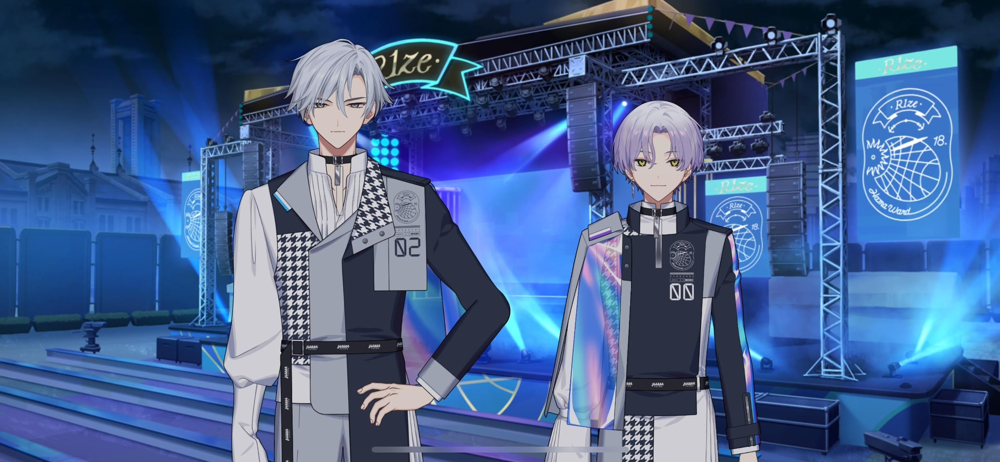

import "@/styles/series/18trip.scss";

<Divider loc="R1ze Stage" />

<Bubble character="Yukikaze Fan A">
Being asked about our goals on this tour is something only super-stoic Yukikaze could come up with.
</Bubble>

<Bubble character="Yukikaze Fan C">
Ahaha, but I’m glad we did that. I’ve been meaning to go on a diet, so I’m glad to have Yukikaze helping me along the way!
</Bubble>

<Bubble character="Hama Fan A">
I can’t afford to fail my next company evaluation, so I chose Liguang as my companion. Now I really feel like I can do it! I want him to be strict with me!
</Bubble>

<Bubble character="Hama Fan B">
I can’t believe that we could only pick one… I was stuck between Ten-chamu and Kafka-taso[^1]… I just had my mom choose for me.
</Bubble>

<Bubble character="Hama Fan C">
I had no idea what Renga was talking about. Did he take an offer to appear on some weird show? I like Renga the way he usually is.
</Bubble>

<Bubble mc>

(I was worried about it, but it sounds like the “Future Walk” is a big hit! Thank God for that…)

Hm…? Is that…?
</Bubble>

<Bubble character="Hassaku" name="???">

(I see… I never expected to have such a good time in this ward. Its tourist attractions are so few. I suppose traveling isn’t only about exciting sights.)

(Don’t get me wrong, I was absolutely _not_ moved at all…!!)

</Bubble>

<Bubble mc>
It’s so nice to see you here again, Hassaku-san!
</Bubble>

<Bubble character="Hassaku">
(Scoff) Well if it isn’t the HAMA Tours Chief… A-Ahem!

Oh, my, it has been quite a while.

(I can’t blow my cover. Right now I’m Matsushige Hassaku, a feeble old man…!)

</Bubble>

<Bubble mc>
May I sit next to you? I’d love to watch the show together.
</Bubble>

<Bubble character="Hassaku">
O-Oh, is that so…? Deary me, I’m just too old to understand what all of this is about.
</Bubble>

<Bubble mc>
I really hope you enjoy it. How did you like the tour?
</Bubble>

<Bubble character="Hassaku">
H-Hm. Well, the show was quite wonderful… And the bento, hm, it was excellent. I would have liked some sweets myself…
</Bubble>

<Bubble mc>
That’s true! Something sweet would’ve fit really well. I’ll make sure to bring that up for next time.
</Bubble>

<Bubble character="Hassaku">
Hm. I will be, hm, looking forward to that.
</Bubble>

<Bubble mc>
Did you decide on your goals?
</Bubble>

<Bubble character="Hassaku">
H-Hmmm……

…At my age, I don’t think there’s much left for me to achieve.
</Bubble>

<Bubble mc>
…That’s not true. Having goals is a good thing no matter how old you are. It’s fun to have them.

Nobody has the right to laugh at you for them. All of your goals and dreams are up to you to decide.
</Bubble>

<Bubble character="Hassaku">
…Hm. You’re right… I suppose having someone to tell me that is…special in and of itself…
</Bubble>

<Bubble mc>
…?
</Bubble>

<Narration>
&ast;applause&ast;
</Narration>

<Bubble mc>

(It’s starting! Yuki-nii and Kafka’s duo show…!)

</Bubble>

<Bubble character="Yukikaze">
&lt;Thank you all for today. We hope you enjoyed HAMA Tours’ first feature tour.&gt;
</Bubble>

<Narration>
&ast;cheering&ast;
</Narration>

<Bubble character="Yukikaze">
&lt;None of this would've been possible without Kafka helping me. Thank you, Kafka.&gt;
</Bubble>

<Bubble character="Kafka">
&lt;……&gt;
</Bubble>

<Bubble mc>

(Yuki-nii put his arm around Kafka… I’m surprised he didn’t shove him off… But maybe he’s holding himself back because they’re in front of guests… Good job, Kafka!)

</Bubble>

<Bubble character="Kafka">
&lt;I helped out with making the shumai and coordinating the new app features. Did you all decide on your personal goals? If you haven’t yet, take some time to think about them on your way home.&gt;
</Bubble>

<Bubble character="Yukikaze">
&lt;Kafka, I’m glad I got to see this view with you today. I’m just one of many people who want to keep moving forward to see the scenery of my dreams. I want everyone else to feel the same and look forward to your futures.&gt;

&lt;…I hope this song will help encourage you along the way. Its name is…&gt;

_&lt;Next Voyage.&gt;_
</Bubble>

<Narration>
&ast;cheering&ast;
</Narration>

<Bubble mc>

(Wow, they’re shining like stars.)

(…I hope that this memory will cheer people on towards their goals.)

(I want everyone’s dreams to come true, no matter how small they are… Mine is for people to keep coming back to HAMA!)

</Bubble>

---

[^1]: Similar to -chamu, -taso is another honorific that some otakus use for nicknames of their favorites. It's believed to be an offshoot of the -tan honorific. It seems to be mostly used for gentle and kind female characters.
