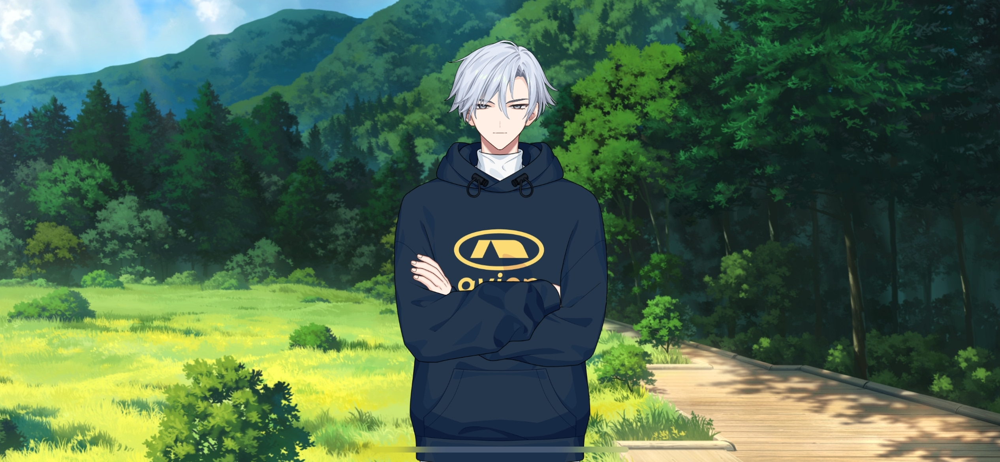
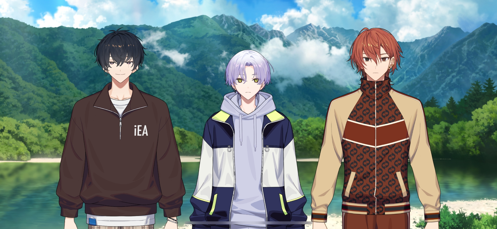
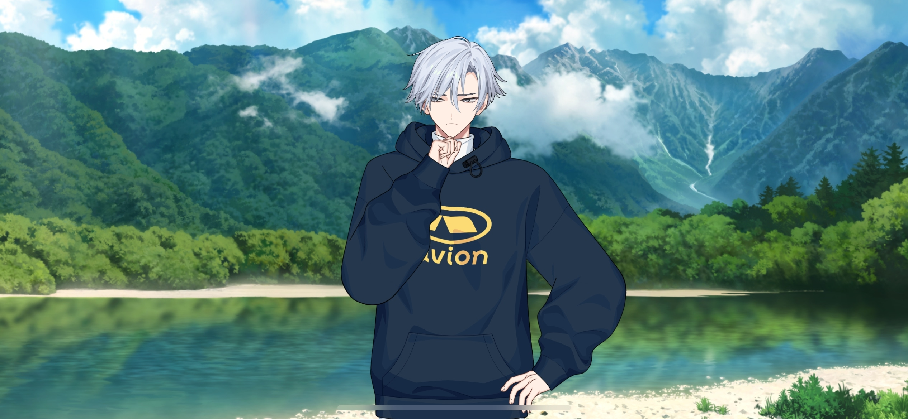

import "@/styles/series/18trip.scss";

<Divider loc="Nagano, Kamikochi - Hiking Trail" />

<Bubble character="Yukikaze">
Everyone looks tired from running. Let’s take a break.
</Bubble>

<Bubble mc>

(&ast;pant, pant&ast; Yuki-nii didn’t even break a sweat… That’s a pro athlete for you.)

</Bubble>

<Bubble character="Kafka">
I’m gonna…take a seat here… Phew…
</Bubble>

<Bubble character="Yachiyo">
I might throw up… Urggh…
</Bubble>

<Bubble character="Renga">
&ast;pant, pant&ast; We… We lost the bear, right?

Wait, what? Liguang isn’t here!
</Bubble>

<Bubble character="Ten">
Oh, you’re right.
</Bubble>

<Bubble character="Yachiyo">
D-Did Boss get eaten by the bear?!
</Bubble>

<Bubble character="Renga">
There’s no way! Wh-What do we do? I should’ve put some bells on him…!!
</Bubble>

<Narration>
&ast;rustling&ast;
</Narration>

<Bubble character="Yachiyo">
Hyah! Did the bear find us?!
</Bubble>

<Bubble character="Passing Monkey">
Ook?
</Bubble>

<Bubble character="Renga">
…A monkey? Th-Then was that just…
</Bubble>

<Bubble character="Ten">
It’s the same monkey we saw earlier.
</Bubble>

<Bubble character="Liguang">
That’s why I said this is ridiculous.
</Bubble>

<Bubble character="Renga">
Wh… Liguang, you’re finally here! Did you walk the entire way?!

You didn’t get eaten… That’s good…
</Bubble>

<Bubble character="Liguang">
Why on earth would a _monkey_ eat me?
</Bubble>

<Bubble character="Renga">
Hey, Yachiyo! It wasn’t even a bear!
</Bubble>

<Bubble character="Yachiyo">
I-I was wrong?! I-I’m so sorryyyyyy!! I can only atone with my death… I need a bear to eat me!!
</Bubble>

<Bubble character="Renga">
Ah, no, I didn’t mean to put all of the blame on you…! I started running too… Sorry…
</Bubble>

<Bubble character="Ten">
Well, it’s good that it was a false alarm. Chief, you bought a bunch of snacks from the store back there, right? We should eat some of them.
</Bubble>

<Bubble mc>
Oh, yeah! I got some oyaki and kappa-yaki,[^1] so everyone can have some.

Here, everyone take your pick!
</Bubble>

<Bubble character="Yukikaze">
Local oyaki… There are a lot of different fillings… Turnip greens and eggplant… Even white radish.
</Bubble>

<Bubble character="Yachiyo">
Th-The kappa-yaki is so cuuuute… I know beggars can’t be choosers, but can I have that one?
</Bubble>

<Bubble character="Renga">
Can I take one too? …Mm.

I-It’s so good…! What’s in this thing?! It tastes homemade…
</Bubble>

<Bubble mc>

(The kappa-yaki tastes great too…! Eating out in nature like this makes everything feel extra special.)

</Bubble>

<Bubble character="Kafka">
……
</Bubble>

<Bubble mc>
Kafka, do you wanna try the eggplant one?
</Bubble>

<Bubble character="Kafka">
…Huh? Oh, sure. It’s great. I’m really looking forward to dinner tonight, by the way. What were we having again?
</Bubble>

<Bubble mc>
Yachiyo-kun made a reservation for us somewhere. Since we’re in Nagano… Maybe it’s a soba place?
</Bubble>

<Bubble character="Yachiyo">
Heheh… You expect too little of me, Chief. Our reservation’s for a restaurant called M’Nagano, where they have not just soba, but also horse-meat sashimi and sanzoku-yaki,[^2] too!
</Bubble>

<Bubble character="Renga">
They have all of that?!
</Bubble>

<Bubble character="Ten">
Says on Grublog[^3] that M’Nagano has a 0.01-star rating.
</Bubble>

<Bubble character="Yachiyo">
Huh?!
</Bubble>

<Bubble character="Liguang">
Looking at the restaurant’s website… The owner seems to be quite eccentric.
</Bubble>

<Bubble mc>

(O-Oh, yeah… He’s wearing a towel as a headband and cutting mincemeat with a giant knife… And it’s covered in blood… It says “Only fellas who can savor m’flavor are welcome here…”)

</Bubble>

<Bubble character="Renga">
Y-Yikes… Are we really gonna be eating here? I haven’t been to such a…_wild_ place ever since the Nishizonos took me in, so…
</Bubble>

<Bubble character="Yukikaze">
It says “No same-day cancellations. If you do so, I will chase you until the ends of the earth.”
</Bubble>

<Bubble character="Ten">
…I guess we gotta go.
</Bubble>

<Bubble character="Yachiyo">
H-hyahhhh, I’msorryI’msorry!! I-I think a demon must have possessed me and forced me to make this reservation! I promise I’ll get it exorcized next tiiiiime!!
</Bubble>

<Bubble mc>
Haha… I’m glad we looked them up. But that aside, should we get going now?
</Bubble>

<Bubble character="Renga">
…Yeah! We should get outta here before any bears show up!
</Bubble>

<Bubble character="Kafka">
……
</Bubble>

<Bubble mc>

(Hm? What’s going on with Kafka…?)

</Bubble>

<Bubble character="Yukikaze">
……

Kafka, I’m going to take off your shoes and socks.
</Bubble>

<Bubble character="Kafka">
……
</Bubble>

<Bubble mc>
…! Kafka, you have a cut on your ankle! When did you… Wait, did you get it when you tripped?
</Bubble>

<Bubble character="Renga">
…! Won’t it be hard for him to walk? If he does, his shoe will keep rubbing against it.
</Bubble>

<Bubble character="Liguang">
…Now’s the time to turn back if we need to. We haven’t walked that far yet.
</Bubble>

<Bubble character="Renga">
It’s because I ran off… I’m sorry, Kafka…
</Bubble>

<Bubble character="Kafka">
Stop, it isn’t all that bad. I can still walk. Could you let go of my leg now, Yukikaze?
</Bubble>

<Bubble character="Yukikaze">
…No.
</Bubble>

<Bubble character="Kafka">
!

Let…go!
</Bubble>

<Bubble character="Yukikaze">
…Yachiyo, can you hand me a water bottle?
</Bubble>

<Bubble character="Yachiyo">
Eh, uh, o-okay!
</Bubble>

<Bubble character="Kafka">
……Tsk.
</Bubble>

<Narration>
&ast;water pouring&ast;
</Narration>

<Bubble character="Yukikaze">
Does it sting? Sorry, you’ll have to bear with the pain for a bit.

The cut isn’t too deep, so applying some pressure on the clean wound should stop the bleeding. A bandage will prevent it from drying out, so it’ll heal quicker. I just need to wrap it well so it doesn’t slip off…
</Bubble>

<Bubble character="Kafka">
…What’s up with these bandaids and the tape? They have some weird mascot printed all over them.
</Bubble>

<Bubble character="Yachiyo">
Ah, is that the limited-time merch from mascot idol Chiimon?!?! S-So cute…!
</Bubble>

<Bubble character="Yukikaze">
You know them? These were souvenirs I got from Chihiro when he went to Beppu. I’m glad I brought them just in case.

They look cute, but they also work well… Done. Let me know if the bandage falls off. You should be able to walk now.
</Bubble>

<Bubble character="Kafka">
……
</Bubble>

<Bubble character="Yukikaze">
Alright, we’re all ready to go.
</Bubble>

<Bubble mc>

(Yuki-nii… I didn’t expect that. I thought he would forbid Kafka from continuing…)

</Bubble>

<Bubble character="Yukikaze">
…Are you worried about Kafka, Chief?
</Bubble>

<Bubble mc>
Ah, yeah… He got hurt, after all.
</Bubble>

<Bubble character="Yukikaze">
He’ll be alright. He should be able to make it to Taisho Pond. If anything happens, I’ll carry him.
</Bubble>

<Bubble character="Kafka">
I never asked you to do that. I have no intention of letting you carry me.

Okay, let’s go! Chief! Let’s try and be the first ones there!
</Bubble>

<Bubble character="Yukikaze">
…Hah, go ahead.
</Bubble>

<Bubble mc>
…!

(Yuki-nii really believes in Kafka now… That makes me happy!)

</Bubble>

<Divider loc="Nagano, Kamikochi - Taisho Pond" />

<Bubble mc>
We made it to Taisho Pond! Wooow… It’s gorgeous! This is amazing…
</Bubble>

<Bubble character="Kafka">
You can see the mountains reflected in the water… Woah…
</Bubble>

<Bubble character="Renga">
Everything around us is huge… I’m getting kind of emotional…
</Bubble>

<Bubble character="Ten">
Yeah, really makes you feel connected to nature.
</Bubble>

<Bubble character="Liguang">
Kamikochi… Some people call it “the land where gods descend.”[^4] The view suits that name.
</Bubble>

<Bubble character="Yachiyo">
Does that mean God’s here right now?! I need to make a wish… No more debt, no more debt… Muttermuttermutter…
</Bubble>

<Bubble character="Yukikaze">

(I’m glad to see that everyone’s enjoying the destination I chose.)

(Especially Chief and Kafka…)

</Bubble>

<Bubble mc>
Kafka, you did so well. All of that training paid off.
</Bubble>

<Bubble character="Kafka">
Stop, I’m not a kindergartener. You know that I always do things once I put my mind to them.
</Bubble>

<Bubble mc>
Yeah, but… It almost feels like a dream to be here with you… We only ever saw each other in the hospital for the longest time.
</Bubble>

<Bubble character="Kafka">
…I feel the same.

I’ve always wanted to walk with you and see sights like this, <Name first />-chan. That’s why I want to work so hard.
</Bubble>

<Bubble mc>
Heheh, I’m glad I told you about all of those scenic spots!
</Bubble>

<Bubble character="Kafka">
…Will you come with me to see all of them too?
</Bubble>

<Bubble mc>
Of course! Let’s go to every single one!
</Bubble>

<Bubble character="Ten">
Those two are off in their own little world. You okay with that, Yukikaze-san?
</Bubble>

<Bubble character="Yukikaze">
Hm? Well, yeah. This is what Kafka wanted. I’m happy for him.
</Bubble>

<Bubble character="Renga">
Yeah, it’s really nice to set a goal and end up learning how to do things you couldn’t do before!
</Bubble>

<Bubble character="Liguang">
I don’t think you’d ever do the learning part.
</Bubble>

<Bubble character="Renga">
Whazzat?!
</Bubble>

<Bubble character="Yukikaze">

(Doing things you couldn’t do before…)

</Bubble>

<Divider fb="start" />

<Bubble character="Sadayuki">
It’s alright! Be brave and jump!

I know you can do it. Even if you don’t believe in yourself, I’ll always believe in you. Because you’re my…
</Bubble>

<Divider fb="end" />

<Bubble character="Yukikaze">
…Dad…
</Bubble>

---

[^1]: Both of these are Nagano specialties. Oyaki are roasted dumplings that are filled with a variety of things from red bean past to vegetables. Kappa-yaki are just like taiyaki, but in the shape of a kappa head. They're famous as a Kamikochi offering.
[^2]: A large piece of fried teriyaki chicken, another Nagano specialty.
[^3]: A parody of the popular Japanese resturant review site 食べログ (Tablog).
[^4]: Kamikochi is usually written as 上高地, but some people nickname it 神降地. It's read the same way, but the meaning of the kanji in the nickname literally means "place were gods descend."
